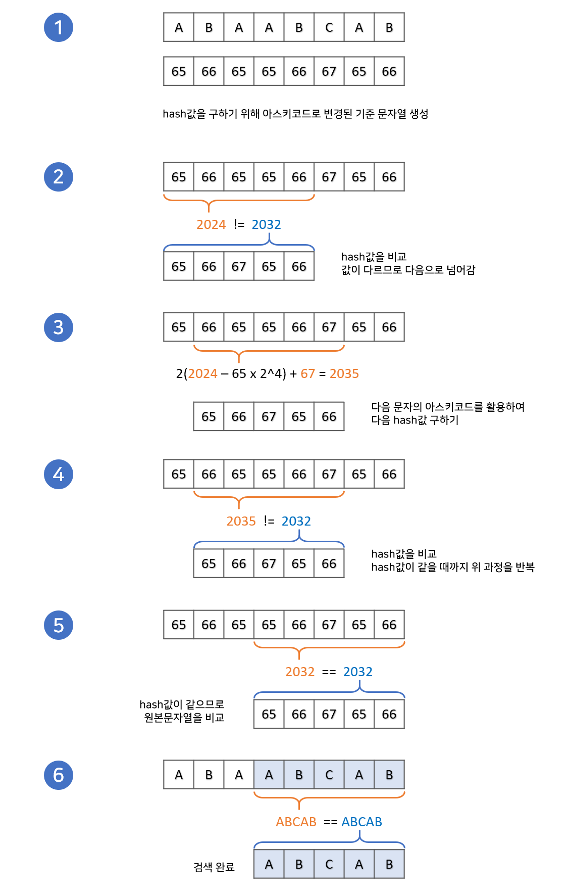
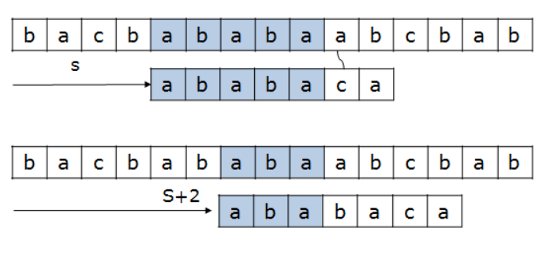
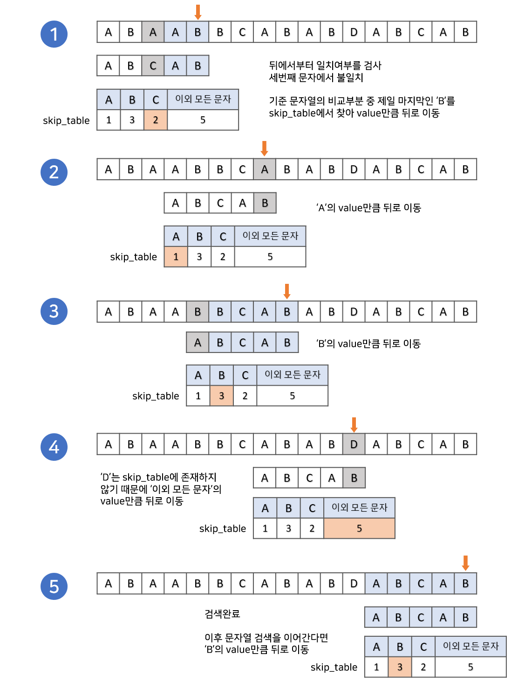
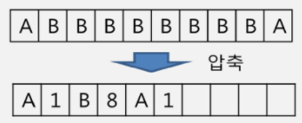

# Algorithms_03

## 문자열

-   컴퓨터에서의 문자표현

    ```
    글자 A를 메모리에 저장하는 방법에 대해서 생각해보자.
    
    메모리는 숫자만을 저장할 수 있기 때문에 각 문자에 대해 대응되는 숫자를 정해놓고 이것을 메모리에 저장하는 방법이 사용될 것이다.
    
    영어가 대소문자 합해서 52개이므로 6비트면 모두 표현할 수 있다. 이를 코드체계라고 한다.
    
    그런데 네트워크가 발전되기 전 미국의 각 지역 별로 코드체계를 정해놓고 사용했다.
    
    네트워크가 발전하면서 서로간에 정보를 주고 받을 때 정보를 달리 해석한다는 문제가 생겼다.
    
    따라서 혼동을 피하기 위해 표준안을 만들기로 하였다.
    
    이러한 목적으로 1967년, 미국에서 ASCII(American Standard Code for Information Interchange)라는 문자 인코딩 표준이 제정되었다.
    ```

    -   `ASCII`는 7bit 인코딩으로 128문자를 표현하며 33개의 출력 불가능한 제어 문자들과 공백을 비롯한 95개의 출력 가능한 문자들로 이루어져 있다.

-   확장 아스키는 표준 문자 이외의 악센트 문자, 도형 문자, 특수 문자, 특수 기호 등 부가적인 문자를 128개 추가할 수 있게 하는 부호이다.

    ```
    표준 아스키는 7bit를 사용하여 문자를 표현하는 데 비해 확장 아스키는 1B 내의 8bit를 모두 사용함으로써 추가적인 문자를 표현할 수 있다.
    
    컴퓨터 생산자와 소프트웨어 개발자가 여러 가지 다양한 문자에 할당할 수 있도록 하고 있다. 이렇게 할당된 확장 부호는 표준 아스키와 같이 서로 다른 프로그램이나 컴퓨터 사이에 교환되지 못한다.
    
    그러므로 표준 아스키는 마이크로컴퓨터 하드웨어 및 소프트웨어 사이에서 세계적으로 통용되는 데 비해, 확장 아스키는 프로그램이나 컴퓨터 또는 해독자가 그것을 해독할 수 있도록 설계되어 있어야 올바로 해독될 수 있다.
    ```

-   오늘날 대부분의 컴퓨터는 문자를 읽고 쓰는데 `ASCII`형식을 사용한다.

    ```
    그런데 컴퓨터가 발전하면서 미국 뿐 아니라 각 나라에서도 컴퓨터가 발전했으며 각 국가들은 자국의 문자를 표현하기 위하여 코드체계를 만들어서 사용하게 되었다.
    
    따라서 다국어 처리를 위한 표준을 마련했고, 이것이 유니코드이다.
    ```

-   유니코드도 다시 Character Set으로 분류된다.

    -   UCS-2(Universal Character Set 2)
    -   UCS-4(Universal Character Set 4)

    ```
    유니코드를 저장하는 변수의 크기를 정의
    
    그러나, 바이트 순서(big-endian, little-endian)에 대해 표준화하지 못했음
    
    다시 말해 파일을 인식 시 이 파일이 UCS-2, UCS-4인지 인식하고 각 경우를 구분해서 모두 다르게 구현해야 하는 문제 발생
    
    따라서 유니코드의 적당한 외부 인코딩이 필요하게 됨
    ```

-   유니코드 인코딩 (UTF: Unicode Transformation Format)

    -   UTF-8 (in web)
        -   MIN: 8bit, MAX: 32bit
    -   UTF-16 (in windows, java)
        -   MIN: 16bit, MAX: 32bit
    -   UTF-32 (in unix)
        -   MIN: 32bit, MAX: 32bit

-   `Python` Encoding

    -   2.x version: `#-*- coding: utf-8 -*-`
    -   3.x version: 유니코드 UTF-8 -> 생략 가능

-   `Java`에서 String 클래스에 대한 메모리 배치

    -   java.lang.String 클래스에는 기본적인 객체 메타 데이터 외에도 네가지 필드들이 포함되어 있는데, hash, 문자열의 길이(count), 문자열 데이터의 시작점(offset), 실제 문자열에 대한 참조(value)이다.

-   `C언어`에서 문자열 처리

    -   문자열은 문자들의 배열 형태로 구현된 응용 자료형

    -   문자배열에 문자열을 저장할 때는 항상 마지막에 끝을 표시하는 널문자(`\0`)를 넣어줘야 한다.

    -   문자열 처리에 필요한 연산을 함수 형태로 제공한다.

        ```
        strlen(), strcpy(). strcmp(), ...
        ```

-   `Java`(객체지향 언어)에서의 문자열 처리

    -   문자열 데이터를 저장, 처리해주는 클래스를 제공한다.

    -   String 클래스를 사용한다.

        ```java
        String str="abc"; //또는 String str = new String("abc")
        ```

    -   문자열 처리에 필요한 연산을 연산자, 메서드 형태로 제공한다.

-   `Python`에서의 문자열 처리

    -   char 타입 없음
    -   텍스트 데이터의 취급방법이 통일되어 있음


## 패턴 매칭

### 고지식한 패턴 검색 알고리즘(Brute Force)

-   본문 문자열을 처음부터 끝까지 차례대로 순회하면서 패턴 내의 문자들을 일일이 비교하는 방식으로 동작

```python
p = 'is'
t = 'This is a book~!'
M = len(p)
N = len(t)

def BruteForce(p, t):
    i = j = 0
    while j < M and i < N:
        if t[i] != p[j]:
            i = i - j
            j = -1
        i += 1
        j += 1
    if j == M:
        return i - M
    else:
        return -1
```

-   시간 복잡도: `O(MN)`


### 라빈-카프 알고리즘



-   해시(Hash)를 활용하는 알고리즘
-   아스키 코드 기반의 해시 함수를 이용해 해시 값을 구함
-   연속적인 문자열이므로 해시 함수 동작의 연산 속도가 `O(1)`
-   시간 복잡도:`O(N+M)`


### KMP 알고리즘



-   불일치가 발생한 텍스트 스트링의 앞 부분에 어떤 문자가 있는지를 미리 알고 있으므로, 불일치가 발생한 앞 부분에 대하여 다시 비교하지 않고 매칭을 수행
-   패턴을 전처리하여 배열 next[M]을 구해서 잘못된 시작을 최소화함

```python
def kmp(t, p):
    N = len(t)
    M = len(p)
    lps = [0] * (M+1)
    
    # preprocessing
    j = 0
    lps[0] = -1
    for i in range(1, M):
        lps[i] = j
        if p[i] == p[j]:
            j += 1
        else:
            j = 0
    lps[M] = j
    
	# search
	i = j = 0

	while i < N and j <= M:
    	if j == -1 or t[i] == p[j]:  # 첫글자가 불일치하거나, 일치하면
        	i += 1
        	j += 1
    	else:  # 불일치
        	j = lps[j]
    	if j == M:  # 패턴을 찾을 경우
        	print(i-M, end=' ')  # 패턴의 인덱스 출력
        	j = lps[j]
```

-   시간 복잡도: `O(N+M)`


### 보이어-무어 알고리즘



-   오른쪽에서 왼쪽으로 비교
-   대부분의 상용 S/W에서 채택하고 있는 알고리즘
-   보이어-무어 알고리즘은 패턴 오른쪽 끝에 있는 문자가 불일치하고 이 문자가 패턴 내에 존재하지 않는 경우, 이동 거리는 패턴의 길이만큼이 된다.
-   시간 복잡도: `O(N/M)`


## 문자열 암호화

### 시저 암호(Caesar cipher)

-   줄리어스 시저가 사용했다고 하는 암호
-   시저 암호에서는 평문에서 사용되고 있는 알파벳을 일정한 문자 수만큼 평행이동 시킴으로써 암호화를 행한다.


### 문자 변환표를 이용한 암호화(단일 치환 암호)

-   단일 치환 암호의 키의 총수는 `26!` = 403,291,461,126,605,635,584,000,000


### bit열의 암호화

-   배타적 논리합(exclusive-or) 연산 사용


## 문자열 압축

### Run-length encoding 알고리즘

-   같은 값이 몇 번 반복되는가를 나타냄으로써 압축

    

    

-   이 방법은 BMP 파일포맷의 압축방법


### 허프만 코딩 알고리즘

-   입력 파일의 문자 빈도 수를 가지고 최소힙을 이용하여 파일을 압축
