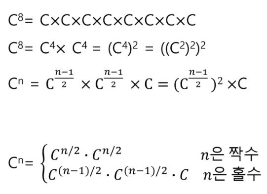
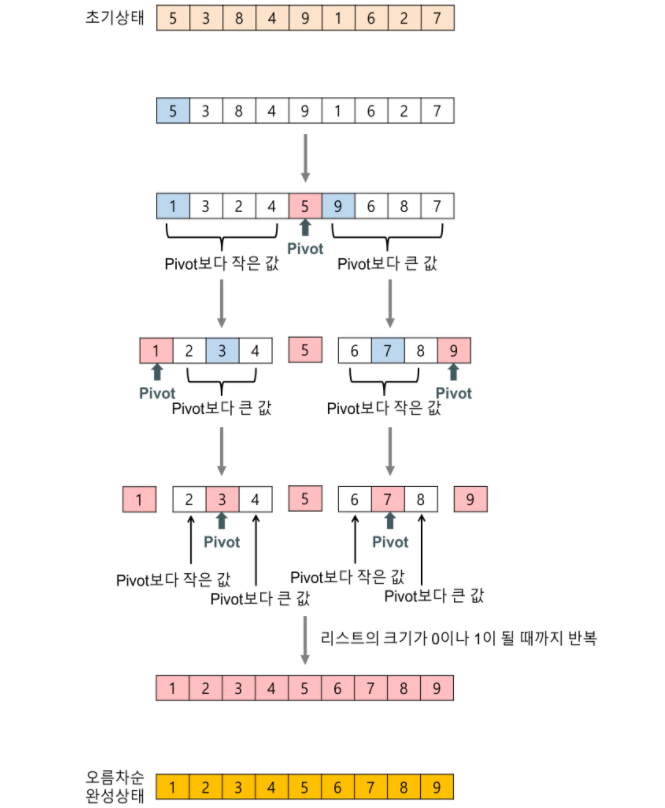

# Algorithms_05

## 스택(Stack) II

### 계산기(Calculator)

-   문자열로 된 계산식이 주어질 때, 스택을 이용하여 이 계산식의 값을 계산할 수 있다.
-   문자열 수식 계산의 일반적 방법
    1.   **중위 표기법**의 수식을 **후위 표기법으로 변경**한다. (스택 이용)
         1.   입력받은 중위 표기식에서 토큰을 읽는다.
         2.   **토큰이 피연산자**이면 토큰을 출력한다.
         3.   **토큰이 연산자(괄호포함)일 때**, 이 토큰이 스택의 top에 저장되어 있는 연산자보다 우선순위가 높으면 스택에 push하고, 그렇지 않다면 스택 top의 연산자의 우선순위가 토큰의 우선순위보다 작을 때까지 스택에서 pop 한 후 토큰의 연산자를 push한다. 만약 top에 연산자가 없으면 push한다.
         4.   토큰이 오른쪽 괄호 `)`이면 스택 top에 왼쪽 괄호 `(`가 올 때까지 스택에 pop 연산을 수행하고 pop한 연산자를 출력한다. 왼쪽 괄호를 만나면 pop만 하고 출력하지는 않는다.
         5.   중위 표기식에 더 읽을 것이 없다면 중지하고, 더 읽을 것이 있다면 a.부터 다시 반복한다.
         6.   스택에 남아있는 연산자를 모두 pop하여 출력한다.
    2.   후위 표기법의 수식을 스택을 이용하여 계산한다.

### 백트래킹(Backtracking)

-   백트래킹 기법은 해를 찾는 도중에 **막히면** 되돌아가서 다시 해를 찾아가는 기법이다.

-   백트래킹 기법은 **최적화(optimization) 문제**와 **결정(decision) 문제**를 해결할 수 있다.

-   대표적인 결정 문제

    -   미로찾기
    -   n-Queen

    ```python
    def checknode(v):
        if promising(v):
            if there is a solution a v:
                write the solution
            else:
                for w in each child of v:
                    checknode(w)
    ```

    -   Map coloring
    -   부분 집합의 합

-   백트래킹과 DFS의 차이

    -   어떤 노드에서 출발하는 경로가 해결책으로 이어질 것 같지 않으면 더 이상 그 경로를 따라가지 않음으로써 시도횟수를 줄임 (**Pruning, 가지치기**)
    -   `N!` 경우의 수를 가진 문제에 DFS를 이용하면 당연히 처리 불가능
    -   백트래킹을 적용하면 일반적으로 경우의 수가 줄어들지만 최악의 경우 여전히 지수함수적 시간(**Exponential Time**)을 요하므로 처리 불가능

### 부분집합(Subset)

-   어떤 집합의 공집합과 자기자신을 포함한 모든 부분집합을 powerset이라고 하며, 구하고자 하는 어떤 집합의 원소 개수가 n일 경우 부분집합의 개수는 `2^n`개

-   백트래킹 기법으로 powerset 구하기

    -   n개의 원소가 들어있는 집합의 `2^n`개의 부분집합을 만들 때는, `True` 또는 `False`값을 가지는 항목들로 구성된 n개의 배열을 만드는 방법을 이용
    -   여기서 배열의 i번째 항목은 i번째의 원소가 부분집합의 값인지 아닌지를 나타내는 값이다.

    ```python
    def backtrack(a, k, input):
        global MAXCANDIDATES
        c = [0] * MAXCANDIDATES
        
        if k == input:
            process_solution(a, k)  # 답이면 원하는 작업을 수행
        else:
            k += 1
            ncandidates = construct_candidates(a, k, input, c)
            for i in range(ncandidates):
                a[k] = c[i]
                backtrack(a, k, input)
                
    def construct_candidates(a, k, input, c):
        c[0] = True
        c[1] = False
        return 2
    
    MAXCANDIDATES = 2
    NMAX = 4
    a = [0] * NMAX
    backtrack(a, 0, 3)
    ```

### 분할정복(Divide and Conquer)

-   유래

    -   1805년 12월 2일 아우스터리츠 전투에서 나폴레옹이 사용한 전략
    -   전력이 우세한 연합군을 공격하기 위해 나폴레옹은 연합군의 중앙부로 쳐들어가 연합군을 둘로 나눔
    -   둘로 나뉜 연합군을 한 부분씩 격파함

-   설계전략

    -   **분할(Divide)**: 해결할 문제를 여러 개의 작은 부분으로 나눈다.
    -   **정복(Conquer)**: 나눈 작은 문제를 각각 해결한다.
    -   **결합(Combine)**: (필요하다면) 해결된 해답을 모은다.

-   거듭 제곱(Exponentiation)

    -   `O(n)`

    ```python
    def Power(Base, Exponent):
        if Base == 0:
            return 1
        result = 1  # Base^0은 1이므로
        for i in range(Exponent):
            result *= Base
        return result
    ```

    -   분할정복 알고리즘: `O(log n)`

    

    ```python
    def Power(Base, Exponent):
        if Exponent == 0 or Base == 0:
            return 1
        
        if Exponent % 2 == 0:
            NewBase = Power(Base, Exponent/2)
            return NewBase * NewBase
        else:
            NewBase = Power(Base, (Exponent-1)/2)
            return (NewBase * NewBase) * Base
    ```

### 퀵 소트(Quick Sort)



-   주어진 배열을 두 개로 분할하고, 각각을 정렬한다.
-   **머지 소트(Merge Sort)**와 다른점
    -   **머지 소트**는 그냥 두 부분으로 나누는 반면, **퀵 소트**는 분할할 때, 기준 아이템(pivot item) 중심으로, 이보다 작은 것은 왼편, 큰 것은 오른편에 위치시킨다.
    -   각 부분 정렬이 끝난 후, 머지 소트는 **합병**이라는 후처리 작업이 필요하나, 퀵 소트는 필요로 하지 않는다.

```python
def quickSort(a, begin, end):
    if begin < end:
        p = partition(a, begin, end)
        quickSort(a, begin, p-1)
        quickSort(a, p+1, end)
        
def partition(a, begin, end):
    pivot = (begin + end) // 2
    L = begin
    R = end
    while L < R:
        while(L<R and a[L] < a[pivot]): L += 1
        while(L<R and a[R] >= a[pivot]): R -= 1
        if L < R:
            if L == pivot: pivot = R
            a[L], a[R] = a[R], a[L]
    a[pivot], a[R] = a[R], a[pivot]
    return R
```

- 시간 복잡도: `O(nlog n)`
- **unstable sort**이다.