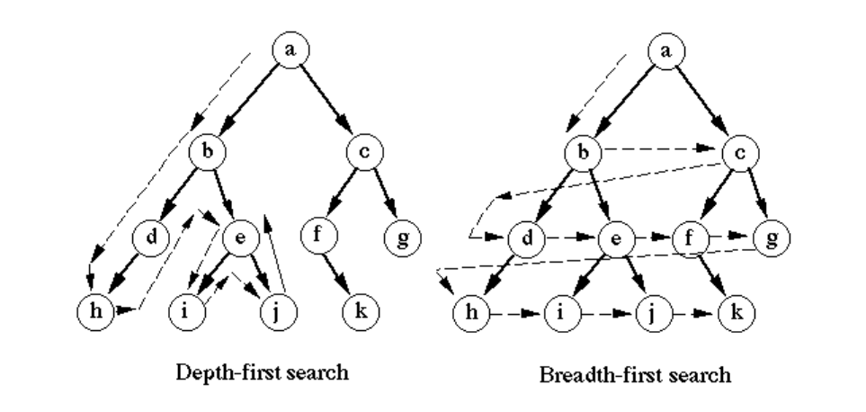

# Algorithms_06

## 큐(Queue)

-   큐(Queue)의 특성
    -   스택과 마찬가지로 삽입과 삭제의 위치가 제한적인 자료구조
        -   큐의 뒤에서는 삽입만 하고, 큐의 앞에서는 삭제만 이루어지는 구조
    -   **선입선출(First-In-First-Out)**
    -   큐의 기본 연산
        -   삽입: `enQueue`
        -   삭제: `deQueue`

```python
class Queue:
    def __init__(self, *args):
        self.items = list(args)
    
    def peek(self):
        return self.items[0]
    
    def enqueue(self, item):
        self.items.append(item)
        
    def dequeue(self):
        if self.isEmpty():
            raise ValueError('Queue is empty')
        else:
            item = self.items[0]
            self.items.pop(0)
            return item
    
    def isEmpty(self):
        return not self.items
    
    def __str__(self):
        return f'Front -> {self.items} <- Rear'
```

### 선형 큐

-   1차원 배열을 이용한 큐
    -   큐의 크기 = 배열의 크기
    -   front: 저장된 첫 번째 원소의 인덱스, 가장 최근 꺼내진 위치
    -   rear: 저장된 마지막 원소의 인덱스, 가장 최근 저장된 위치
-   상태 표현
    -   초기 상태: front = rear = -1
    -   공백 상태: front == rear
    -   포화 상태: rear == n-1
-   선형 큐 이용시의 문제점
    -   잘못된 포화상태 인식
        -   선형 큐를 이용하여 원소의 삽입과 삭제를 계속할 경우, **배열의 앞부분에 활용할 수 있는 공간이 있음에도 불구**하고, `rear = n-1`인 상태, 즉, **포화상태로 인식하여 더 이상의 삽입을 수행하지 않게 됨**
    -   해결방법 1
        -   매 연산이 이루어질 때마다 저장된 원소들을 배열의 앞부분으로 모두 이동시킴
        -   원소 이동에 많은 시간이 소요되어 큐의 효율성이 급격히 떨어짐
    -   해결방법 2
        -   1차원 배열을 사용하되, 논리적으로는 배열의 처음과 끝이 연결되어 원형 형태의 큐를 이룬다고 가정하고 사용

### 원형 큐

-   초기 공백 상태
    -   front = rear = 0
-   Index의 순환
    -   front와 rear의 위치가 배열의 마지막 인덱스인 n-1를 가리킨 후, 그 다음에는 논리적 순환을 이루어 배열의 처음 인덱스인 0으로 이동해야 함
    -   이를 위해 나머지 연산자 mod를 사용
-   front 변수
    -   공백 상태와 포화 상태 구분을 쉽게 하기 위해 front가 있는 자리는 사용하지 않고 항상 빈자리로 둠

|         | 삽입 위치               | 삭제 위치                 |
| ------- | ----------------------- | ------------------------- |
| 선형 큐 | rear = rear + 1         | front = front + 1         |
| 원형 큐 | rear = (rear + 1) mod n | front = (front + 1) mod n |

### 우선순위 큐

-   우선순위를 가진 항목들을 저장하는 큐
-   FIFO 순서가 아니라 우선순위가 높은 순서대로 먼저 나가게 된다.
-   적용 분야
    -   시뮬레이션 시스템
    -   네트워크 트래픽 제어
    -   운영체제의 태스크 스케줄링

### 큐의 활용

#### 버퍼

-   데이터를 한 곳에서 다른 곳으로 전송하는 동안 일시적으로 그 데이터를 보관하는 메모리의 영역
-   버퍼링: 버퍼를 활용하는 방식 또는 버퍼를 채우는 동작을 의미
-   버퍼는 일반적으로 입출력 및 네트워크와 관련된 기능에서 이용된다.
-   순서대로 입력/출력/전달되어야 하므로 FIFO 방식의 자료구조인 큐가 활용된다.

### BFS(Breadth First Search)



-   너비우선탐색은 탐색 시작점의 인접한 정점들을 먼저 모두 차례로 방문한 후에, 방문했던 정점을 시작점으로 하여 다시 인접한 정점들을 차례로 방문하는 방식
-   인접한 정점들에 대해 탐색한 후, 차례로 다시 너비우선탐색을 진행해야 하므로, 선입선출 형태의 자료구조인 큐를 활용