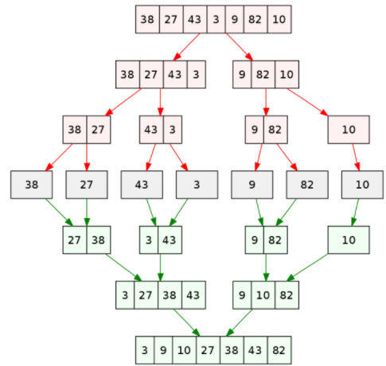
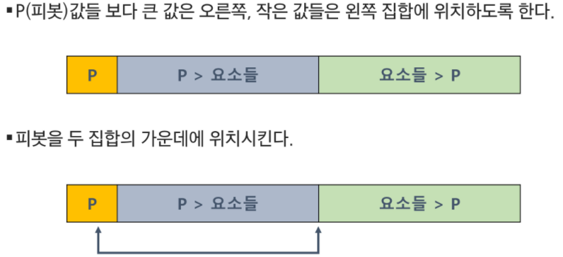
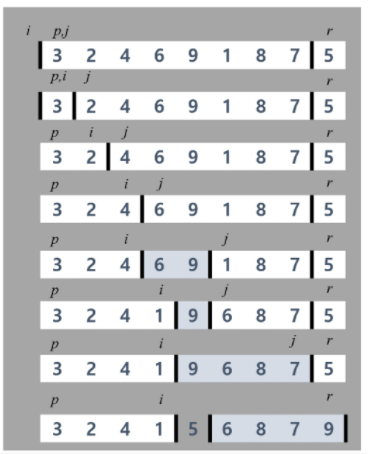

# Algorithms_07

## 분할정복(Divide and Conquer)

### 병합 정렬(Merge Sort)

-   여러 개의 정렬된 자료의 집합을 병합하여 한 개의 정렬된 집합으로 만드는 방식
-   분할 정복 알고리즘 활용
    -   자료를 최소 단위의 문제까지 나눈 후 정렬하여 최종 결과를 도출
    -   Top-down 방식
-   시간 복잡도: `O(n log n)`

-   분할 단계: 전체 자료 집합에 대해, 최소 크기의 부분집합이 될 때까지 분할
-   병합 단계: 2개의 부분집합을 정렬하면서 하나의 집합으로 병합



#### Implementation

```pseudocode
mergeSort(LIST m)
	IF length(m) == 1: RETURN m
	
	LIST left, right
	middle = length(m) // 2
	FOR x in m before middle
		add x to left
	FOR x in m after or equal middle
		add x to right
		
	left = mergeSort(left)
	right = mergeSort(right)
	
	RETURN merge(left, right)
	
merge(LIST left, LIST right)
	LIST result
	
	WHILE length(left) > 0 OR length(right) > 0
		IF length(left) > 0 AND length(right) > 0
			IF first(left) <= first(right)
				append popfirst(left) to result
			ELSE
				append popfirst(right) to result
		ELIF length(left) > 0
			append popfirst(left) to result
		ELIF length(right) > 0
			append popfirst(right) to result
	RETURN result
```


### 퀵 정렬(Quick Sort)

-   주어진 배열을 두 개로 분할하고, 각각을 정렬한다.
-   병합 정렬과 다른 점
    -   병합 정렬은 그냥 두 부분으로 나누는 반면, 퀵 정렬은 분할할 때, pivot item 중심으로 이보다 작은 것은 왼편, 큰 것은 오른편에 위치시킨다.
    -   각 부분 정렬이 끝난 후, 병합 정렬은 병합이라는 후처리가 필요하나, 퀵 정렬은 그렇지 않다.
-   시간 복잡도: `O(n log n)`
-   그러나, pivot을 어떻게 잡느냐에 따라 최악의 경우 `O(n^2)`

#### Implementation

```pseudocode
quickSort(A[], l, r)
	if l < r
		s = partition(A[], l, r)
		quickSort(A[], l, s - 1)
		quickSort(A[], s + 1, r)
```

#### Hoare-Partition Algorithm



```pseudocode
/* Hoare-Partition Algorithm */
partition(A[], l, r)
	p = A[l]  /* p: pivot */
	i, j = l, r
	WHILE i <= j
		WHILE i < j and A[j] <= p: i++
		WHILE i < j and A[j] >= p: j--
		IF i < j: swap(A[i], A[j])
		
	swap(A[l], A[j])
	RETURN j
```

#### Lomuto-Partition Algorithm



```pseudocode
partition(A[], p, r)
	x = A[r]
	i = p - 1
	
	FOR j in (p, r-1)
		IF A[j] <= x
			i++, swap(A[i], A[j])
			
	swap(A[i+1], A[r])
	RETURN i + 1
```


### 이진 탐색(Binary Search)

-   자료의 가운데에 있는 항목의 키 값과 비교하여 다음 검색의 위치를 결정하고 검색을 계속 진행하는 방법
    -   목적 키를 찾을 때까지 이진 탐색을 반복 수행함으로써 검색 범위를 반으로 줄여 보다 빠르게 검색
-   자료가 정렬된 상태여야 한다.
-   시간 복잡도: `O(log n)`

```python
def binarySearch(arr):
    left = 0
    right = len(arr) - 1
    
    while left <= right:
        mid = (left + right) // 2
        
        if arr[mid] == key:
            return mid
        elif arr[mid] > key:
            right = mid - 1
        else:
            left = mid + 1
            
    return
```

```python
def binarySearch(arr, left, right, key):
    if left > right:
        return
    else:
        mid = (left + right) // 2
        if arr[mid] == key:
            return mid
        elif arr[mid] > key:
            return binarySearch(arr, left, mid - 1, key)
        else:
            return binarySearch(arr, mid + 1, right, key)
```


## 백트래킹(Backtracking)

-   어떤 노드에서 출발하는 경로가 해결책으로 이어질 것 같지 않으면 더 이상 그 경로를 따라가지 않음으로써 시도의 횟수를 줄임. (**Pruning**)
-   깊이 우선 탐색이 모든 경로를 추적하는데 비해 백트래킹은 불필요한 경로를 초기에 차단

### N-Queen

-   8-Queen 문제
    -   퀸 8개를 8 x 8 체스판 안에 서로를 공격할 수 없도록 배치하는 모든 경우의 수를 구하는 문제
-   후보 해의 수: 64C8 = 4,426,165,368
-   실제 해의 수: 이 중 실제 해는 92개


