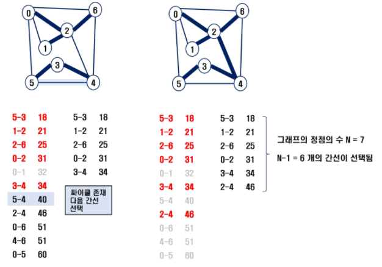

# Algorithms_08

## 최소 신장 트리(Minimum Spanning Tree)


-   그래프에서 **최소 비용 문제**
    1.   모든 정점을 연결하는 간선들의 가중치의 합이 최소가 되는 트리
    2.   두 정점 사이의 최소 비용의 경로 찾기
-   신장 트리
    -   n개의 정점으로 이루어진 무향 그래프에서 n개의 정점과 n-1개의 간선으로 이루어진 트리
-   최소 신장 트리(Minimum Spanning Tree)
    -   무향 가중치 그래프에서 신장 트리를 구성하는 간선들의 가중치의 합이 최소인 신장 트리


### Prim Algorithm


-   **하나의 정점에서 연결된 간선들 중 하나씩 선택하면서 MST를 만들어가는 방식**
    1.   임의의 정점을 하나 선택
    2.   선택한 정점과 인접하는 정점들 중 최소 비용의 간선이 존재하는 정점 선택
    3.   모든 정점이 선택될 때까지 i.와 ii. 반복
-   서로소인 2개의 집합(2 disjoint-sets) 정보를 유지
    -   트리 정점들(tree vertices) - MST를 만들기 위해 선택된 정점들
    -   비트리 정점들(nontree vertices) - 선택되지 않은 정점들

#### Implementation

```pseudocode
MST_PRIM(Graph, s)
	FOR u in Graph.V
		u.key = INF		/* u.key: u에 연결된 간선 중 최소 가중치 */
		u.parent = NULL
	s.key = 0
	PQ <- Graph.V		/* 우선순위 큐에 모든 정점을 넣는다. */
	WHILE PQ:
		u = Extract_MIN(PQ)	/* key 값이 가장 작은 정점 가져오기 */
		FOR v in G.adj[u]
			IF v in PQ AND w(u, v) < v.key
				v.parent = u
				v.key = w(u, v)
```


### Kruskal Algorithm




-   **간선을 하나씩 선택해서 MST를 찾는 알고리즘**
    1.   최초, 모든 간선을 가중치에 따라 오름차순으로 정렬
    2.   가중치가 가장 낮은 간선부터 선택하면서 트리를 증가시킴
         -   사이클이 존재하면 다음으로 가중치가 낮은 간선 선택
    3.   n-1개의 간선이 선택될 때까지 ii.를 반복

#### Implementation

```python
def find(v):
    if parents[v] != v:
        parents[v] = find(parents[v])
    return parents[v]


def union(v1, v2):
    a = find(v1)
    b = find(v2)

    if a < b:
        parents[b] = a
    else:
        parents[a] = b


def kruskal():
    global min_cost

    for i in range(len(edges)):
        a, b, c = edges[i]

        if find(a) != find(b):
            union(a, b)
            min_cost += c


edges = []

for _ in range(9):
    a, b, c = map(int, input().split())
    edges.append((a, b, c))

parents = [i for i in range(11)]
min_cost = 0

edges.sort(key=lambda x: x[2])
kruskal()
```


## 최단 경로

-   간선의 가중치가 있는 그래프에서 두 정점 사이의 경로들 중 간선의 가중치의 합이 최소인 경로

-   하나의 시작 정점에서 다른 정점까지의 최단경로
    -   **다익스트라(Dijkstra) 알고리즘**
        -   음의 가중치가 있는 경우 불가능
    -   **벨만-포드(Bellman-Ford) 알고리즘**
        -   음의 가중치가 있는 경우도 가능
    
-   모든 정점 쌍에 대한 최단 경로
    -   **플로이드-워셜(Floyd-Warshall) 알고리즘**
    
        ```python
        def floyd():
            for m in range(1, n+1):
                for s in range(1, n+1):
                    for e in range(1, n+1):
                        if dist[s][e] > dist[s][m] + dist[m][e]:
                            dist[s][e] = dist[s][m] + dist[m][e]
        
                
        dist = [[float('inf')] * (n+1) for _ in range(n+1)]
        
        for i in range(1, n+1):
            dist[i][i] = 0
        
        floyd()
        ```


### Dijkstra Algorithm

-   시작 정점에서 거리가 최소인 정점을 선택해 나가면서 최단 경로를 구하는 방식
-   시작 정점(s)에서 끝 정점(t)까지의 최단 경로에 정점 x가 존재한다.
-   이 때, **최단 경로는 s에서 x까지의 최단 경로와 x에서 t까지의 최단경로의 합**
-   Greedy에 속하는 알고리즘으로 MST의 Prim Algorithm과 유사하다.
-   **일종의 BFS**

#### Implementation

```python
from heapq import *

def dijkstra(s):
    dist = [float('inf')] * n
    heap = []
    dist[s] = 0
    heappush(heap, (dist[s], s))

    while heap:
        dst, now = heappop(heap)

        if dist[now] < dst:
            continue

        for nxt, weight in graph[now]:
            shortest = dist[now] + weight
            if shortest < dist[nxt]:
                dist[nxt] = shortest
                heappush(heap, (dist[nxt], heap))

    return dist
```


