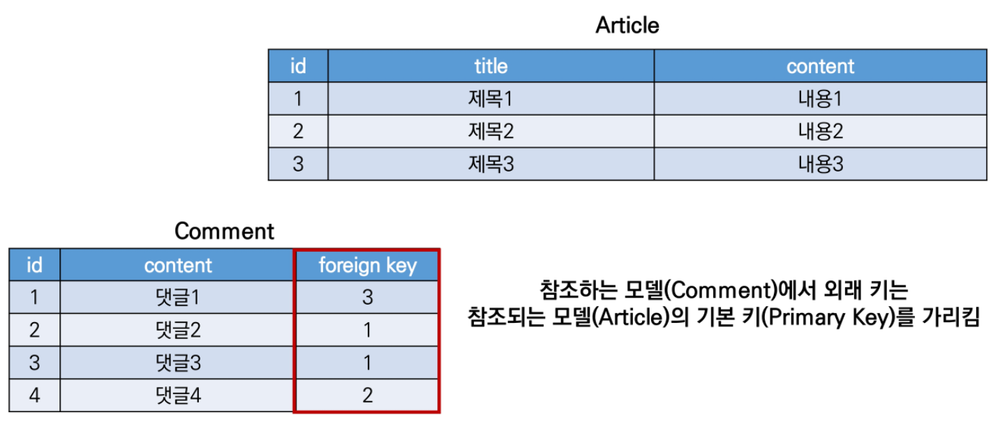
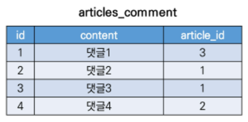

# Django_06

## Foreign Key

-   외래키 (외부키)

-   관계형 데이터베이스에서 한 테이블의 필드 중 다른 테이블의 행을 식별할 수 있는 키

-   참조하는 테이블에서 속성(필드)에 해당하고, 이는 참조되는 테이블의 기본키(Primary Key)를 가리킴

-   참조하는 테이블의 외래 키는 참조되는 테이블 행 1개에 대응됨

    -   이 때문에 참조하는 테이블에서 참조되는 테이블의 존재하지 않는 행을 참조할 수 없음

-   참조하는 테이블의 행 여러 개가 참조되는 테이블의 동일한 행을 참조할 수 있다.

-   **e.g., 게시글(Article)과 댓글(Comment) 간의 모델 관계 설정**

    

-   특징

    -   키를 사용하여 부모 테이블의 유일한 값을 참조 (참조 무결성)
    -   **외래 키의 값이 반드시 부모 테이블의 기본 키일 필요는 없지만 유일한 값이어야 함**
    -   [참고] 참조 무결성
        -   데이터베이스 관계 모델에서 관련된 2개의 테이블 간의 일관성을 말함
        -   **외래 키가 선언된 테이블의 왜리 키 속성(열)의 값은 그 테이블의 부모 테이블의 기본 키 값으로 존재해야 함**

>   ForeignKeyField

-   A many-to-one relationship

-   2개의 위치 인자가 반드시 필요

    1.   참조하는 model class
    2.   `on_delete` 옵션

-   migrate 작업 시 필드 이름에 _id를 추가하여 데이터베이스 열 이름을 만듦

-   [참고] 재귀 관계 (자신과 1:N)

    ```python
    models.ForeignKey('self', on_delete=models.CASCADE)
    ```

```python
# articles/models.py

class Comment(models.Model):
    article = models.ForeignKey(Article, on_delete=models.CASCADE)
    content = models.CharField(max_length=200)
    created_at = models.DateTimeField(auto_now_add=True)
    updated_at = models.DateTimeField(auto_now=True)
```

-   **on_delete**
    -   외래 키가 참조하는 객체가 사라졌을 때 외래 키를 가진 객체를 어떻게 처리할 지를 정의
    -   Database Integrity(데이터 무결성)을 위해서 매우 중요한 설정
    -   옵션에 사용 가능한 값들
        -   **CASCADE:** 부모 객체(참조된 객체)가 삭제됐을 때 이를 참조하는 객체도 삭제
        -   PROTECT
        -   SET_NULL
        -   SET_DEFAULT
        -   SET()
        -   DO_NOTHING
        -   RESTRICT
-   **related_name**
    -   역참조 시 사용할 이름(`model_set` manager)을 변경할 수 있는 옵션
    -   `related_name='comments'`와 같이 변경하면 article.comment_set은 더이상 사용할 수 없고, `article.comments`로 대체됨
    -   [주의] 역참조 시 사용할 이름 수정 후, migration 과정 필요
-   [참고] 데이터 무결성
    -   데이터의 정확성과 일관성을 유지하고 보증하는 것을 가리키며, 데이터베이스나 RDBMS 시스템의 중요한 기능
    -   무결성 제한의 유형
        1.   개체 무결성 (Entity Integrity)
             -   PK의 개념과 관련
             -   모든 테이블이 PK를 가져야 하며 PK로 선택된 열은 고유한 값이어야 하고 빈 값은 허용치 않음
        2.   참조 무결성 (Referential Integrity)
             -   FK(외래 키) 개념과 관련
             -   FK 값이 데이터베이스의 특정 테이블의 PK 값을 참조하는 것
        3.   범위(도메인) 무결성 (Domain Integrity)
             -   정의된 형식(범위)에서 관계형 데이터베이스의 모든 컬럼이 선언되도록 규정

>   데이터베이스의 ForeignKeyField 표현

-   만약 ForeignKey 인스턴스를 abcd로 생성했다면 `abcd_id`로 만들어짐
-   명시적인 모델 관계 파악을 위해 참조하는 클래스 이름의 소문자(단수형)로 작성하는 것이 바람직함 (1:N)



>   1:N 관계 related manager

-   역참조 (`comment_set`)
    -   Article(1) -> Comment(N)
    -   `article.comment` 형태로는 사용할 수 없고, `article.comment_set` manager가 생성됨
    -   게시글에 몇 개의 댓글이 작성되었는지 django ORM이 보장할 수 없기 때문
        -   article은 comment가 있을 수도, 없을 수도 있음
        -   **실제로 Article 클래스는 Comment 와의 어떠한 관계도 작성되어 있지 않음**
-   참조(`article`)
    -   Comment(N) -> Article(1)
    -   댓글의 경우 어떠한 댓글이든 반드시 자신이 참조하고 있는 게시글이 있으므로, `comment.article`과 같이 접근가능
    -   실제 ForeignKey 또한 Comment 클래스에서 작성됨


### Comment CREATE

```python
# articles/forms.py

from .models import Article, Comment


class CommentForm(forms.ModelForm):
    
    class Meta:
        model = Comment
        exclude = ('article',)
```

```python
# articles/urls.py
from django.urls import path

app_name = 'articles'

urlpatterns = [
    path('<int:pk>/comment/', views.comment_create, name='comment_create'),
]
```

```python
# articles/views.py

@require_POST
def comment_create(request, pk):
    article = get_object_or_404(Article, pk=pk)
    comment_form = CommentForm(request.POST)
    if comment_form.is_valid():
        comment = comment_form.save(commit=False)
        comment.article = article
        comment.save()
    return redirect('articles:detail', article.pk)
```

-   The `save()` method
    -   save(commit=False)
        -   Create, but don't save the new instance
        -   아직 **데이터베이스에 저장되지 않은 인스턴스를 반환**
        -   저장하기 전에 **객체에 대한 사용자 지정 처리를 수행할 때** 유용하게 사용


### Comment READ

-   특정 article에 있는 모든 댓글을 가져온 후 context에 추가

```python
# articles/views.py

@require_safe
def detail(request, pk):
    article = get_object_or_404(Article, pk=pk)
    comment_form = CommentForm()
    comments = article.comment_set.all()
    context = {
        'article': article,
        'comment_form': comment_form,
        'comments': comments,
    }
    return render(request, 'articles/detail.html', context)
```


### Comment DELETE

```python
# articles/urls.py
from django.urls import path

app_name = 'articles'

urlpatterns = [
    path('<int:pk>/comment/', views.comment_create, name='comment_create'),
    path('<int:article_pk>/comment/<int:comment_pk>/delete/', views.comment_delete, name='comment_delete'),
]
```

```python
# articles/views.py

@require_POST
def comment_delete(request, article_pk, comment_pk):
    comment = get_object_or_404(Comment, pk=comment_pk)
    comment.delete()
    return redirect('articles:detail', article_pk)
```


## Customizing authentication in Django

### Substituting a custom User model

>   User 모델 대체하기

-   일부 프로젝트에서는 django의 내장 **User 모델이 제공하는 인증 요구사항이 적절하지 않을 수 있음**
    -   e.g., username 대신 email을 식별 토큰으로 사용하는 것이 더 적합한 사이트
-   django는 User를 참조하는데 사용하는 `AUTH_USER_MODEL` 값을 제공하여, default user model을 **재정의(override)** 할 수 있도록 함
-   django는 새 프로젝트를 시작하는 경우 기본 사용자 모델이 충분하더라도, **커스텀 유저 모델을 설정하는 것을 강력하게 권장 (highly recommended)**
    -   **단, 프로젝트의 모든 migrations 혹은 첫 migrate를 실행하기 전에 이 작업을 마쳐야 함**

>   AUTH_USER_MODEL

-   User를 나타내는데 사용하는 모델
-   프로젝트가 **진행되는 동안 변경할 수 없음**
-   프로젝트 시작 시 설정하기 위한 것이며, 참조하는 모델은 첫번째 마이그레이션에서 사용할 수 있어야 함
-   default: `auth.User` (auth 앱의 User 모델)
-   [참고] 프로젝트 중간(mid-project)에 AUTH_USER_MODEL 변경하기
    -   모델 관계에 영향을 미치기 때문에 훨씬 더 어려운 작업이 필요
    -   즉, 중간 변경은 권장하지 않으므로 초기에 설정하는 것을 권장

>   Custom User 모델 정의하기

-   관리자 권한과 함께 완전한 기능을 갖춘 User 모델을 구현하는 기본 클래스인 AbstractUser를 상속받아 새로운 User 모델 작성

```python
# accounts/models.py

from django.contrib.auth.models import AbstractUser


class User(AbstractUser):
    pass

# settings.py

AUTH_USER_MODEL = 'accounts.User'

# accounts/admin.py

from django.contrib import admin
from django.contrib.auth.admin import UserAdmin
from .models import User

admin.site.register(User, UserAdmin)
```


### Custom user & Built-in auth forms

-   빌트인 User 모델을 사용하기 때문에 커스텀 User 모델로 다시 작성하거나 확장해야 하는 forms
    -   `UserCreationForm`
    -   `UserChangeForm`

```python
# accounts/forms.py

from django.contrib.auth.forms import UserChangeForm, UserCreationForm


class CustomUserCreationForm(UserCreationForm):
    
    class Meta(UserCreationForm.Meta):
        model = get_user_model()
        fields = UserCreationForm.Meta.fields + ('email',)
```

>   get_user_model()

-   현재 프로젝트에서 활성화된 사용자 모델(active user model)을 반환
    -   User 모델을 커스터마이징한 상황에서는 Custom User모델을 반환
-   이 때문에 django는 User 클래스를 직접 참조하는 대신 `django.contrib.auth.get_user_mdoel()`을 사용하여 참조하는 것을 권장
