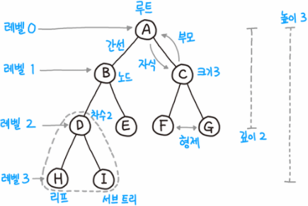

# 자료구조(DataStructure)_03

## 트리(Tree)

-   **비선형** 구조
-   원소들 간 1:N 관계를 가지는 자료구조
-   원소들 간에 계층관계를 가지는 계층형 자료구조
-   상위 원소에서 하위 원소로 내려가면서 확장되는 트리(나무)모양의 구조
-   **그래프와 트리의 차이점**
    -   트리는 순환 구조를 갖지 않는 그래프
    -   Root 제외 모든 노드는 부모가 하나
    -   단 한 개의 Root를 가짐
-   **한 개 이상의 노드로 이루어진 유한 집합이며 다음 조건을 만족한다**
    -   노드 중 최상위 노드를 `root`라고 한다.
    -   나머지 노드들은 n개의 분리 집합 T1, ..., TN으로 분리될 수 있다. (**Subtree**)



-   **차수**
    -   노드의 차수: 노드에 연결된 자식 노드의 수
    -   트리의 차수: 트리에 있는 노드의 차수 중에서 가장 큰 값
    -   단말 노드(리프 노드): 차수가 0인 노드. 자식 노드가 없는 노드
-   **높이**
    -   노드의 높이: 루트에서 노드에 이르는 간선의 수. 노드의 레벨
    -   트리의 높이: 트리에 있는 노드의 높이 중에서 가장 큰 값. 최대 레벨

## 이진 트리(Binary Tree)

-   **모든 노드들이 2개의 서브트리를 갖는 특별한 형태의 트리**
-   **각 노드가 자식 노드를 최대한 2개까지만 가질 수 있는 트리**
    -   왼쪽 자식 노드(Left child node)
    -   오른쪽 자식 노드(Right child node)
-   레벨 i에서의 노드의 최대 개수는 `2^i`개
-   높이가 h인 이진 트리가 가질 수 있는 노드의 최소 개수는 `(h+1)`개가 되며, 최대 개수는 `(2^(h+1)-1)`개가 된다.

### 포화 이진 트리(Full Binary Tree)

-   모든 레벨에 노드가 포화상태로 차 있는 이진 트리
-   루트를 1번으로 하여 정해진 위치에 대한 노드 번호를 가짐

### 완전 이진 트리(Complete Binary Tree)

-   높이가 h이고 노드 수가 n개일 때, 포화 이진 트리의 노드 번호 1번부터 n번까지 빈 자리가 없는 이진 트리

### 편향 이진 트리(Skewed Binary Tree)

-   높이 h에 대한 최소 개수의 노드를 가지면서 한쪽 방향의 자식 노드만을 가진 이진 트리

### 순회(traversal)

-   순회(traversal)란 트리의 각 노드를 중복되지 않게 전부 방문하는 것을 말하는데 **트리는 비선형 구조이기 때문에 선형구조에서와 같이 선후 연결 관계를 알 수 없다.**

-   **전위순회(preorder traversal): VLR**

    -   부모노드 방문 후, 자식노드를 좌, 우 순서로 방문한다.

        ```python
        def preorder_traverse(T):
        	if T:  # T is not none
                visit(T)
                preorder_traverse(T.left)
                preorder_traverse(T.right)
        ```

        

-   **중위순회(inorder traversal): LVR**

    -   왼쪽 자식노드, 부모노드, 오른쪽 자식노드 순으로 방문한다.

        ```python
        def inorder_traverse(T):
            if T:
                inorder_traverse(T.left)
                visit(T)
                inorder_traverse(T.right)
                
        ```

        

-   **후위순회(postorder traversal): LRV**

    -   자식노드를 좌우 순서로 방문한 후, 부모노드를 방문한다.

        ```python
        def postorder_traverse(T):
            if T:
                postorder_traverse(T.left)
                postorder_traverse(T.right)
                visit(T)
        ```

        

### 이진트리의 표현(배열)

-   **배열을 이용한 이진 트리의 표현**

    -   이진 트리에 각 노드 번호를 다음과 같이 부여 (완전이진트리)

    -   루트의 번호를 1로 설정

        

    -   노드 번호의 성질

        -   노드 번호가 i인 노드의 부모 노드: i // 2
        -   노드 번호가 i인 노드의 왼쪽 자식 노드: 2 * i
        -   노드 번호가 i인 노드의 오른쪽 자식 노드: 2 * i + 1
        -   레벨 n의 노드 시작 번호: 2^(n)

        

        

-   **부모 번호를 인덱스로 자식 번호를 저장**

    ```python
    for i in range(1, N+1):
        read p, c
        if c1[p] == 0:
            c1[p] = c
        else:
            c2[p] = c
    ```

    

-   **자식 번호를 인덱스로 부모 번호를 저장**

    ```python
    for i in range(1, N+1):
        read p, c
        parent[p] = p
    ```

    -   조상 찾기

    

-   **배열을 이용한 이진 트리 표현의 단점**

    -   **편향 이진 트리의 경우** 사용하지 않는 배열 원소에 대한 메모리 공간 낭비 발생
    -   **트리의 중간에 새로운 노드를 삽입하거나 기존 노드를 삭제할 경우** 배열의 크기 변경이 어려워 비효율적

​    

## 이진 탐색 트리(Binary Search Tree)

-   탐색작업을 효율적으로 하기 위한 자료구조
-   모든 원소는 서로 다른 유일한 키를 갖는다.
-   **key(left) < key(root) < key(right)**
-   중위 순회하면 오름차순으로 정렬된다.


-   이상적인 상황에서 탐색/삽입/삭제 모두 시간복잡도가 `O(log N)`이 된다.
-   다만, 값이 삽입되거나 삭제되는 경우에 따라 최악의 경우 `O(N)`의 시간이 걸린다.
    -   예를 들어, 비어있는 이진 탐색 트리에 1부터 100까지 순서대로 삽입한다면 처음 루트 노드는 1이 되고, 2는 1보다 크니 1의 오른쪽 자식이 되고, 3은 1보다 크니 1의 오른쪽, 2보다 크니 2의 오른쪽… 이런 식으로 트리의 오른쪽 끝으로만 계속 성장하게 된다.
    -   이 상태로 50을 찾는다고 하면 결국 1부터 순서대로 오른쪽으로 쭉 내려가는 선형 탐색과 다를 것이 없게 된다. 이러한 경우를 **트리가 편향(skew)되었다고 한다.**


## 힙(Heap)

-   **완전 이진 트리에** 있는 노드 중에서 **키값이 가장 큰 노드나 키값이 가장 작은 노드를 찾기 위해서 만든 자료구조**
-   최대 힙(max heap), 최소 힙(min heap)

### 데이터 삽입

1.   가장 끝의 자리에 노드를 삽입한다.
2.   그 노드와 부모 노드를 서로 비교한다.
3.   규칙에 맞으면 그대로 두고, 그렇지 않으면 부모와 교환한다.
4.   규칙에 맞을 때까지 3번 과정을 반복한다.


### 데이터 삭제

최댓값 혹은 최솟값이 저장된 루트 노드만 제거할 수 있다.

1.  루트 노드를 제거한다.
2.  루트 자리에 가장 마지막 노드를 삽입한다.
3.  올라간 노드와 그의 자식 노드(들)와 비교한다.
4.  조건에 만족하면 그대로 두고, 그렇지 않으면 자식과 교환한다.

-   최대 힙
    1.  부모보다 더 큰 자식이 없으면 교환하지 않고 끝낸다.
    2.  부모보다 더 큰 자식이 하나만 있으면 그 자식하고 교환하면 된다.
    3.  부모보다 더 큰 자식이 둘 있으면 자식들 중 큰 값과 교환한다.

-   최소 힙
    1.  부모보다 더 작은 자식이 없으면 교환하지 않고 끝낸다.
    2.  부모보다 더 작은 자식이 하나만 있으면 그 자식하고 교환하면 된다.
    3.  부모보다 더 작은 자식이 둘 있으면 자식들 중 작은 값과 교환한다.

5.   조건을 만족할 때까지 4의 과정을 반복한다.


