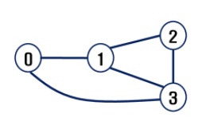
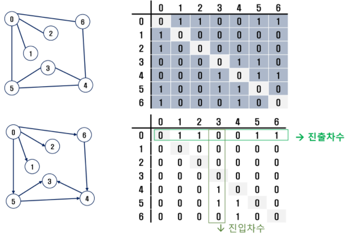

# 자료구조(DataStructure)_04

## 그래프(Graph)

-   그래프는 아이템(사물 또는 추상적 개념)들과 이들 사이의 연결 관계를 표현한다.
-   그래프는 **정점(Vertex)들의** 집합과 이들을 연결하는 **간선(Edge)들의** 집합으로 구성된 자료구조
    -   **V개의 정점을** 가지는 그래프는 최대 **V(V-1) / 2 개의 간선을** 그릴 수 있다.
-   선형 자료구조나 트리 자료구조로 표현하기 어려운 **N : N 관계를 가지는 원소들을 표현하기에** 용이하다.
-   **인접(Adjacency)**
    -   두 개의 정점에 간선이 존재하면 서로 인접해 있다고 한다.

### 그래프 유형

-   무향 그래프(Undirected Graph)

    

-   유향 그래프(Directed Graph)

    

-   가중치 그래프(Weighted Graph)

    

-   사이클 없는 방향 그래프(DAG, Directed Acyclic Graph)

    

-   완전 그래프

    -   정점들에 대해 가능한 모든 간선들을 가진 그래프

-   부분 그래프

    -   원래 그래프에서 일부의 정점이나 간선을 제외한 그래프

### 그래프 경로

-   경로 중 한 정점을 최대한 한번만 지나는 경로를 **단순경로라** 한다.
-   시작한 정점에서 끝나는 경로를 **사이클(Cycle)이라고** 한다.

### 그래프 표현

-   간선의 정보를 저장하는 방식, 메모리나 성능을 고려해 결정
-   인접 행렬(Adjacent matrix)
    -   V x V 크기의 2차원 배열을 이용해 간선 정보를 저장
    -   배열의 배열(포인터 배열)
-   인접 리스트(Adjacent List)
    -   각 정점마다 해당 정점으로 나가는 간선의 정보를 저장
-   간선의 배열
    -   간선(시작 정점, 끝 정점)을 배열에 연속적으로 저장

#### 인접 행렬(Adjacent matrix)

-   두 정점을 연결하는 간선의 유무를 행렬로 표현
-   V x V 정방 행렬
-   두 정점이 인접하면 1, 그렇지 않으면 0으로 표현
-   무향 그래프
    -   i번쨰 행의 합 = i번째 열의 합 = V_i의 차수
-   유향 그래프
    -   행 i의 합 = V_i의 진출 차수
    -   열 i의 합 = V_i의 진입 차수

#### 인접 리스트(Adjacent List)

-   각 정점에 대한 인접 정점들을 순차적으로 표현
-   하나의 정점에 대한 인접 정점들을 각각 노드로 하는 연결 리스트로 저장

