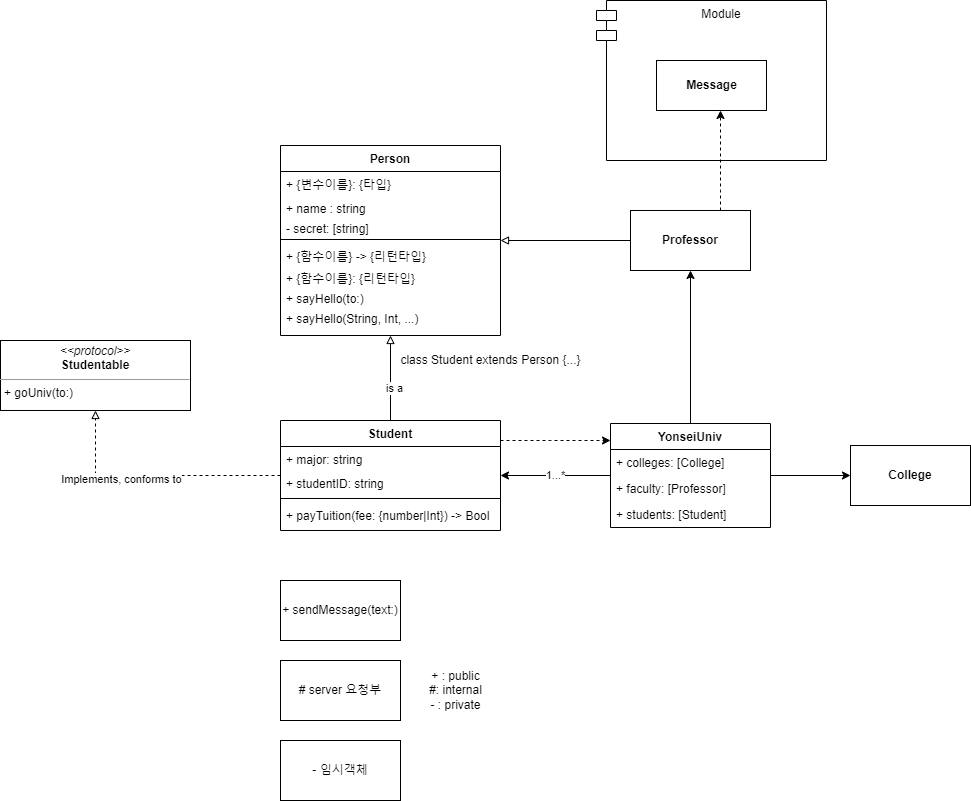

# DesignPattern_01

## Class Diagram

-   클래스 다이어그램은 구조 다이어그램으로 **클래스 내부 구성요소 및 클래스 간의 관계를 도식화하여 시스템의 특정 모듈이나 일부 및 전체를 구조화한다.**
-   시스템 내 클래스 간의 **의존성 파악과 팀원들 간 의사소통이 편리하다.**

### Elements

#### Class

-   클래스는 **이름, 속성(변수), 메서드 순으로 나열**
-   `+`: public, `#`: internal, `-`: private
-   `[*]`나 `[0...1]`은 리스트와 같은 변수에 지정된 사이즈를 뜻한다.
-   속성(변수)
    -   `{Access level} {field name}: {type}`

#### Stereo Type

-   인터페이스나 추상 클래스와 같은 요소를 표기하기 위해 `<<>>`와 같은 문법을 사용하는데 이를 **길러멧(guillemet)이라 한다.**
-   길러멧은 보통 인터페이스, enum, 추상 클래스 등에서 사용되지만 확장 클래스를 의미하는 데에도 사용될 수 있다.

#### Abstract Class

-   추상 클래스를 나타내는 방법은 총 3가지로 *Italic으로* 표시하거나 클래스 명에 {abstract}, 혹은 길러멧으로 표시할 수 있다.

### Class Relationship

