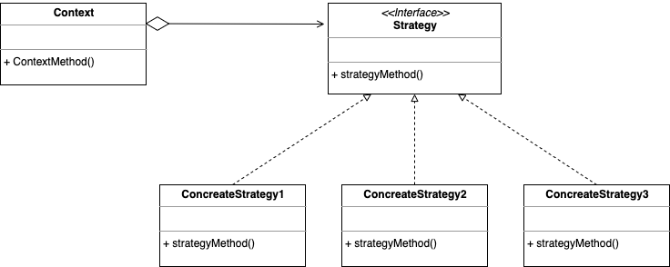
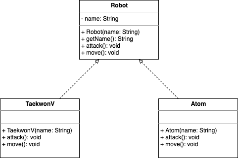
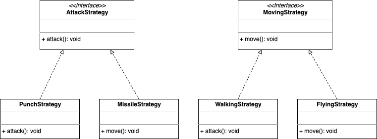
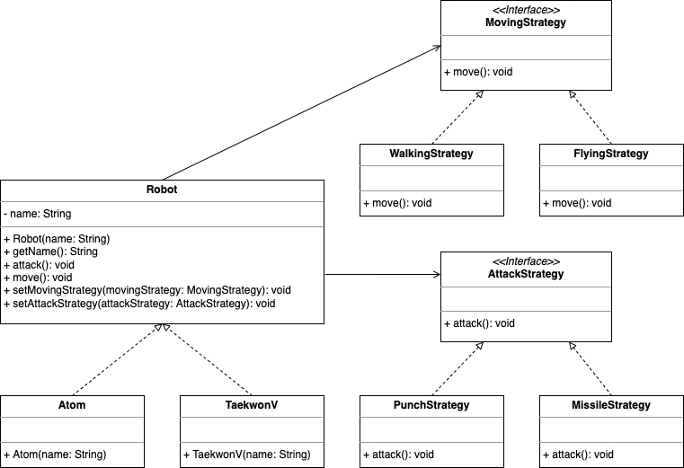
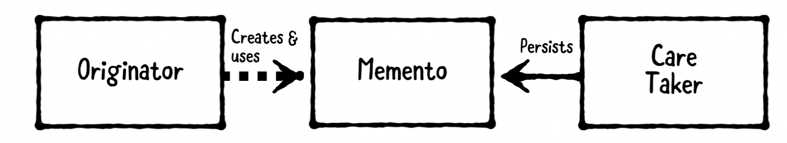

# Design Pattern_04

## Strategy Pattern

-   같은 문제를 해결하는 여러 알고리즘이 클래스별로 캡슐화되어 있고 이들이 필요할 때 교체할 수 있도록 함으로써 동일한 문제를 다른 알고리즘으로 해결할 수 있게 하는 패턴



-   **Strategy**
    -   인터페이스나 추상 클래스로 문제 해결 알고리즘을 호출하는 방법을 명시
-   **ConcreateStrategy**
    -   문제 해결 알고리즘을 실제로 구현한 클래스
-   **Context**
    -   Strategy pattern을 이용하는 역할 수행. 필요에 따라 동적으로 구체적인 전략을 바꿀 수 있도록 `setter` 메서드 제공


### 해결할 수 있는 문제상황

-   로봇을 만드는 상황을 생각해보자.



#### 구현

-   **`Robot` 추상 클래스**

    ```javascript
    class Robot {
        const name;
        
        constructor(name) {
            this.name = name;
        }
        
        const getName = function () {
            return name;
        }
        
        const attack = function () {};
    	const move = function () {};
    }
    ```

-   **`Atom` 구현 클래스**

    ```javascript
    class Atom extends Robot {
        constructor(name) {
            super(name);
        }
        
    	const attack = function () {
            console.log('Punch!');
        }
        
        const move = function () {
            console.log('Fly')
        }
    }
    ```

-   **`Client` 클래스**

    ```javascript
    class Client {
        const atom = new Atom('Atom');
    	
    	console.log('My name is ' + atom.getName());
    	atom.move();
    }
    ```

#### 문제점

-   새로운 기능 수정의 경우
    -   기존 로봇의 공격 또는 이동 방법을 수정할 때
        -   공격 방법과 관련이 없는 Atom 클래스를 수정해야함 (OCP(Open-Closed Principle) 원칙에 위배된다.)
    -   새로운 로봇을 만들고, 기존의 공격 또는 이동 방법을 추가하거나 수정할 때
        -   `Atom` 클래스의 move 메서드와 `TaekwonV` 클래스의 move 메서드 기능의 중복이 발생한다.

#### 해결방법

-   무엇이 변화되었는지에 중점을 둔다.
-   변화된 것을 **캡슐화**
    -   `move()`, `attack()`
-   구체적 이동 방식, 공격 방식을 담은 클래스를 은닉화
-   공격, 이동을 위한 인터페이스 생성, 실현할 클래스를 만듦




### 개선된 설계



| 클래스                          | 설명                                            |
| ------------------------------- | ----------------------------------------------- |
| Robot                           | 이동과 공격 메서드, 구체적인 로봇의 추상 클래스 |
| Atom, TaekwonV                  | Robot 클래스를 상속해 실제 로봇 구현            |
| `<<interface>>` AttackStrategy  | 각 로봇이 취할 수 있는 공격 방법 인터페이스     |
| PunchStrategy, MissileStrategy  | 각 공격 방법의 실제 구현                        |
| `<<interface>>` MovingStrategy  | 각 로봇이 취할 수 있는 이동 방법 인터페이스     |
| WalkingStrategy, FlyingStrategy | 각 이동 방법의 실제 구현                        |

-   새로운 공격, 이동 방법 추가시
    -   Robot 클래스의 변경을 차단
-   OCP 원칙을 만족
    -   새로운 기능 추가시, 기존 코드를 수정할 필요가 없음
-   클래스 외부에서 로봇 객체의 이동과 공격 방식을 변경할 수 있는 메서드를 `setter`를 통해 구현 가능

#### 구현

-   **`Robot` 추상 클래스**

    ```javascript
    class Robot {
        const name;
        const movingStrategy;
        const attackStrategy;
        
        constructor(name) {
            this.name = name;
        }
        
        const getName = function () {
            return name;
        }
    
    	const move = function () {
            movingStrategy.move();
        }
        
        const attack = function () {
            attackStrategy.attack();
        }
        
        const setMovingStrategy = function (movingStrategy) {
            this.movingStrategy = movingStrategy;
        }
        
        const setAttackStrategy = function (attackStrategy) {
            this.attackStrategy = attackStrategy;
        }
    }
    ```

-   **`Atom` 클래스**

    ```javascript
    class Atom extends Robot {
        constructor(name) {
            super(name);
        }
    }
    ```

-   **`MovingStrategy` 인터페이스**

    ```typescript
    interface MovingStrategy {
        const move = function () {};
    }
    ```

-   **`FlyingStrategy` 구현체**

    ```typescript
    class FlyingStrategy implements MovingStrategy {
        const move = function () {
            console.log('Fly!');
        }
    }
    ```

-   **`Client` 클래스**

    ```javascript
    class Client {
        const atom = new Atom('Atom');
    
    	atom.setMovingStrategy(new FlyingStrategy());
    	
    	console.log('My name is ' + atom.getName());
    	atom.move();
    }
    ```


### 다른 패턴과 비교

#### Delegation Pattern

|           | Strategy |   Delegation    |
| :-------: | :------: | :-------------: |
| Interface | 알고리즘 |     이벤트      |
|  구현체   |  다양함  | 이벤트 처리방식 |


#### State Pattern

|                     |               Strategy               |                            State                             |
| :-----------------: | :----------------------------------: | :----------------------------------------------------------: |
|     캡슐화 대상     |               알고리즘               |                       상태에 따른 행동                       |
|        범위         |          하나의 작업만 처리          | 컨텍스트 객체가 수행하는 대부분의 메서드에 대한 인터페이스 제공 |
|     유용한 상황     | 원하는 알고리즘으로 변경하고 싶을 때 |                    상태 변화가 잦은 경우                     |
| Concreate 결정 주체 |   클라이언트 혹은 사용자 (setter)    |                 컨텍스트 스스로 상태를 변환                  |


## Memento Pattern

>   메멘토 패턴에 대한 내용은 `jaesung-0o0`님의 [TIL](https://github.com/jaesung-0o0/TIL_iOS/blob/main/%EB%94%94%EC%9E%90%EC%9D%B8%ED%8C%A8%ED%84%B4/%EB%A9%94%EB%A9%98%ED%86%A0%ED%8C%A8%ED%84%B4.md)을 참고하였다.




-   객체를 저장하고 복구할 수 있도록 하는 패턴
-   잘 디자인된 패턴은 캡슐화된 형태를 갖기에 외부에서 접근하기 어렵다. 메멘토 패턴을 사용하면 캡슐화를 훼손하지 않고 state를 변경, 복구할 수 있다.
-   **Originator**
    -   저장되거나 복구할 객체
    -   State를 갖는 객체
    -   다음과 같은 책임을 가짐
        -   메멘토에 내부 state 저장
        -   메멘토로부터 이전 state 복구
-   **Memento**
    -   저장된 state를 나타냄
-   **Care-taker**
    -   Originator에게 저장을 요청하고 응답으로 memento를 받음
    -   다음과 같은 책임을 가짐
        -   메멘토를 보존
        -   오리지네이터에 메멘토를 돌려줘서 상태를 복구시킴


### 해결할 수 있는 문제상황

-   게임을 저장하는 시스템
    -   Originator: 게임상태(레벨, 체력)
    -   Memento: 저장된 데이터
    -   Care-taker: 게임시스템

#### 구현

-   **오리지네이터**

```javascript
class Game {
    
    class State {
        // 남은 시도
    	const attemptsRemaining = 3
		// 레벨
		const level = 1
		// 점수
		const score = 0
    }
	
	const state = new State()
    
    // 보스를 잡아 점수 획득
    const rackUpMassivePoints = function() {
        state.score += 9000
    }
    
    // 몬스터가 플레이어를 kill
    const monstersKillPlayer = function() {
        state.attemptsRemaing -= 1
    }
    
}
```

-   **메멘토**

```javascript
const GameMemento = Data
```

-   **케어테이커**

```javascript
class GameSystem {
    // 데이터로부터 게임을 복구
    const decoder = JSON.parse
	// 게임을 데이터로 저장
	const encoder = JSON.stringify
    // 로컬 데이터 저장소
    const userDefaults = {}
    
    // 저장 로직을 캡슐화. 로컬데이터 저장소에 오리지네이터를 메멘토 객체로 인코딩 후 저장
    function save(game, title) {
        const data = encoder(game)
        userDefaults.title = data
    }
	
	// 로딩 로직을 캡슐화. 메멘토 객체를 오리지네이터로 복구해서 리턴
	function load(title) {
        const data = userDefaults[title]
        const game = decoder(data)
        
        return game
    }
}
```

-   **클라이언트**

```javascript
let game = new Game()
game.rackUpMassivePoints()

// Save
const gameSystem = new GameSystem()
gameSystem.save(game, title='Best Game Ever')

// New
game = new Game()
game.monstersKillPlayer()

// Load
game = gameSystem.load(title='Best Game Ever')
```


