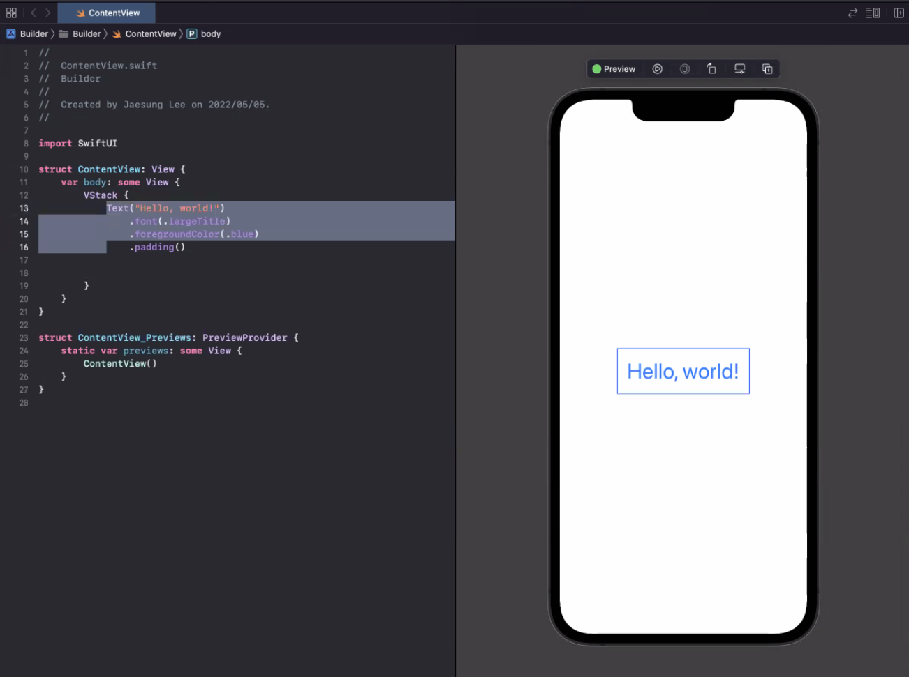

# Design Pattern_05

## Builder Pattern

-   빌더 패턴은 **인스턴스를 생성자를 통해 직접 생성하지 않고, 빌더라는 내부 클래스를 통해 간접적으로 생성하게 하는 패턴이다.**


### Snippet

```python
class Something:
    def __init__(self, number, name, size):
        self.number = number
        self.name = name
        self.size = size
    
    class Builder:
        def __init__(self):
            pass
        
        def setNumber(self, number):
            self.number = number
            return self
        
        def setName(self, name):
            self.name = name
            return self
        
        def setSize(self, size):
            self.size = size
            return self
        
        def build(self):
            return Something(self.number, self.name, self.size)
        
        
something = Something.Builder().setNumber(3).setName('st').setSize(7).build()

print(something.number, something.name, something.size)  # 3 st 7
```


### 사용 상황

>    클래스와 사용 대상의 결합도를 낮추기 위해

-   클래스의 사양 변경으로, 생성자에 인수로 전달하는 부분의 규격이 변경되었다면, 일반적인 경우 해당 클래스를 생성하는 모든 부분을 수정해야 한다.
-   **Builder를 사용하면 설정되지 않은 인수에 대해 적절한 값으로 초기화하고, 사용자의 요청에 따라 상세한 값을 설정하는 것도 가능하므로** 이러한 문제를 해결할 수 있다.
-   e.g., 위 `Something` 클래스에서 `weight`라는 인수를 추가로 할당하려고 하면, **일반 패턴에서는 생성자를 호출하는 모든 코드마다** `weight`라는 인자를 추가해야 하지만, **Builder 패턴에서는** 대상 클래스의 private 생성자에 `weight`를 추가하고, `setter`를 정의한 뒤 기본값을 `-1`로 설정하면 그냥 기능 추가가 된다.


>   복잡한 객체를 만들 때 인자에 의미를 부여

-   위 클래스에서 빌더 패턴이 없다면, `something = Something(3, 'st', 7)`이라고 작성한다.
-   생성자에 전달하는 인수의 개수가 많아진다면, 이러한 방식은 인수의 종류와 순서를 모두 외우고 있어야 하므로 매우 비효율적이다.

-   **따라서, 복잡한 객체를 만드는 데 좋은 패턴이다.**

    -   e.g., text (font, color, padding etc.,)

        


## Observer Pattern


-   옵저버 패턴은 객체의 상태 변화를 관찰하는 관찰자들, **즉 옵저버들의 목록을 객체에 등록하여 상태변화가 있을 때마다 객체가 직접 각 옵저버들에게 통지하도록 하는 패턴**
-   Subscriber, Listener 라고 불리기도 한다.
-   **이벤트가 발생하면, observer들이 반응한다.**


### Snippet

```python
class Observer:
    def update(self, msg):
        pass
    

class Cat(Observer):
    def update(self, msg):
        print(f'고양이가 주인에게 "{msg}"라는 말을 들었다.')
        print('meow')
        
        
class Dog(Observer):
    def update(self, msg):
        print(f'개가 주인에게 "{msg}"라는 말을 들었다.')
        print('bark!')
```

```python
class Owner:
    def __init__(self):
        self.animals = []
        
    def register(self, animal):
        self.animals.append(animal)
        
    def notify(self, msg):
        for animal in self.animals:
            animal.update(msg)
```

```python
owner = Owner()
cat = Cat()
dog = Dog()

owner.register(cat)
owner.register(dog)

owner.notify('오늘부터 밥 안준다.')
"""
고양이가 주인에게 "오늘부터 밥 안준다."라는 말을 들었다.
meow
개가 주인에게 "오늘부터 밥 안준다."라는 말을 들었다.
bark!
"""
```


### 사용 상황

-   `willset`과 `didset`에서 사용
    -   e.g., 닉네임을 바꿀 때, 바꾸는 것을 커밋하기 전 실행되는 함수가 `willset`, 커밋 후 실행되는 함수가 `didset`
    
-   테스트 코드에서 `Input -> Output` 과정동안 값을 프린트하고 싶을 때

    <details>
        <summary>Vue.js의 computed 속성은 어떻게 반응형 시스템으로 작동하는지?</summary>
        <div>
            <br>
            
            <br>
            Vue.js에서 일반 객체는 "Observable"이라고 불리는 형태로 변환하는 기본 구성을 가진다.<br><br>
            내부의 코드 형태로는 <strong>Observer, getter, setter</strong>를 통해 이를 가능하게 한다.
        </div>
    </details>


>   Polling

-   **단위시간마다, 혹은 순번으로** `Event`가 있는지 검사하는 것
-   문제점
    -   필요없는 리소스 단계가 생기기도 한다.
    -   **Polling interval 주기/순번 내에 Event가 발생했다가 사라지면** Event를 감지할 수 없다.
-   이러한 문제를 해결할 수 있는 것이 observer pattern


