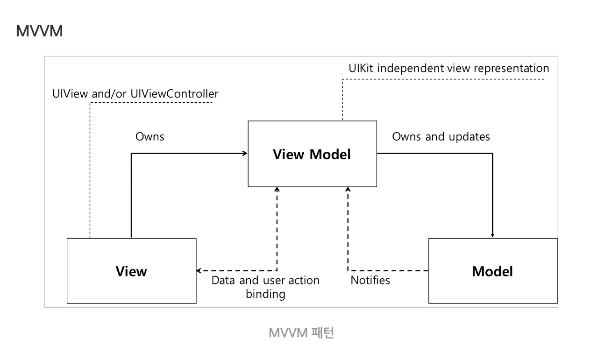

# Design Pattern_06



## MVVM Pattern

-   Model - View - ViewModel Pattern
-   사용자 인터페이스(View)를 비즈니스 로직(Model)으로부터 분리시켜 뷰가 모델에 종속되지 않도록 해주는 패턴
-   ViewModel이 Model에 있는 데이터 객체를 변환하는 책임을 맡기 때문에 객체 관리가 쉬워진다.


### Model

-   **도메인 모델을** 참조하거나, **데이터 접근 계층을** 참조한다.


### View

-   MVC Pattern이나 MVP Pattern과 같이, 사용자가 화면에서 보는 것들에 대한 구조, 배치를 담당한다.
-   사용자와 View의 상호작용(Event)을 수신하여, 이에 대한 처리를 View와 ViewModel의 연결을 정의하는 **데이터 바인딩을** 통하여 ViewModel로 전달한다.


### ViewModel

-   View를 나타내기 위한 데이터 처리를 담당하는 부분
-   Data Binding을 통해 View와 싱크를 유지
    -   Delegation
    -   Reactive Programming
    -   Property Observer


### 장점

-   View와 Model의 독립을 보장한다.
-   View와 ViewModel가 **커맨드와 데이터 바인딩을** 사용해 서로 독립적으로 구현될 수 있다. 


### 단점

-   복잡한 어플리케이션일수록 ViewModel이 빠르게 비대해진다.


### Snippet

```javascript
// View

<body>
  <div id="app">
    <h1>{{ h1Message }}</h1>
    
    <div>
      <button @click="swichTheme">{{ buttonMessage }}</button>
    </div>

    <div :class="switchDarkMode">
      <ul>
        <li v-for="article in articles">
          <strong>{{ article.title }}</strong>: {{ article.content }}
        </li>
      </ul>
    </div>

  </div>

  <script src="https://cdn.jsdelivr.net/npm/vue/dist/vue.js"></script>
  <script>
    new Vue({
      el: '#app',
      
      // Model
      
      data: {
        dark: true,
        articles: [
          {id: 1, title: 'Hello', content: 'World'},
          {id: 2, title: 'Vue', content: 'is Coming'},
          {id: 3, title: 'FrontEnd', content: 'Developer'},
        ],
      },
      
      // ViewModel
      
      methods: {
        swichTheme: function () {
          this.dark = !this.dark
        }
      },
      computed: {
        buttonMessage: function () {
          return this.dark ? 'light mode' : 'dark mode'
        },
        h1Message: function () {
          return this.dark ? 'Dark mode' : 'Light mode'
        },
        switchDarkMode: function () {
          return this.dark ? 'dark-mode' : 'light-mode'
        },
      },
    })
  </script>
</body>
</html>
```

