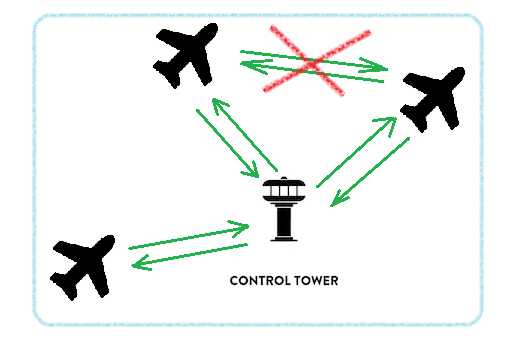
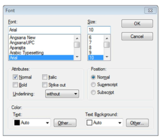
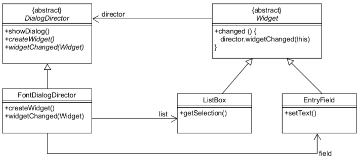
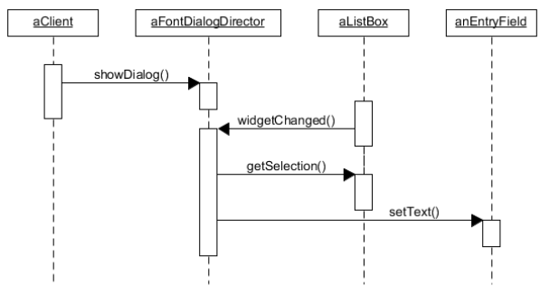

# DesignPattern_10

## Mediator Pattern

### 사용상황

-   *Tightly coupled objects* are hard to implement, change, test, and reuse because they refer to and know about many different objects.
    -   클래스간 **결합도가 높다면,** 하나의 클래스를 변경했을 때, 이를 참조하는 코드의 많은 부분을 일일이 바꿔야 한다.

-   M개의 객체들 사이에 **N개의 관계(로직)가 복잡하게** 얽혀있을 때 이를 **M:1 관계로** 바꿔주기 위해 중재자 패턴을 사용한다.
-   `objects`들 사이에 `Mediator`를 넣어 연결관계를 캡슐화한다.
-   `class` 간 `loose coupling` 상태를 유지할 수 있다. (클래스들은 서로 모르는 상태로, `Mediator`가 클래스를 모두 관리한다.)

<br>

### 효과

-   **클래스 간 관계의 흐름을 파악하기 쉽다**
-   따라서, **유지보수 및 확장성에 유리하다.**

<br>

### 다른 패턴과 비교

#### 옵저버 패턴

-   **Observer는** Subscriber가 `notify`를 받기만 하지만 **Mediator는** 서로 커뮤니케이션한다.

<br>

### 예시



-   위 그림에서, 중재자 패턴이 적용되지 않았다면, **비행기 간 교신하며** 비행한다. (M:N)
-   관제탑을 중재자로 이용한다면, **각 비행기는 서로 교신할 필요없이 관제탑에만 통신하면** 되므로 관계의 복잡도가 줄어든다. (M:1)

<br>

#### Fonts



-   위 그림과 같이 Font box에서, 각 Font마다 지원되는 size, style이 다르므로 각 object들이 서로 관찰하고 있어야 한다.

<br>



-   따라서 위 다이어그램처럼 Font box의 `Mediator`인 **`FontDialogDirector`가** Widget objects들을 관리해야 한다.

<br>



1.   `ListBox`가 `Director`에게 변화를 알려준다.
2.   `Director`가 `ListBox`에서 어떤 selection이 선택되었는지 요청해서 받아온다.
3.   `EntryField`에게 그 selection 데이터를 전달한다.
4.   `EntryField`는 그 selection에 맞는 style을 제공한다.

<br>

#### Chat

```python
from abc import ABCMeta, abstractmethod


class Colleague(metaclass=ABCMeta):
    def __init__(self, _mediator, name):
        self.mediator = _mediator
        self.name = name

    @abstractmethod
    def send(self, msg: str):
        pass

    @abstractmethod
    def receive(self, msg: str):
        pass

    
class Mediator(metaclass=ABCMeta):
    @abstractmethod
    def add_users(self, user):
        pass

    @abstractmethod
    def delete_user(self, user):
        pass

    @abstractmethod
    def send_message(self, msg: str, user):
        pass

    
class ConcreteMediator(Mediator):
    def __init__(self):
        self.users = []

    def add_users(self, *users):
        self.users.extend(users)

    def delete_user(self, user):
        self.users.remove(user)

    def send_message(self, msg: str, user):
        for _user in self.users:
            if _user == user: continue
            _user.receive(msg)

            
class ConcreteColleague(Colleague):
    def __init__(self, mediator, name):
        super().__init__(mediator, name)

    def send(self, msg: str):
        print(f'{self.name} sending message={msg}')
        self.mediator.send_message(msg, self)

    def receive(self, msg: str):
        print(f'{self.name} receiving message={msg}')

        
mediator = ConcreteMediator()
user1 = ConcreteColleague(mediator, 'lee')
user2 = ConcreteColleague(mediator, 'kim')
user3 = ConcreteColleague(mediator, 'park')
user4 = ConcreteColleague(mediator, 'yon')

mediator.add_users(user1, user2, user3, user4)
user1.send("안녕하세요")
mediator.delete_user(user4)
user2.send("user 4 없지?")
```


<br>

### Reference

-   https://en.wikipedia.org/wiki/Mediator_pattern

-   https://ganghee-lee.tistory.com/8
-   https://www.crocus.co.kr/1542
-   https://brownbears.tistory.com/568