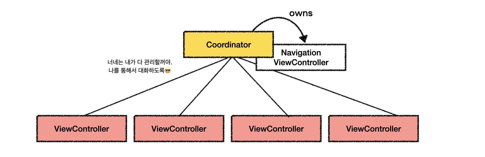
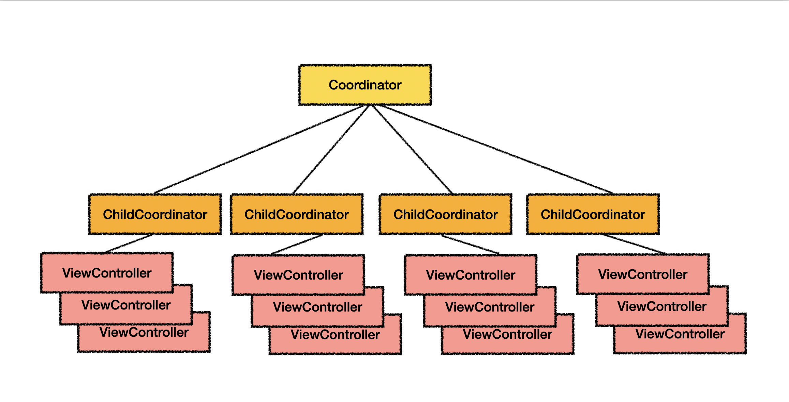

# DesignPattern_11

## Coordinator

### 사용상황

`iOS`에서는 화면 전환을 담당하는 컨트롤러인 `UINavigationController`가 존재한다.

이는 내부적으로 `Stack`을 이용해 새로운 View를 push하고, 뒤로가기시 pop한다.

```swift
navigationController?.pushviewController(nextViewController, animated: true)
```

하지만, 앱이 점차 커지고 제공하는 View가 많아진다면 각 화면의 순서를 모두 외우고 있어야 하므로 관리하기가 점점 어려워진다.

이를 해결해주는 것이 `Coordinator Pattern`이다.

<br>

### Coordinator?

>   A Coordinator is an object that bosses one or more view controllers around.

즉, `Coordinator`는 앱 전반에서 화면 전환 및 계층에 대한 흐름을 제어하는 역할



#### 기대효과

Coordinator 패턴을 사용하면,

-   ViewController 사이의 결합도를 낮출 수 있다. 각 화면간 전환하는 흐름은 오직 Coordinator만이 관리하므로.

<br>

### 예시

다음과 같이 `Coordinator`를 구현한다.

```swift
protocol Coordinator: AnyObject {
  func pushToDetail(_ navigationController: UINavigationController, productId: String)
}

extension Coordinator {

  func pushToDetail(_ navigationController: UINavigationController, productId: String) {
    let vc = DetailViewController()
    vc.setNavigationTitle("상세화면")
    vc.productId = productId
    vc.coordinator = self
    navigationController.pushViewController(vc, animated: true)
  }
}
```

상세 화면으로 전환하는 ViewController에 Coordinator를 담당하는 delegate를 만들어, Coordinator를 통해 화면을 전환하도록 한다.

```swift
class ListViewController: UIViewController {
  weak var coordinator: Coordinator?
  ...
  
  func productTapped(_ productId: String) {
    coordinator?.pushToDetail(navigationController, productId: String)
  }
  
  ...
}
```

<br>

#### Sub-Coordinator

여기서 앱이 더 커진다면, 다음과 같은 구조도 가능하다.



<br>

### 추가

<details>
    <summary>Web에서는 이러한 문제를 어떻게 해결하고 있을까?</summary>
    <br>
    <div>
        Web은 브라우저의 window.history API를 통해 뷰의 전환을 관리하고 있다.
        <br>
        window.history.pushState({page: 1}, 'title 1', '?page=1')<br>
        window.history.forward()<br>
        window.history.back()<br>
        <br>
        <a href="https://v3.router.vuejs.org/kr/guide/essentials/navigation.html" target="_blank">Vue router</a> & <a href="https://reactrouter.com/docs/en/v6/getting-started/installation" target="_blank">React Router</a>
    </div>
</details>
<br>

## Reference

[ellyheetov님 블로그](https://velog.io/@ellyheetov/Coordinator-Pattern)
