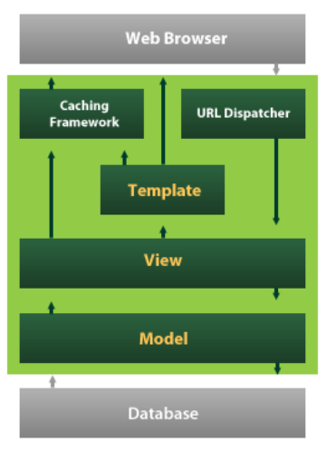

# Django_01



-   Django is a high-level Python Web framework that encourages rapid development and clean, pragmatic design
-   It takes care of much of the hassle of Web development, so you can focus on writing your app without needing to reinvent the wheel

## Web framework

-   **웹 페이지를 개발하는 과정에서 겪는 어려움을 줄이는 것이 주 목적**으로 데이터베이스 연동, 템플릿 형태의 표준, 세션 관리, 코드 재사용 등의 기능을 포함
-   동적인 웹 페이지나, 웹 애플리케이션, 웹 서비스 개발 보조용으로 만들어지는 Application Framework의 일종

-   **Static web page**
    -   서버에 미리 저장된 파일이 사용자에게 그대로 전달되는 웹 페이지
    -   서버가 정적 웹 페이지에 대한 요청을 받은 경우, 서버는 추가적인 처리 과정 없이 클라이언트에게 응답을 보냄
    -   **모든 상황에서 모든 사용자에게 동일한 정보를 표시**
    -   일반적으로 HTML, CSS, JavaScript로 작성됨
    -   flat page라고도 함
-   **Dynamic web page**
    -   웹 페이지에 대한 요청을 받은 경우 서버는 **추가적인 처리 과정** 이후 클라이언트에게 응답을 보냄
    -   동적 웹 페이지는 방문자와 상호작용하기 때문에 페이지 내용은 그때그때 다름
    -   서버 사이드 프로그래밍 언어(Python, Java, C++ 등)가 사용되며, 파일을 처리하고 데이터베이스와의 상호작용이 이루어짐
-   **Framework**
    -   프로그래밍에서 특정 운영 체제를 위한 응용 프로그램 표준 구조를 구현하는 클래스와 라이브러리 모임
    -   재사용할 수 있는 수많은 코드를 프레임워크로 통합함으로써 개발자가 새로운 애플리케이션을 위한 표준 코드를 다시 작성하지 않아도 같이 사용할 수 있도록 도움
    -   Application framework라고도 함

-   **Framework Architecture**
    -   MVC Design Pattern (model-view-controller)
    -   소프트웨어 공학에서 사용되는 디자인 패턴 중 하나
    -   사용자 인터페이스로부터 프로그램 로직을 분리하여 애플리케이션의 시각적 요소나 이면에서 실행되는 부분을 서로 영향 없이 쉽게 고칠 수 있는 애플리케이션을 만들 수 있음
    -   Django는 **MTV Pattern**이라고 함

### MTV Pattern

-   *Model*
    -   응용프로그램의 데이터 구조를 정의하고 데이터베이스의 기록을 관리(추가, 수정 삭제)
-   *Template*
    -   파일의 구조나 레이아웃을 정의
    -   실제 내용을 보여주는 데 사용(presentation)
-   **View**
    -   HTTP 요청을 수신하고 응답을 반환
    -   Model을 통해 요청을 충족시키는데 필요한 데이터에 접근
    -   Template에게 응답의 서식 설정을 맡김

## Intro

### Project & Application

-   Project
    -   Project는 Application의 집합
    -   프로젝트에는 여러 앱이 포함될 수 있음
    -   앱은 여러 프로젝트에 있을 수 있음
-   Application
    -   앱은 실제 요청을 처리하고 페이지를 보여주고 하는 등의 역할을 담당
    -   하나의 프로젝트는 여러 앱을 가짐
    -   일반적으로 앱은 하나의 역할 및 기능 단위로 작성함

#### 가상환경 생성 및 활성화

```
$ python -m venv venv
$ source venv/Scripts/activate
```

#### Django 설치

```
$ pip install django==3.2.12
```

#### Project 생성

```
$ django-admin startproject firstpjt .
```

#### 서버 활성화

```
$ python manage.py runserver
```

#### Application 생성

-   일반적으로 Application명은 **복수형**으로 하는 것을 권장

```
$ python manage.py startapp articles
```

#### Application 등록

-   프로젝트에서 앱을 사용하기 위해서는 반드시 `INSTALLED_APPS` 리스트에 추가해야 함
-   앱 등록 시 순서
    -   `Local apps`
    -   `Third party apps`
    -   `Django apps`

## Template

-   데이터 표현을 제어하는 도구이자 표현에 관련된 로직
-   사용하는 built-in system
    -   Django Template Language(DTL)

-   **표현과 로직(view)을 분리**
    -   템플릿 시스템은 표현을 제어하는 도구이자 표현에 관련된 로직일 뿐
    -   즉, 템플릿 시스템은 이러한 **기본 목표를 넘어서는 기능을 지원하지 말아야** 한다.
-   **중복을 배제**
    -   대다수의 동적 웹사이트는 공통 header, footer, navbar 같은 사이트 공통 디자인을 갖는다.
    -   Django 템플릿 시스템은 이러한 요소를 한 곳에 저장하기 쉽게 하여 중복 코드를 없앤다.
    -   이것이 **템플릿 상속**의 기초가 되는 철학이다.

### Django Template Language (DTL)

-   Django template에서 사용하는 built-in template system
-   조건, 반복, 변수 치환, 필터 등의 기능을 제공
-   단순히 Python이 HTML에 포함 된 것이 아니며, 프로그래밍적 로직이 아니라 **프레젠테이션을 표현하기 위한 것**

#### DTL Syntax (1/4) - Variable

-   `render()`를 사용하여 `views.py`에서 정의한 변수를 template 파일로 넘겨 사용하는 것
-   변수명은 영어, 숫자와 밑줄의 조합으로 구성될 수 있으나 밑줄로는 시작할 수 없음
    -   공백이나 구두점 문자 또한 사용할 수 없음
-   `.`을 사용하여 변수 속성에 접근할 수 있음
-   `render()`의 세번째 인자로 {'key':value}와 같이 딕셔너리 형태로 넘겨주며, 여기서 정의한 key에 해당하는 문자열이 template에서 사용 가능한 변수명이 됨

#### DTL Syntax (2/4) - Filters

-   표시할 변수를 수정할 때 사용

```django
{{ name|lower }}
```

-   60개의 built-in template filters를 제공
-   chained가 가능하며 일부 필터는 인자를 받기도 함

```django
{{ variable|truncatewords:30 }}
```

#### DTL Syntax (3/4) - Tags

-   출력 텍스트를 만들거나, 반복 또는 논리를 수행하여 제어 흐름을 만드는 등 변수보다 복잡한 일들을 수행
-   일부 태그는 시작과 종료 태그가 필요
-   약 24개의 built-in template tags를 제공

```django
<p>메뉴판</p>
<ul>
    
    	<li>{{ food }}</li>
    
</ul>
```

#### DTL Syntax (4/4) - Comments

-   Django template에서 라인의 주석을 표현하기 위해 사용
-   한 줄 주석: `{#  #}`
-   여러줄 주석: ` content `

### Template Inheritance

-   템플릿 상속은 기본적으로 코드의 재사용성에 초점을 맞춤
-   템플릿 상속을 사용하면 사이트의 모든 공통 요소를 포함하고, 하위 템플릿이 재정의(override)할 수 있는 블록을 정의하는 기본 'skeleton' 템플릿을 만들 수 있음

```django




```

