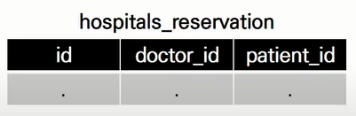

# Django_07

## Intro

### 병원 진료 기록 시스템

>   병원 진료 기록 시스템을 통한 M:N 관계 학습

-   환자와 의사가 사용하는 병원 진료 기록 시스템 구축
    -   병원 시스템에서 가장 핵심이 되는 객체는 무엇일까? -> 환자와 의사
    -   이 둘의 관계를 어떻게 표현할 수 있을까?

>   1:N의 한계

-   한 번에 두 의사에게 진료를 받고자 함
-   하나의 외래키에 2개의 의사 데이터를 넣을 수 없음
    -   외래키에 '1, 2' 형식의 데이터를 사용할 수 없음

>   중개 모델



-   중개 모델(혹은 중개 테이블, Associative Table) 작성

>   ManyToManyField

-   다대다 (M:N, many-to-many) 관계 설정 시 사용하는 모델 필드
-   하나의 필수 위치인자(M:N 관계로 설정할 모델 클래스)가 필요
-   `related_name`
    -   target model(관계 필드를 가지지 않은 모델)이 source model(관계 필드를 가진 모델)을 참조할 때 사용할 manager의 이름을 설정
    -   즉, 역참조 시에 사용하는 manager의 이름을 설정
    -   **ForeignKey의 related_name과 동일**
-   django는 ManyToManyField를 통해 중개 테이블을 자동으로 생성
-   그렇다면 중개 테이블을 직접 작성하는 경우는 없을까?
    -   중개 테이블을 수동으로 지정하려는 경우 `through` 옵션을 사용하여, 중개 테이블을 나타내는 django 모델을 지정할 수 있음
    -   가장 일반적인 용도는 중개 테이블에 추가 데이터를 사용해 다대다 관계로 연결하려는 경우에 사용


## ManyToManyField

-   다대다 (M:N, many-to-many) 관계 설정 시 사용하는 모델 필드
-   하나의 필수 위치인자(M:N 관계로 설정할 모델 클래스)가 필요
-   모델 필드의 RelatedManager를 사용하여 관련 개체를 추가, 제거 또는 만들 수 있음
    -   **add(), remove(),** create(), clear(), ...
-   [참고] RelatedManager
    -   일대다 또는 다대다 관련 컨텍스트에서 사용되는 manager

>   add()

-   "지정된 객체를 관련 객체 집합에 추가"
-   이미 존재하는 관계에 사용하면 관계가 복제되지 않음
-   모델 인스턴스, 필드 값(PK)을 인자로 허용

>   remove()

-   "관련 객체 집합에서 지정된 모델 객체를 제거"
-   내부적으로 QuerySet.delete()를 사용하여 관계가 삭제됨
-   모델 인스턴스, 필드 값(PK)을 인자로 허용

### 좋아요 기능 (Like)

```python
# articles/models.py

class Article(models.Model):
    user = models.ForeignKey(settings.AUTH_USER_MODEL, on_delete=models.CASCADE)
    like_users = models.ManyToManyField(settings.AUTH_USER_MODEL)
    ...
```

-   에러 발생 원인
    -   `like_users` 필드 생성 시 자동으로 역참조는 `.article_set` 매니저를 생성
    -   **그러나 이전 1:N(User:Article) 관계에서 이미 해당 매니저 이름을 사용중이기 때문**
    -   `User`와 관계된 `ForeignKey` 또는 `ManyToManyField` 중 하나에 `related_name` 추가 필요

```python
# articles/views.py

@require_POST
def likes(request, article_pk):
    if request.user.is_authenticated:
        article = get_object_or_404(Article, pk=article_pk)
        
        if article.like_users.filter(pk=request.user.pk).exists():
            article.like_users.remove(request.user)
        else:
            article.like_users.add(request.user)
        return redirect('articles:index')
    return redirect('accounts:login')
```

