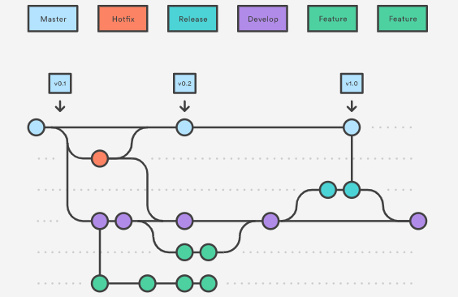
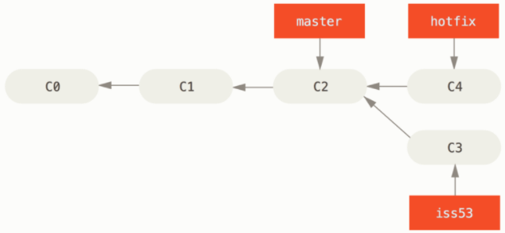
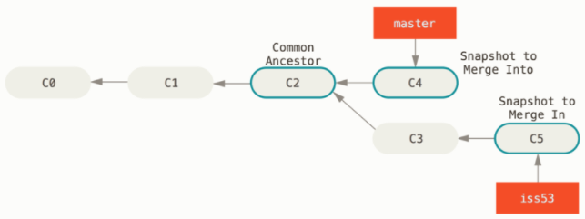
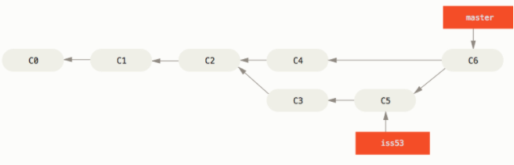

# Git_02

## Branch



### Master Branch

-   릴리즈 이력을 관리하기 위해 사용
-   즉, 배포 가능한 상태만을 관리한다.

### Develop Branch

-   다음 출시될 버전을 개발하는 브랜치
-   **기능 개발을 위한 브랜치들을 병합**하기 위해 사용
-   모든 기능이 추가되고 버그가 수정되어 배포 가능한 상태라면 `develop` 브랜치를 `master` 브랜치에 `merge`한다.

### Feature Branch

-   `feature` 브랜치는 새로운 기능 개발 및 버그 수정이 필요할 때마다 `develop` 브랜치로부터 분기한다.
-   `feature`브랜치에서의 작업은 기본적으로 **공유할 필요가 없기 때문에, 자신의 로컬 저장소에서 관리**한다.
-   개발이 완료되면 `develop` 브랜치로 `merge`하여 다른 사람들과 공유한다.

### Release Branch

-   배포를 위한 전용 브랜치를 사용함으로써 **한 팀이 해당 배포를 준비하는 동안 다른 팀은 다음 기능 개발을 계속**할 수 있다.

### Hotfix Branch

-   배포한 버전에 긴급하게 수정을 해야 할 필요가 있을 경우, `master` 브랜치에서 분기하는 브랜치이다.
-   `develop` 브랜치에서 문제가 되는 부분을 수정하여 배포 가능한 버전을 만들기에는 **시간도 많이 소요되고 안정성을 보장하기도 어렵다.**
-   따라서, 배포가 가능한 `master` 브랜치에서 직접 브랜치를 만들어 필요한 부분만을 수정한 후 `merge`하여 이를 배포한다.

### 명령어

```
$ git branch  // 브랜치 목록 확인
$ git branch [branch_name]  // 새로운 브랜치 생성
$ git branch -d [branch_name]  // 특정 브랜치 삭제
$ git switch [branch_name]  // 다른 브랜치로 이동
```


## Merge

[Git - 브랜치와 Merge의 기초](https://git-scm.com/book/ko/v2/Git-%EB%B8%8C%EB%9E%9C%EC%B9%98-%EB%B8%8C%EB%9E%9C%EC%B9%98%EC%99%80-Merge-%EC%9D%98-%EA%B8%B0%EC%B4%88)

```
$ git merge [--no-ff] [branch_name]
```

### Fast-Forward



-   `hotfix` 브랜치가 가리키는 `C4` 커밋이 `C2` 커밋에 기반한 브랜치이기 때문에 브랜치 포인터는 Merge 과정 없이 그저 최신 커밋으로 이동한다. 이런 Merge 방식을 “Fast forward” 라고 부른다.
-   다시 말해 A 브랜치에서 다른 B 브랜치를 Merge 할 때 B 브랜치가 A 브랜치 이후의 커밋을 가리키고 있으면 그저 A 브랜치가 B 브랜치와 동일한 커밋을 가리키도록 이동시킬 뿐이다.

### 3-Way Merge



-   `hotfix` 를 Merge 했을 때와 메시지가 다르다. 현재 브랜치가 가리키는 커밋이 Merge 할 브랜치의 조상이 아니므로 Git은 'Fast-forward’로 Merge 하지 않는다.
-   이 경우에는 Git은 각 브랜치가 가리키는 커밋 두 개와 공통 조상 하나를 사용하여 3-way Merge를 한다.

-   단순히 브랜치 포인터를 최신 커밋으로 옮기는 게 아니라 3-way Merge 의 결과를 별도의 커밋으로 만들고 나서 해당 브랜치가 그 커밋을 가리키도록 이동시킨다. 그래서 이런 커밋은 부모가 여러 개고 Merge 커밋이라고 부른다.




#### Conflict

-   `merge`하는 두 브랜치에서 같은 파일의 같은 부분을 동시에 수정하고 `merge`하면, git은 해당 부분을 자동으로 `merge`해주지 못한다.
-   Git은 자동으로 Merge 하지 못해서 새 커밋이 생기지 않는다. 변경사항의 충돌을 개발자가 해결하지 않는 한 Merge 과정을 진행할 수 없다. Merge 충돌이 일어났을 때 Git이 어떤 파일을 Merge 할 수 없었는지 살펴보려면 `git status` 명령을 이용한다.
-   충돌을 해결하고 나면, `3-Way Merge`와 동일한 방식으로 `merge`한다.
