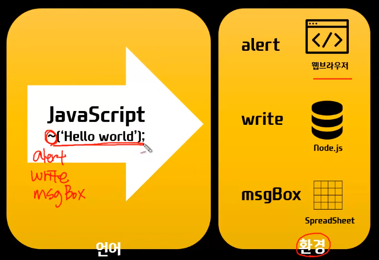

# JavaScript_01

-   Browser를 제어하기 위한 프로그래밍 언어 **(클라이언트 사이드 스크립트)**
-   But, **탈웹브라우저**
    -   웹서버를 동작하기 위한 언어로 사용 **(서버 사이드 스크립트)**
        -   `Node.js`
-   Also, **탈웹**



## 코드 작성과 실행

```javascript
<!DOCTYPE html>
<html lang="en">
<head>
  <meta charset="UTF-8">
  <meta http-equiv="X-UA-Compatible" content="IE=edge">
  <meta name="viewport" content="width=device-width, initial-scale=1.0">
  <title>Document</title>
</head>
<body>
  <script>
    alert('Hello World!');
  </script>
</body>
</html>
```

## 주석

```javascript
// 이것이 주석입니다.

/*
	이것은 여러줄 주석입니다.
	이것은 여러줄 주석입니다.
	이것은 여러줄 주석입니다.
*/
```

## 줄바꿈과 여백

```javascript
var a = 1;
alert(a);
```

-   세미콜론(;)이 없더라도 줄바꿈이 있다면 동작에는 문제없다. 하지만 명시적으로 **세미콜론을 써주는 것을 권장함**
-   **두 줄의 명령어를 한 줄로 바꾸고 싶은 경우 세미콜론 필수**

