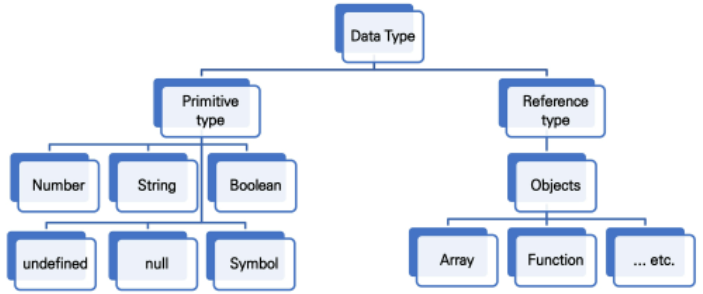

# JavaScript_01

## JavaScipt의 필요성

-   브라우저 화면을 '동적'으로 만들기 위함

-   브라우저를 조작할 수 있는 **유일한 언어**

## Browser

-   DOM(Document Object Model) 조작
    -   문서(HTML) 조작
-   BOM(Browser Object Model) 조작
    -   navigator, screen, location, frames, history, XHR
-   JavaScript Core(ECMAScript)
    -   Data Structure(Object, Array), Conditional Expression, Iteration

### DOM?

-   HTML, XML과 같은 문서를 다루기 위한 프로그래밍 인터페이스
-   문서를 구조화하고, 구조화된 구성 요소를 하나의 객체로 취급하여 다루는 논리적 트리 모델
-   문서가 객체(object)로 구조화되어 있으며 key로 접근 가능
-   단순한 속성 접근, 메서드 활용뿐만 아니라 프로그래밍 언어적 특성을 활용한 조작 가능
-   주요 객체
    -   window: DOM 표현하는 창(브라우저 탭), 최상위 객체(작성 시 생략 가능)
    -   document: 페이지 컨텐츠의 Entry Point 역할을 하며, `<head>`, `<body>`등과 같은 수많은 다른 요소들을 포함
    -   navigator, location, history, screen

### BOM?

-   Broswer Object Model
-   자바스크립트가 브라우저와 소통하기 위한 모델
-   브라우저의 창이나 프레임을 추상화해서 프로그래밍적으로 제어할 수 있도록 제공하는 수단
    -   버튼, URL 입력창, 타이틀 바 등 브라우저 윈도우 및 웹 페이지의 일부분을 제어 가능
-   window 객체는 모든 브라우저로부터 지원받으며 브라우저의 창(window)를 지칭

### JavaScript Core

-   브라우저(BOM & DOM)을 조작하기 위한 명령어 약속(언어)

## Introduction

### ECMA?

-   ECMA(ECMA International)
    -   정보 통신에 대한 표준을 제정하는 비영리 표준화 기구
-   ECMAScript는 ECMA에서 ECMA-262 규격에 따라 정의한 언어
    -   ECMA-262*: 범용적인 목적의 프로그래밍 언어에 대한 명세
-   **ECMAScript6는 ECMA에서 제안하는 6번째 표준 명세를 말함**
    -   (참고) ECMAScript6의 발표 연도에 따라 ECMAScript2015라고도 불림

### Semicolon

-   자바스크립트는 세미콜론을 선택적으로 사용 가능
-   세미콜론이 없으면 ASI*에 의해 자동으로 세미콜론이 삽입됨
    -   ASI*: 자동 세미콜론 삽입 규칙 (Automatic Semicolon Insertion)

### 스타일 가이드

-   코딩 스타일의 핵심은 합의된 원칙과 일관성
    -   절대적인 하나의 정답은 없으며, 상황에 맞게 원칙을 정하고 일관성 있게 사용하는 것이 중요
-   코딩 스타일은 코드의 품질에 직결되는 중요한 요소
    -   코드의 가독성, 유지보수 또는 팀원과의 커뮤니케이션 등 **개발 과정 전체에 영향을 끼침**
-   (참고) 다양한 자바스크립트 스타일 가이드
    -   Airbnb Javascript Style Guide
    -   Google Javascript Style Guide
    -   standardjs

## 변수와 식별자

-   식별자(Identifier)는 변수를 구분할 수 있는 변수명을 말함
-   식별자는 반드시 문자, 달러($) 또는 밑줄(_)로 시작
-   대소문자를 구분하며, 클래스명 외에는 모두 소문자로 시작
-   예약어 사용 불가능

### 식별자 작성 스타일

-   **카멜 케이스** (camelCase, lower-camel-case)
    -   변수, 객체, 함수에 사용
-   **파스칼 케이스** (PascalCase, upper-camel-case)
    -   클래스, 생성자에 사용
-   **대문자 스네이크 케이스** (SNAKE_CASE)
    -   **상수(constant)에 사용**
        -   상수*: 개발자의 의도에 상관없이 변경될 가능성이 없는 값

### 변수 선언 키워드

-   **let**
    -   **재할당 할 예정인** 변수 선언시 사용
    -   변수 **재선언 불가능**
    -   블록 스코프*
-   **const**
    -   **재할당 할 예정이 없는** 변수 선언시 사용
    -   변수 **재선언 불가능**
    -   블록 스코프*
-   **var**
    -   var로 선언한 변수는 재선언 및 재할당 모두 가능
    -   ES6 이전에 변수를 선언할 때 사용되던 키워드
    -   **호이스팅*되는** 특성으로 인해 예기치 못한 문제 발생 가능
        -   따라서 **ES6 이후부터는** var 대신 **const와 let을 사용하는 것을 권장**
    -   함수 스코프*

#### 블록 스코프 (block scope)

-   **if, for, 함수** 등의 중괄호 내부를 가리킴
-   블록 스코프를 가지는 변수는 블록 바깥에서 접근 불가능

#### 호이스팅 (hoisting)

-   함수 안에 있는 선언들을 모두 끌어올려서 해당 함수 유효 범위의 최상단에 선언하는 것
-   결과적으로 변수를 선언 이전에 참조할 수 있는 현상
-   변수 선언 이전의 위치에서 접근 시 `undefined`를 반환

## 데이터 타입

### 원시 타입과 참조 타입 비교

-   원시 타입 (Primitive type)
    -   객체(object)가 아닌 기본 타입
    -   변수에 해당 타입의 값이 담김
    -   다른 변수에 복사할 때 실제 값이 복사됨
-   참조 타입 (Reference type)
    -   객체(object) 타입의 자료형
    -   변수에 해당 객체의 참조 값이 담김
    -   다른 변수에 복사할 때 참조 값이 복사됨

### 원시 타입 (Primitive type)

-   **숫자 (Number) 타입**

    -   **정수, 실수 구분 없는 하나의 숫자 타입**
    -   **부동소수점 형식을** 따름
    -   (참고) NaN (Not-A-Number)
        -   **계산 불가능한 경우** 반환되는 값

-   **문자열 (String) 타입**

    -   **텍스트 데이터를 나타내는 타입**
    -   16비트 유니코드 문자의 집합
    -   작은따옴표 또는 큰따옴표 모두 가능

    -   템플릿 리터럴 (Template Literal)
        -   ES6부터 지원
        -   따옴표 대신 backtick(``)으로 표현
        -   ${ expression } 형태로 표현식 삽입 가능

-   **undefined**

    -   **변수의 값이 없음을 나타내는 데이터 타입**
    -   변수 선언 이후 직접 값을 할당하지 않으면, 자동으로 undefined가 할당됨

-   **null**

    -   변수의 **값이 없음을 의도적으로 표현할 때** 사용하는 데이터 타입
    -   (참고) null 타입과 **typeof 연산자***
        -   **typeof 연산자*: 자료형 평가를 위한 연산자**
        -   null 타입은 ECMA 명세의 원시 타입의 정의에 따라 원시 타입에 속하지만, **typeof 연산자의 결과는 객체로 표현됨**

-   **Boolean**

    -   **논리적 참 또는 거짓을** 나타내는 타입

    -   **true** 또는 **false로** 표현

    -   **조건문 또는 반복문*에서** 유용하게 사용

        -   (참고) 조건문 또는 반복문에서 **boolean이 아닌 데이터 타입은** 자동 형변환 규칙에 따라 true 또는 false로 변환됨

        

## 연산자

### 동등 비교 연산자 (==)

-   두 피연산자가 같은 값으로 평가되는지 비교 후 boolean 값을 반환
-   비교할 때 암묵적 타입 변환을 통해 타입을 일치시킨 후 같은 값인지 비교
-   두 피연산자가 모두 객체일 경우 메모리의 같은 객체를 바라보는지 판별
-   **예상치 못한 결과가 발생할 수 있으므로 특별한 경우를 제외하고 사용하지 않음**

### 일치 비교 연산자 (===)

-   두 피연산자가 같은 값으로 평가되는지 비교 후 boolean 값을 반환
-   엄격한 비교*가 이루어지며 암묵적 타입 변환이 발생하지 않음
    -   엄격한 비교*: 두 비교 대상의 타입과 값 모두 같은지 비교하는 방식
-   두 피연산자가 모두 객체일 경우 메모리의 같은 객체를 바라보는지 판별

### 논리 연산자

-   세 가지 논리 연산자로 구성
    -   and: `&&`
    -   or: `||`
    -   not: `!`

### 삼항 연산자(Ternary Operator)

-   세 개의 피연산자를 사용하여 조건에 따라 값을 반환하는 연산자
-   가장 왼쪽의 조건식이 참이면 콜론(:) 앞의 값을 사용하고 그렇지 않으면 콜론(:) 뒤의 값을 사용
-   삼항 연산자의 결과 값이기 때문에 변수에 할당 가능

## 조건문

### 조건문의 종류와 특징

-   `if` statement
    -   조건 표현식의 결과값을 **Boolean 타입으로 변환 후 참/거짓을 판단**
    -   **if, else if, else**
        -   조건은 **소괄호(condition)** 안에 작성
        -   실행할 코드는 **중괄호{}** 안에 작성
        -   블록 스코프 생성
-   `switch` statement
    -   조건 표현식의 결과값이 **어느 값(case)에 해당하는지 판별**
    -   (참고*) 주로 특정 변수의 값에 따라 조건을 분기할 때 활용
        -   조건이 많아질 경우 if문보다 가독성이 나을 수 있음

## 반복문

### 반복문의 종류와 특징

-   **while**
-   **for**
-   **for ... in**
    -   주로 객체의 속성들을 순회할 때 사용
    -   배열도 순회 가능하지만 인덱스 순으로 순회한다는 보장이 없으므로 **권장하지 않음**
-   **for ... of**
    -   반복 가능한 객체를 순회하며 값을 꺼낼 때 사용
        -   반복 가능한 객체의 종류: `Array`, `Map`, `Set`, `String` 등

