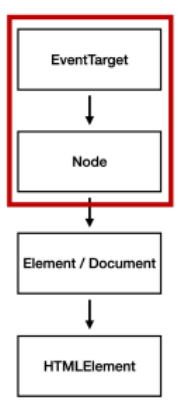

# JavaScript_03

## DOM (Document Object Model)

-   HTML, XML과 같은 문서를 다루기 위한 문서 프로그래밍 인터페이스
-   문서를 구조화하고 구조화된 구성 요소를 하나의 객체로 취급하여 다루는 논리적 트리 모델
-   문서가 구조화되어 있으며 각 요소는 객체(object)로 취급
-   단순한 속성 접근, 메서드 활용뿐만 아니라 프로그래밍 언어적 특성을 활용한 조작 가능
-   주요 객체
    -   window: DOM을 표현하는 창. 가장 최상위 객체 (작성 시 생략 가능)
    -   document: 페이지 컨텐츠의 Entry Point 역할을 하며, `<body>`등과 같은 수많은 다른 요소들을 포함
    -   navigator, location, history, screen

### DOM 관련 객체의 상속 구조

-   EventTarget
    -   Event Listener를 가질 수 있는 객체가 구현하는 DOM 인터페이스
-   Node
    -   여러 가지 DOM 타입들이 상속하는 인터페이스
-   Element
    -   Document 안의 모든 객체가 상속하는 가장 범용적인 인터페이스
    -   부모인 Node와 그 부모인 EventTarget의 속성을 상속
-   Document
    -   브라우저가 불러온 웹 페이지를 나타냄
    -   DOM 트리의 진입점(entry point) 역할을 수행
-   HTMLElement
    -   모든 종류의 HTML 요소
    -   부모 element의 속성 상속

### 선택 관련 메서드

-   **document.querySelector(selector)**
    -   제공한 선택자와 일치하는 element 하나 선택
    -   제공한 CSS selector를 만족하는 첫 번째 `element` 객체를 반환 (없다면 null)
-   **document.querySelectorAll(selector)**
    -   제공한 선택자와 일치하는 여러 element를 선택
    -   매칭할 하나 이상의 셀렉터를 포함하는 유효한 CSS selector를 인자로 받음
    -   지정된 셀렉터에 일치하는 `NodeList`를 반환

#### HTMLCollection & NodeList

-   둘 다 배열과 같이 각 항목에 접근하기 위한 index를 제공 (유사 배열)
-   **HTMLCollection**
    -   name, id, index 속성으로 각 항목에 접근 가능
-   **NodeList**
    -   index로만 각 항목에 접근 가능
    -   단, HTMLCollection과 달리 배열에서 사용하는 `forEach` 메서드 및 다양한 메서드 사용 가능
-   둘 다 Live Collection으로 DOM의 변경사항을 실시간으로 반영하지만, **`querySelectorAll()`에 의해 반환되는 NodeList는 Static Collection으로 실시간으로 반영되지 않음**

### 변경 관련 메서드

-   **document.createElement()**
    -   작성한 태그 명의 HTML 요소를 생성하여 반환
-   **Element.append()**
    -   특정 부모 Node의 자식 NodeList 중 마지막 자식 다음에 Node 객체나 DOMString을 삽입
    -   여러 개의 Node 객체, DOMString을 추가할 수 있음
    -   반환 값이 없음
-   **Node.appendChild()**
    -   한 Node를 특정 부모 Node의 자식 NodeList 중 마지막 자식으로 삽입 (Node만 추가 가능)
    -   한번에 오직 하나의 Node만 추가할 수 있음
    -   만약 주어진 Node가 이미 문서에 존재하는 다른 Node를 참조한다면 새로운 위치로 이동
    -   추가된 Node 객체를 반환

### 변경 관련 속성

-   **Node.innerText**
    -   Node 객체와 그 자손의 텍스트 컨텐츠(DOMString)를 표현 (해당 요소 내부의 raw text)
    -   즉, 줄 바꿈을 인식하고 숨겨진 내용을 무시하는 등 최종적으로 스타일링이 적용된 모습으로 표현
-   **Element.innerHTML**
    -   요소(element) 내에 포함된 HTML 마크업을 반환
    -   **[참고] XSS (Cross-Site Scripting) 공격에 취약하므로 사용 시 주의**
        -   공격자가 입력요소를 사용하여(`<input>`) 웹 사이트 클라이언트 측 코드에 악성 스크립트를 삽입해 공격하는 방법
        -   피해자의 브라우저가 악성 스크립트를 실행하며 공격자가 액세스 제어를 우회하고 사용자를 가장할 수 있도록 함

### 삭제 관련 메서드

-   **ChildNode.remove()**
    -   Node가 속한 트리에서 해당 Node를 제거
-   **Node.removeChild()**
    -   DOM에서 자식 Node를 제거하고 제거된 Node를 반환
    -   Node는 인자로 들어가는 자식 Node의 부모 Node

### 속성 관련 메서드

-   **Element.setAttribute(name, value)**
    -   지정된 요소의 값을 설정
    -   속성이 이미 존재하면 값을 갱신, 존재하지 않으면 지정된 이름과 값으로 새 속성을 추가
-   **Element.getAttribute(attributeName)**
    -   해당 요소의 지정된 값(문자열)을 반환
    -   인자는 값을 얻고자 하는 속성의 이름

## Event

-   네트워크 활동이나 사용자와의 상호작용같은 사건의 발생을 알리기 위한 객체
-   이벤트 발생
    -   마우스를 클릭하거나 키보드를 누르는 등 사용자 행동으로 발생할 수도 있음
    -   특정 메서드를 호출(`Element.click()`)하여 프로그래밍적으로도 만들어 낼 수 있음
-   **특정 이벤트가 발생하면, 할 일을 등록한다.**

### Event 기반 인터페이스

-   AnimationEvent, ClipboardEvent, DragEvent 등
-   **UIEvent**
    -   간단한 사용자 인터페이스 이벤트
    -   Event의 상속을 받음
    -   MouseEvent, KeyboardEvent, InputEvent, FocusEvent 등의 부모 객체 역할을 함

### Event handler

-   **EventTarget.addEventListener(type, listener[, options])**
    -   지정한 이벤트가 대상에 전달될 때마다 호출할 함수를 설정
    -   이벤트를 지원하는 모든 객체(Element, Document, Window 등)를 대상으로 지정 가능
    -   **type**
        -   반응할 이벤트 유형 (대소문자 구분 문자열)
    -   **listener**
        -   지정된 타입의 이벤트가 발생했을 때 알림을 받는 객체
        -   EventListener 인터페이스 혹은 JS function 객체(콜백 함수)여야 함

### Event 취소

-   **event.preventDefault()**
    -   현재 이벤트의 기본 동작을 중단
    -   HTML 요소의 기본 동작을 작동하지 않게 막음
        -   e.g., a 태그의 기본 동작은 클릭 시 링크로 이동 / form 태그의 기본 동작은 from-data 전송
    -   이벤트를 취소할 수 있는 경우, 이벤트의 전파를 막지 않고 그 이벤트를 취소한다.
    -   취소할 수 없는 이벤트도 존재
        -   이벤트의 취소 가능 여부는 `event.cancelable`을 사용해 확인할 수 있음

