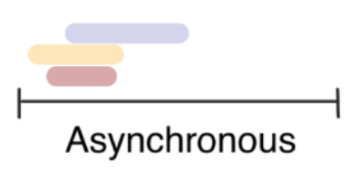

# JavaScript_04

## AJAX

-   Asynchronous JavaScript And XML
-   서버와 통신하기 위해 `XMLHttpRequest` 객체를 활용
-   JSON, XML, HTML 그리고 일반 텍스트 형식 등을 포함한 다양한 포맷을 주고 받을 수 있음
    -   [참고] AJAX의 X가 XML을 의미하지만, 요즘은 더 가벼운 용량과 JS의 일부라는 장점 덕에 JSON을 더 많이 사용
-   특징
    -   페이지 전체를 reload(새로고침)를 하지 않고서도 수행되는 **비동기성**
        -   서버의 응답에 따라 전체 페이지가 아닌 일부분만을 업데이트할 수 있음


### XMLHttpRequest 객체

-   서버와 상호작용하기 위해 사용되며 전체 페이지의 새로고침 없이 데이터를 받아올 수 있음
-   사용자의 작업을 방해하지 않으면서 페이지 일부를 업데이트
-   주로 AJAX 프로그래밍에 사용
-   이름과 달리 XML 뿐만 아니라 모든 데이터를 받아올 수 있음
-   `XMLHttpRequest()`


## Asynchronous JavaScript

-   **동기식**

    

    -   순차적, 직렬적 Task 수행
    -   요청을 보낸 후 응답을 받아야만 다음 동작이 이루어짐 (blocking)

-   **비동기식**

    

    -   병렬적 Task 수행
    -   요청을 보낸 후 응답을 기다리지 않고 다음 동작이 이루어짐 (non-blocking)


>   왜 비동기(Asynchronous)를 사용하는가?

-   "사용자 경험"
    -   매우 큰 데이터를 동반하는 앱이 있다고 가정
    -   동기식 코드라면 데이터를 모두 불러온 뒤 앱이 실행됨
        -   즉, 데이터를 모두 불러올 때까지는 앱이 모두 멈춘 것처럼 보임
        -   코드 실행을 차단하여 화면이 멈추고 응답하지 않는 것 같은 사용자 경험을 제공
    -   비동기식 코드라면 데이터를 요청하고 응답받는 동안, 앱 실행을 함께 진행함
        -   데이터를 불러오는 동안 지속적으로 응답하는 화면을 보여줌으로써 더욱 쾌적한 사용자 경험을 제공
    -   때문에 많은 웹 API 기능은 현재 비동기 코드를 사용하여 실행됨


>   "JavaScript는 single threaded"

-   컴퓨터가 여러 개의 CPU를 가지고 있어도 main thread라 불리는 단일 스레드에서만 작업 수행
-   즉, 이벤트를 처리하는 `Call Stack`이 하나인 언어
-   이 문제를 해결하기 위해 JS는
    1.   즉시 처리하지 못하는 이벤트들을 **다른 곳(Web API)으로** 보내서 처리하도록 하고,
    2.   처리된 이벤트들은 처리된 순서대로 **대기실(Task queue)에** 줄을 세워 놓고,
    3.   Call Stack이 비면 **담당자(Event Loop)가** 대기 줄에서 가장 오래된 이벤트를 Call Stack으로 보냄


>   Concurrency model


-   Event loop를 기반으로 하는 **동시성 모델**
    1.   Call Stack
    2.   Web API (Browser API)
         -   JS 엔진이 아닌 브라우저 영역에서 제공하는 API
         -   **`setTimeout()`, DOM events 그리고 AJAX로 데이터를 가져오는, 시간이 소요되는 일들을 처리**
    3.   Task Queue (Event Queue, Message Queue)
         -   비동기 처리된 callback 함수가 대기하는 Queue 형태의 자료구조
         -   main thread가 끝난 후 실행되어 후속 JS 코드가 차단되는 것을 방지
    4.   Event Loop
         -   Call Stack이 비어있는지 확인
         -   비어있는 경우 Task Queue에서 대기중인 callback 함수가 있는지 확인
         -   대기중인 함수가 있다면 Call Stack으로 push


>   Zero delays

```javascript
console.log('Hi')

setTimeout(function () {
    console.log('Done!')
}, 0)

console.log('Bye..')

/*
Hi
Bye..
undefined
Done!
*/
```

-   실제로 0ms 후에 callback 함수가 실행된다는 의미가 아님
-   Web API에서 먼저 완료된 작업이 먼저 Task Queue로 들어감
-   Call Stack의 작업들이 모두 완료된 후 Task Queue에 대기하는 작업들이 실행됨


>   순차적 비동기 처리

-   Web API로 들어오는 순서는 중요하지 않고, 어떤 이벤트가 먼저 처리되느냐가 중요 **(실행 순서를 보장하지 않음)**
-   이를 해결하기 위해 순차적 비동기 처리를 위한 2가지 방식
    1.   **Async callbacks**
         -   백그라운드에서 실행을 시작할 함수를 호출할 때 인자로 지정된 함수
         -   e.g., `addEventListener()`의 두번째 인자
    2.   **promise-style**
         -   Modern Web APIs에서의 새로운 코드 스타일
         -   `XMLHttpRequest` 객체를 사용하는 구조보다 조금 더 현대적


### Callback Function

-   다른 함수에 인자로 전달된 함수
-   외부 함수 내에서 호출되어 일종의 루틴 또는 작업을 완료함
-   동기식, 비동기식 모두 사용됨
    -   그러나 비동기 작업이 완료된 후 코드 실행을 계속하는 데 주로 사용됨
        -   이러한 경우를 비동기 콜백(asynchronous callback)이라고 함


>   Asynchronous callback

-   백그라운드에서 코드 실행을 시작할 함수를 호출할 때 인자로 지정된 함수
-   백그라운드 코드 실행이 끝나면 callback 함수를 호출하여 작업이 완료되었음을 알리거나, 다음 작업을 실행하게 할 수 있음
-   "Called at back"


>   Callback Hell


-   순차적인 연쇄 비동기 작업을 처리하기 위해 "callback 함수를 호출하고, 그 다음 callback 함수를 호출하고, ..."의 패턴이 지속적으로 반복됨
-   이를 **callback hell(콜백 지옥)** 혹은 pyramid of doom(파멸의 피라미드)이라 함
-   위와 같은 상황이 벌어질 경우 아래 사항들을 통제하기 어려움
    -   디버깅
    -   코드 가독성


### Promise

>   Promise object

-   비동기 작업의 최종 완료 또는 실패를 나타내는 객체
    -   미래의 완료 또는 실패와 그 결과값을 나타냄
    -   미래의 어떤 상황에 대한 약속
-   성공(이행)에 대한 약속
    -   `.then(callback)`
-   실패(거절)에 대한 약속
    -   `.catch(callback)`
-   `.then()`과 `.catch()` 메서드는 모두 promise를 반환하기 때문에 **chaining 가능**
    -   **[주의] 반환 값이 반드시 존재해야 함**
-   `.finally(callback)`
    -   Promise 객체를 반환
    -   결과와 상관없이 무조건 지정된 callback 함수가 실행
    -   어떠한 인자도 전달받지 않음
    -   무조건 실행되어야 하는 절에서 사용
        -   `.then()`과 `.catch()` 블록에서의 코드 중복 방지


### Axios

-   "Promise based HTTP client for the browser and Node.js"
-   브라우저를 위한 Promise 기반 클라이언트
-   원래는 `XHR`이라는 브라우저 내장 객체를 이용해 AJAX 요청을 처리하지만, 이보다 편리한 AJAX 요청이 가능하도록 도와줌

```html
<script src="https://unpkg.com/axios/dist/axios.min.js"></script>
<script>
	
    const URL = 'https://jsonplaceholder.typicode.com/todos/1'
    
   axios.get(URL)
    .then(res => console.log(res.data.title))
   	.catch(err => console.error(err))
    
</script>
```


### async & await

-   비동기 코드를 작성하는 새로운 방법
    -   ECMAScript 2017(ES8)에서 등장
-   기존 Promise 시스템 위에 구축된 syntactic sugar
    -   Promise 구조의 then chaining을 제거
    -   비동기 코드를 조금 더 동기 코드처럼 표현

```javascript
const URL = 'https://dog.ceo/api'

async function fetchFirstDogImage() {
    const res = await axios.get(URL + '/breeds/list/all')
    const breed = Object.keys(res.data.message)[0]
    const images = await axios.get(URL + `/breed/${breed}/images`)
    console.log(images)
}

fetchFirstDogImage()
	.catch(err => console.error(err.response))
```


