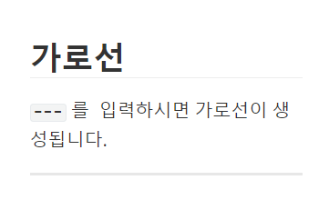

# Markdown 학습하기

## 제목(Heading)

가장 큰 제목부터 ~ 6번째로 큰 제목까지 존재

#의 개수로 제목의 중요도를 지정


## 목록(List)

순서가 있는 목록(ordered list)과 순서가 없는 목록(unordered list)가 있다.

### 순서 없는 목록

-혹은 *를 앞에 붙이고 띄어쓰기

- python
- js
- web
- django
- vue

### 순서 있는 목록

1을 쓰고 띄어쓰기

1. md학습

2. git 기초 학습

3. github 학습

     

## 강조(Emphasis)

글자의 스타일링 지정

### 기울임

*로 감싼 글자들은 *기울어 집니다.*

### 굵게

** 로 감싼 글자들은 **굵어집니다.**

### 취소

~~ 로 감싼 글자들은 ~~취소선이 생깁니다.~~

### 인라인 코드

백틱으로 감싼 글자들은 `코드처럼 표시됩니다.`


## 코드 블럭(Code block)

백틱 3개로 감싼 블럭은 코드 출력용입니다.

```python
def my_func():
	print("Hello World!")
```


## 표(Table)

파이프 |

| 이름   | 전공       | 나이 |
| ------ | ---------- | ---- |
| 한승재 | 기계공학   | 28   |
| 김철수 | 컴퓨터과학 | 25   |


## 가로선

`---` 를  입력하시면 가로선이 생성됩니다.

---


## 링크 & 이미지

복사 → 붙여넣기 하시면 자동으로 추가됩니다.



## 수식(Latex)

>   원래 마크다운은 지원하지 않으나, Typora가 추가적으로 지원하는 기능


$$
\begin{align*}
y = y(x,t) &= A e^{i\theta} \\
&= A (\cos \theta + i \sin \theta) \\
&= A (\cos(kx - \omega t) + i \sin(kx - \omega t)) \\
&= A\cos(kx - \omega t) + i A\sin(kx - \omega t)  \\
&= A\cos \Big(\frac{2\pi}{\lambda}x - \frac{2\pi v}{\lambda} t \Big) + i A\sin \Big(\frac{2\pi}{\lambda}x - \frac{2\pi v}{\lambda} t \Big)  \\
&= A\cos \frac{2\pi}{\lambda} (x - v t) + i A\sin \frac{2\pi}{\lambda} (x - v t)
\end{align*}
$$