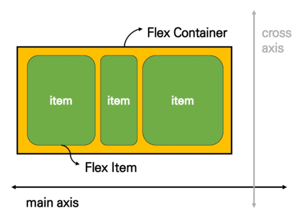
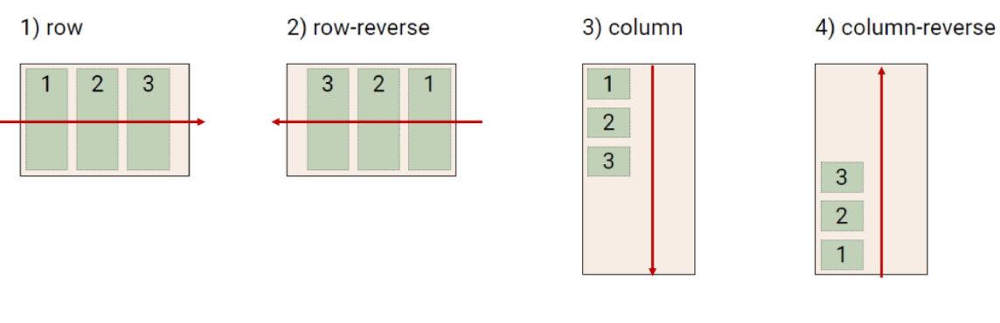
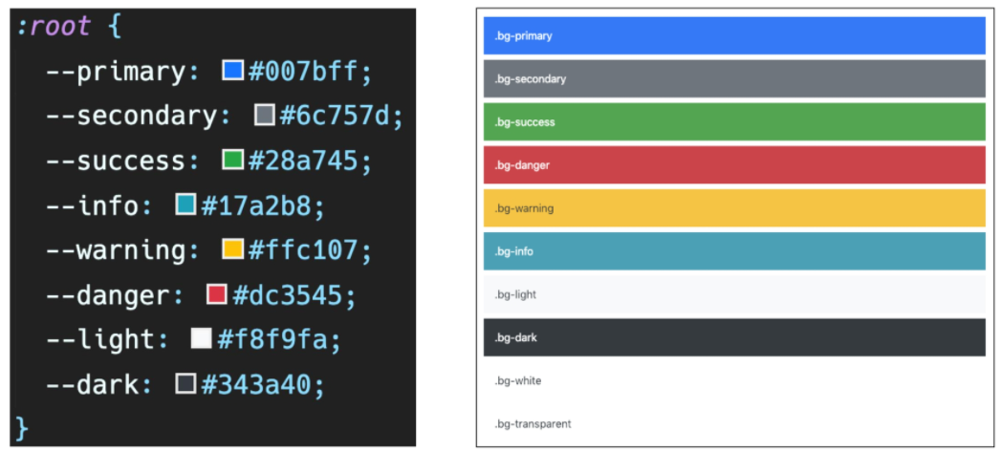

# HTML/CSS_02

## CSS Layout

>   CSS layout techniques

-   Display
-   Position
-   Float (CSS1, 1996)
-   **Flexbox (2012)**
-   Grid (2017)
-   기타
    -   Responsive Web Design (2010), Media Queries (2012)

### Float

>   CSS 원칙 I

-   Normal Flow

>   Float

-   박스를 왼쪽 혹은 오른쪽으로 이동시켜 텍스트를 포함 인라인요소들이 주변을 wrapping 하도록 함
-   요소가 Normal flow를 벗어나도록 함
-   속성
    -   none
    -   left
    -   right
-   Float는 레이아웃을 구성하기 위해 필수적으로 활용되었으며, 최근에는 Flexbox, Grid 등장과 함께 사용도가 낮아짐

>   Clearing Float

-   Float는 Normal Flow에서 벗어나 부동 상태
-   따라서, 이후 요소에 대하여 Float 속성이 적용되지 않도록 Clearing이 필수적
    -   `::after`: 선택한 요소의 맨 마지막 자식으로 가상 요소를 하나 생성
        -   보통 `content`속성과 짝지어, 요소에 장식용 콘텐츠를 추가할 때 사용
    -   clear 속성 부여

### Flexbox

>   CSS Flexible Box Layout

-   행과 열 형태로 아이템들을 배치하는 **1차원 레이아웃 모델**
-   수동 값 부여 없이 **수직 정렬**
-   아이템의 너비와 높이 혹은 간격을 동일하게 배치
-   축
    -   main axis
    -   cross axis
-   구성 요소
    -   Flex Container
        -   `display: flex` or `display: inline-flex`
    -   Flex Item

>   flex-direction

-   Main axis 기준 방향 설정
-   역방향의 경우 HTML 태그 선언 순서와 시각적으로 다르니 유의

>   flex-wrap

-   요소들이 강제로 한 줄에 배치되게 할 것인지 여부 설정
    -   nowrap: 한 줄에 배치
    -   wrap: 넘치면 그 다음 줄로 배치

>   flex-flow

-   flex-direction과 flex-wrap의 shorthand
-   `ex. flex-flow: row nowrap;`

>   justify-content & align-content

-   justify-content: Main axis를 기준으로 공간 배분
-   align-content: Cross axis를 기준으로 공간 배분(아이템이 한 줄로 배치되는 경우 확인할 수 없음)

-   공간 배분
    -   flex-start: 아이템들을 axis 시작점으로 *default*
    -   flex-end: 아이템들을 axis 끝 쪽으로
    -   center: 아이템들을 axis 중앙으로
    -   space-between: 아이템 사이의 간격을 균일하게 분배
    -   space-around: 아이템을 둘러싼 영역을 균일하게 분배(가질 수 있는 영역을 반으로 나눠서 양쪽에 배분)
    -   space-evenly: 전체 영역에서 아이템 간 간격을 균일하게 분배

>   align-items & align-self

-   align-items: 모든 아이템을 Cross axis를 기준으로 정렬
-   align-self: 개별 아이템을 Cross axis 기준 정렬

-   Cross axis를 중심으로
    -   stretch: 컨테이너를 가득 채움 *default*
    -   flex-start: 위
    -   flex-end: 아래
    -   center: 가운데
    -   baseline: 텍스트 baseline에 기준선을 맞춤

>   Flex에 적용하는 속성

-   flex-grow: 남은 영역을 아이템에 분배
-   order: 배치 순서

---

## Bootstrap

>   CDN(Content Delivery(Distribution) Network)

-   컨텐츠(CSS, JS, Image, Text 등)을 효율적으로 전달하기 위해 여러 노드에 가진 네트워크에 데이터를 제공하는 시스템
-   개별 end-user의 가까운 서버를 통해 빠르게 전달 가능
-   외부 서버를 활용함으로써 본인 서버의 부하가 적어짐

>   spacing

|  m   | margin  |  t   |     top      |
| :--: | :-----: | :--: | :----------: |
|  p   | padding |  b   |    bottom    |
|      |         |  s   |     left     |
|      |         |  e   |    right     |
|      |         |  x   | left & right |
|      |         |  y   | top & bottom |

| class name | rem  |  px  |
| :--------: | :--: | :--: |
|    m-1     | 0.25 |  4   |
|    m-2     | 0.5  |  8   |
|    m-3     |  1   |  16  |
|    m-4     | 1.5  |  24  |
|    m-5     |  3   |  48  |

>   color

### Responsive Web

-   다양한 화면 크기를 가진 디바이스들이 등장함에 따라 reponsive web design 개념이 등장
-   반응형 웹은 별도의 기술 이름이 아닌 웹 디자인에 대한 접근 방식, 반응형 레이아웃 작성에 도움이 되는 사례들의 모음 등을 기술하는데 사용되는 용어

>   Grid system

-   요소들의 디자인과 배치에 도움을 주는 시스템
-   기본 요소
    -   Column: 실제 컨텐츠를 포함하는 부분
    -   Gutter: Column과 Column 사이의 공간 (사이 간격)
    -   Container: Column들을 담고 있는 공간
-   Bootstrap Grid system은 Flexbox로 제작됨
-   container, rows, column으로 컨텐츠를 배치하고 정렬
    -   12개의 column
    -   6개의 grid breakpoints

