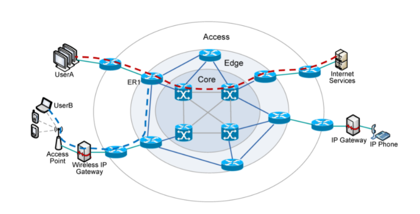

# 네트워크(Network)_01

## 네트워크의 내부구조

-   **계층적 구조(Layered Architecture)**

## 네트워크의 역사

### 통신의 역사

-   우편
-   봉화
    -   최초의 전자기 신호(광통신, 디지털)를 이용한 통신 시스템
-   전보(모스 부호)
    -   **Samuel F. B. Morse**가 1846년에 발명
    -   Data Network
    -   **Digital Network**
-   전화
    -   **Graham Bell**에 의해 1876년 발명
    -   현대적 통신
    -   Voice Network
    -   **Analog Network**
    -   사용자의 폭발적 증가
    -   수동교환에서 자동교환으로 발전
    -   **DDD(Direct Distance Dialing)**라는 방식이 컴퓨터 네트워크에 많은 영향을 끼침

## 컴퓨터 통신 (Network의 역사)

-   **Dial-up Modem**
    -   전화선(음성정보, 20Hz ~ 20,000Hz)을 그대로 이용해 통신
    -   Binary Data -> 가청주파수
    -   **1,200 bps ~ 14,400 bps**
    -   전화를 걸어서 통신
    -   음성정보와 데이터정보를 동일하게 취급
    -   Network Core = 전화망

-   **DSL (Digital Subscriber Line)**
    
    -   전화선을 통신선로로 사용
    -   Last Mile (마지막 1단계)만 전화선을 사용
    -   Network Core는 별도로 존재
    -   **1 ~ 8Mbps**
    -   Dedicated channel
    
-   **Cable Modem**
    -   케이블 TV 선로(동축선)를 이용
    -   **30Mbps**
    -   하지만, 실제로는 선로를 여러 명이 공유해 이론적인 속도보다는 느리다.
    -   Shared channel
    
-   **FTTH (Fiber To The Home)**
    -   집 앞까지 광케이블을 연결
    -   국내에서 활성화된 서비스
    
    |     구리선      |      광케이블       |
    | :-------------: | :-----------------: |
    |      전류       | 전자기파(가시광선)  |
    | 설치비용이 낮다 |   설치비용이 높다   |
    | 잡음에 취약하다 | 잡음특성이 우수하다 |
    
-   기타 Last Mile 통신기법

    |  Wi-fi   | EtherNet |
    | :------: | :------: |
    | 공유채널 |  전용선  |

    |     3G      |      LTE      |
    | :---------: | :-----------: |
    | 음성 최적화 | 데이터 최적화 |

### 통신선로의 종류

-   구리선

    |    전화선     |   EtherNet   |         고성능 이더넷          |  케이블TV선   |
    | :-----------: | :----------: | :----------------------------: | :-----------: |
    |   일반pair    | Twisted pair |         여러가락의 TP          |    동축선     |
    |     싸다      |              |      Pair간 플라스틱 격벽      |    비싸다     |
    | 전송률이 낮다 |              | 전체 케이블에 Aluminium Shield | 전송률이 높다 |

-   광섬유
    -   단위전송률의 가성비가 높다
-   무선(공기)
    -   잡음에 매우 취약
    -   공유채널

## 음성정보 vs. 데이터정보

|            음성정보             |                  데이터정보                   |
| :-----------------------------: | :-------------------------------------------: |
|  **Circuit Switching에 적합**   |          **Packet Switching에 적합**          |
| 시작과 끝이 명시적으로 구분된다 |             시작과 끝이 모호하다              |
|     꾸준히 정보가 전송된다      | 패킷에 발신인과 수신인의 정보를 담아 전송한다 |
| 시작부터 끝까지 선로자원을 점유 |                 편지배달방식                  |
|  Circuit의 초기화 비용이 높다   |    패킷당 부하가 높다, 초기화 비용이 낮다     |
|         과금은 시간단위         |          패킷당 과금, 데이터량 과금           |

## 프로토콜(Protocol)

-   통신규약
-   계층적인 규약 구조
-   **ISO/OSI 7 Layer** 
    -   응용계층
        -   카카오톡, LOL, YouTube
    -   표현계층
        -   HTML
    -   세션계층
        -   응용/표현 객체의 전달(HTTP)
    -   전송계층
        -   양 끝단 전송품질 보장
    -   네트워크계층
        -   어떻게 Network Core가 끝단간 전송을 구현하는지
    -   데이터링크계층
        -   각 링크의 규약을 규정
    -   물리계층

## 성능지표

-   전송률
    -   최대전송률 - 공유채널에 의해 거품 발생 가능
    -   평균전송률
    -   최저전송률
-   지연시간