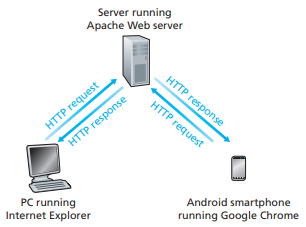
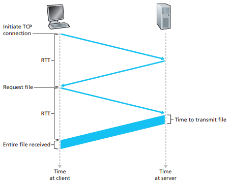
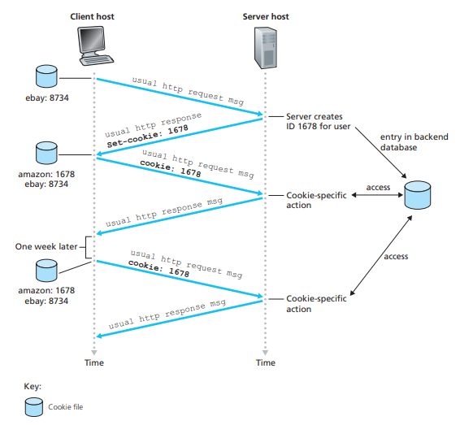
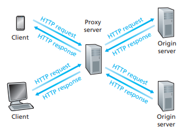
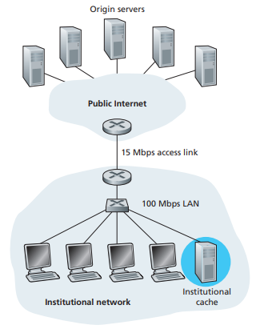
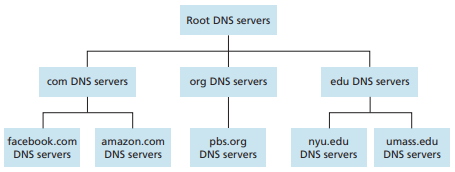
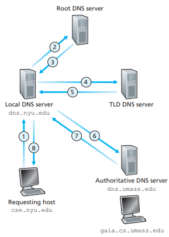

# 네트워크(Network)_02

## Client-server architecture

### Server

-   Always-on host
-   **Permanent IP address**
-   Data centers for scaling
-   Server process: process that waits to be contacted

<br>

### Client

-   Communicate with server
-   May be intermittently(간헐적으로) connected
-   May have dynamic IP addresses
-   Do not communicate directly with each other
-   Client process: process that initiates communication

<br><br>

## Processes communicating

### process

-   Program running within a host
    -   within same host, two processes communicate using **inter-process communication** (defined by OS)
    -   processes in different hosts communicate by exchanging **messages**

<br>

### Addressing processes

-   To receive messages, process must have **identifier**
-   Host device has unique 32-bit IP address
-   **Identifier** includes both **IP address** and **port numbers** associdated with process on host.
-   Example:
    -   HTTP server: 80
    -   mail server: 25

<br><br>

## Internet Transport Protocols Services

### TCP service:

-   **reliable transport** (말한 그대로 전달) between sending and receiving process
-   **flow control**: sender won't overwhelm receiver
-   **congestion control**: throttle sender when network overloaded
-   **does not provide**: timing, minimum throughput guarantee, security
-   **connection-oriented**: setup required between client and server processes

<br>

### UDP service:

-   **unreliable data transfer** between sending and receiving process
-   **does not provide**: reliability, flow control, congestion control, timing, throughput guarantee, security, or connection setup

|      Application       |     Application layer protocol      | Underlying transport protocol |
| :--------------------: | :---------------------------------: | :---------------------------: |
|         E-mail         |           SMTP [RFC 2821]           |              TCP              |
| Remote terminal access |          Telnet [RFC 854]           |              TCP              |
|          Web           |           HTTP [RFC 2616]           |              TCP              |
|     File transfer      |            FTP [RFC 959]            |              TCP              |
|  Streaming multimedia  | HTTP (e.g. YouTube), RTP [RFC 1889] |          TCP or UDP           |
|   Internet telephony   | SIP, RTP, proprietary (e.g. Skype)  |          TCP or UDP           |

<br><br>

## Chapter 2. Application Layer

-   네트워크란 컴퓨터에서 실행되는 프로세스가 다른 컴퓨터의 프로세스와 메시지를 주고받는 것. (interprocess간 통신)
-   이 chapter에서는 응용 계층만 볼 것이므로 패킷 유실을 극복하는 방법 등에 관해서는 생각하지 않는다. (계층화)
-   Socket이라는 OS의 system call을 이용한다.
-   IP address를 통해 machine을 지정하고, 이 안의 수많은 process의 socket을 port 번호를 이용해 특정한다.
-   Web browser가 DNS를 통해 `www.naver.com`의 IP 주소를 얻게되고, **80번 port에** 접근한다.

<br><br>

### Web and HTTP

-   **Web page** consists of **objects**
-   Object can be HTML file, JPEG file, Java applet, audio file...
-   Web page consists of **base HTML-file** which includes **several referenced objects**
-   Each object is addressable by a **URL**, e.g., `www.someschool.edu[host name]/someDept/pic.gif[path name]`

<br><br>

#### HTTP: hypertext transfer protocol

-   Web's application layer protocol
-   Client/server model



-   HTTP는 TCP를 기반으로 동작 (유실되지 않는다.)

<br>

-   **uses TCP**:
    -   client initiates TCP connection (creates socket) to server, port 80
    -   server accepts TCP connection from client
    -   HTTP massages exchanged between browser (HTTP client) and Web server (HTTP server)
    -   TCP connection closed

<br>

-   **HTTP is "stateless"**
    -   server maintains no information about past client requests
    -   단순하기에 서버가 많은 사용자들을 처리할 수 있음

<br><br>

### HTTP connections

#### Non-persistent HTTP

-   매번 새로운 TCP 연결

-   **RTT (definition)**: time for a small packet to travel from client to server and back

-   **HTTP response time**:

    -   one RTT to tinitiate TCP connection
    -   one RTT for HTTP request and first few bytes of HTTP response to return
    -   file transmission time
    -   **non-persistent HTTP response time = 2RTT + file transmission time**

    

#### Persistent HTTP

-   TCP 연결 재사용

<br><br>

### HTTP request message

-   ASCII (human-readable format)

```
GET /index.html HTTP/1.1\r\n
Host: www-net.cs.umass.edu\r\n
User-Agent: Firefox/3.6.10\r\n
...
```

<br><br>

### HTTP response message

```
HTTP/1.1 200 OK\r\n
...
```

<br><br>

### User-server state: cookies



<br><br>

### Web caches (proxy server)

-   **Goal**: satisfy client request without involving origin server
-   Client는 응답을 빠르게 받는다.
-   Server는 부하가 적어진다.
-   Proxy server의 운영 주체는 나가는 트래픽이 적어진다. (사용료를 아낀다.)
-   Cache가 등장하면 항상 발생하는 문제: 일관성 (Origin에서의 업데이트가 즉각적으로 반영되지 않음)



<br>

#### Caching example:

-   케이블 확장공사를 하는 것이 하나의 해결책이지만 비용이 매우 비싸다.
-   Web proxy를 설치하면 hit rate = 0.4라고 했을 때, utilization of access link가 60% 수준으로 줄어들고, total avg delay = 0.6 * (2.01 seconds) + 0.4 * (milliseconds) < 1.4 seconds, 그리고 비용이 확장공사에 비해 저렴하다.



<br>

#### Conditional GET

-   Web cache의 일관성 문제를 해결하기 위한 방법

-   **Goal**: don't send object if cache has up-to-date cached version
    -   No object transmission delay
    -   Lower link utilization
-   Cache: specify date of cached copy in HTTP request `If-modified-since: <date>`
-   Server: response contains no object if cached copy is up-to-date: `HTTP/1.0 304 Not Modified`

<br><br>

### DNS: Domain Name System

-   people: many identifiers:
    -   SSN, name, passport #

<br>

-   Internet hosts, routers:
    -   IP address (32 bit) - used for addressing datagrams
    -   "name", e.g., `www.yahoo.com` - used by humans
    -   Q: how to map between IP address and name, and vice versa?

<br>

-   DNS:
    -   distributed database
        -   implemented in hierarchy of many **name servers**
    -   application-layer protocol:
        -   hosts, name servers communicate to resolve names (address/name translation)

<br>

-   Host name과 IP address를 mapping한 database를 한 서버에서 관리하면 single point failure (그 서버가 다운되면 이용 불가능)이 발생할 수 있다.
-   DNS는 UDP를 사용한다.
    -   UDP는 TCP와 다르게 준비절차가 없으므로 빠르다. (DNS는 HTTP 요청의 준비과정일 뿐이므로 빠른 것이 유리함)
    -   HTTP와 다르게 전송하는 데이터 크기가 매우 작으므로 유실의 위험이 적다.

<br>

#### DNS: a distributed, hierarchical database



-   client wants IP for `www.amazon.com`: 1st approx:
    -   client queries root server to find `com DNS server`
    -   client queries `com DNS server` to get `amazon.com DNS server`
    -   client queries `amazon.com DNS server` to get IP address for `www.amazon.com`

<br>

#### DNS: root name servers

-   contacted by local name server that can not resolve name
-   `root name server`:
    -   contacts `authoritative name server` if name mapping not known
    -   gets mapping
    -   returns mapping to local name server
    -   13 root name "servers" worldwide

<br>

#### TLD, authoritative servers

-   top-level domain (TLD) servers:
    -   responsible for com, org, net, edu, aero, jobs, museums, and all top-level country domains, e.g. uk, fr, ca, jp
    -   Network Solutions maintains servers for .com TLD
    -   Educause for .edu TLD

<br>

-   authoritative DNS servers:
    -   organization's own DNS server(s), providing authoritative hostname to IP mappings for organization's named hosts
    -   can be maintained by organization or service provider
    -   `www`, `portal`, `info`, etc,.

<br>

#### Local DNS name server

-   does not strictly belong to hierarchy
-   each ISP (residential ISP, company, university) has one
    -   also called "default name server"
-   when host makes DNS query, query is sent to its local DNS server
    -   has local cache of recent name-to-address translation pairs (but may be out of date!)
    -   acts as proxy, forwards query into hierarchy

<br>

#### DNS name resolution example



<br>

#### DNS:caching, updating records

-   once (any) name server learns mapping, it *caches* mapping
    -   cache entries timeout (disappear) after some time (TTL)
    -   TLD servers typically cached in local name servers

<br>

-   cached entries may be **out-of-date** (best effort name-to-address translation!)
    -   if name host changes IP address, may not be known Internet-wide until all TTLs expire

<br>

-   update/notify mechanisms proposed IETF standard
    -   RFC 2136

<br>

#### DNS records

-   **DNS**: distributed db storing resource records **(RR)**

    ```
    RR format: (name, value, type, ttl)
    ```

-   **type=A**

    -   `name` is hostname
    -   `value` is IP address

<br>

-   **type=NS**

    -   `name` is domain (e.g., foo.com)
    -   `value` is hostname of authoritative name server for this domain

<br>

-   type=CNAME

    -   `name` is alias name for some "canonical" (the real) name
    -   `www.bim.com` is really `servereast.backup2.ibm.com`
    -   `value` is canonical name

<br>

-   type=MX

    -   `value` is name of mailserver associated with `name`

<br><br>

### What is a socket?

#### An interface between application and network

-   The application creates a socket
-   The socket type dictates the style of communication
    -   reliable vs. best effort
    -   connection-oriented vs. connectionless

<br>

#### Once configured, the application can

-   pass data to the socket for network tranmission
-   receive data from the socket (transmitted through the network by some other host)

<br>

#### Two essential types of sockets

-   **SOCK_STREAM**
    -   a.k.a TCP
    -   reliable delivery
    -   in-order guaranteed
    -   connection-oriented
    -   bidirectional

<br>

-   **SOCK_DGRAM**
    -   a.k.a UDP
    -   unreliable delivery
    -   no order guarantees
    -   no notion of "connection" - app indicates dest. for each packet
    -   can send or receive

<br>

#### Sockets API

-   Creation and Setup
-   Establishing a Connection (TCP)
-   Sending and Receiving Data
-   Tearing Down a Connection (TCP)

<br>

#### TCPServer.py

```python
from socket import *
import threading
import time


def send(sock):
    while True:
        sendData = input('>>> ')
        sock.send(sendData.encode('utf-8'))


def receive(sock):
    while True:
        recvData = sock.recv(1024)
        print('Opponent:', recvData.decode('utf-8'))


port = 8081

serverSock = socket(AF_INET, SOCK_STREAM)
serverSock.bind(('', port))
serverSock.listen(1)

connectionSock, addr = serverSock.accept()
print('Successfully connected from', str(addr) + '.')

sender = threading.Thread(target=send, args=(connectionSock,))
receiver = threading.Thread(target=receive, args=(connectionSock,))
    
sender.start()
receiver.start()

while True:
    time.sleep(1)
    pass

```

<br>

#### TCPClient.py

```python
from socket import *
import threading
import time


def send(sock):
    while True:
        sendData = input('>>> ')
        sock.send(sendData.encode('utf-8'))


def receive(sock):
    while True:
        recvData = sock.recv(1024)
        print('Opponent:', recvData.decode('utf-8'))


port = 8081

clientSock = socket(AF_INET, SOCK_STREAM)
clientSock.connect(('127.0.0.1', port))
print('Successfully connected.')

sender = threading.Thread(target=send, args=(clientSock,))
receiver = threading.Thread(target=receive, args=(clientSock,))
    
sender.start()
receiver.start()

while True:
    time.sleep(1)
    pass

```

<br><br>

## Reference

[컴퓨터네트워크: 이석복 교수님](http://www.kocw.net/home/cview.do?cid=6b984f376cfb8f70)
