# 네트워크(Network)_03

## Chapter 3. Transport Layer

-   인터넷은 IP라는 protocol을 사용하는 device들의 연결 (모래시계 형태)
-   APP MESSAGE가 TCP, UDP SEGMENT의 DATA 부분에 들어가고, DATA에 대한 부가설명이 HEADER에 들어간다.
-   SEGMENT는 그 아래계층인 IP PACKET에 담기고, PACKET은 그 아래 링크계층의 FRAME에 담기고... 계속해서 내려간다.

### Multiplexing/Demultiplexing

-   목적 process에 알맞게 전달해주는 일

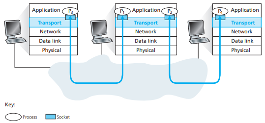

#### Connectionless demux:

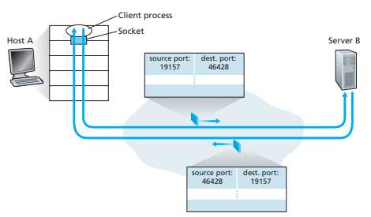

-   UDP segment가 사용하는 방식
-   Connection이 없다. (socket 간 1:1 mapping이 아님)

#### Connection-oriented demux:

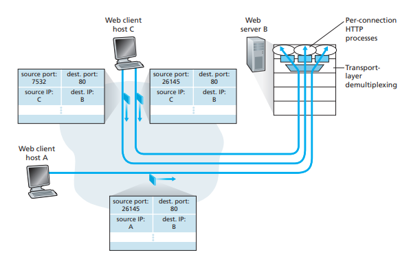

-   TCP segment
-   Connection (socket 이 1:1 관계)
-   TCP socket들은 고유의 port #가 아닌 고유 ID를 가진다.
    -   source port + source IP + dest. port + dest. IP: `socket ID`
-   socket API의 accept 메서드의 리턴값이 new socket ID이다.
-   같은 machine에서 naver 창을 4개 띄웠을 때, source port가 다르므로 다른 socket ID를 갖는다.

### UDP: segment header

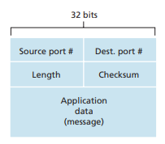

-   no connection establishment (which can add delay)
-   simple: no connection state at sender, receiver
-   small header size
-   no congestion control: UDP can blast away as fast as desired
-   checksum: error detection
-   유실될 수는 있지만, 엉뚱한 데이터를 demultiplexing 하지 않는다.

### Principles of reliable data transfer

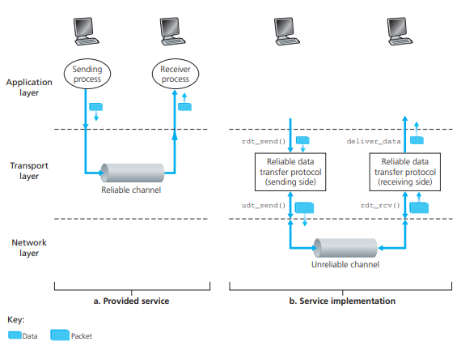

-   important in application, transport, link layers
    -   top-10 list of important networking topics!
    -   하위 계층은 Unreliable channel (Error & Loss)임에도 사용자에게 Reliable channel처럼 보이게 해주는 방법

### RDT(Reliable Data Transfer)

-   incrementally develop sender, receriver sides of RDT protocol
-   consider only unidirectional data transfer
    -   but control info will flow on both directions!
-   use finite state machines (FSM) to specify sender, receiver

#### rdt1.0

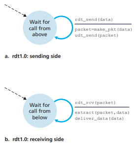

-   underlying channel perfectly reliable
    -   no bit errors
    -   no loss of packets
-   separate FSMs for sender, receiver
    -   sender sends data into underlying channel
    -   receiver reads data from underlying channel

#### rdt2.0

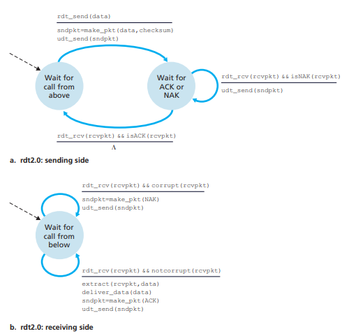

-   underlying channel may flip bits in packet
    -   checksum to detect bit errors
-   *the question:* how to recover from errors
    -   **acknowledgements (ACKs):** receiver explicitly tells sender that pkt received OK
    -   **negative acknowledgements (NAKs):** receiver explicitly tells sender that pkt had errors
    -   sender retransmits pkt on receipt of NAK
-   new mechanisms in **rdt2.0** (beyond **rdt1.0**)
    -   error detection
    -   feedback: control msgs (ACK, NAK) from receiver to sender (NAK 받으면 재전송)
-   rdt2.0 has a fatal flaw!
    -   what happens if ACK/NAK corrupted?
        -   sender doesn't know what happened at receiver!
        -   can't just retransmit: possible duplicate
    -   handling duplicates:
        -   sender retransmits current pkt if ACK/NAK corrupted
        -   sender adds *sequence number* to each pkt
            -   receiver가 받은 메시지가 새로운 메시지인지, 중복된 메시지인지 판단하기 위함
            -   sequence number는 2개면 충분하다. (1 bit)
        -   receiver discards (doesn't deliver up) duplicate pkt

#### rdt2.1

##### sender

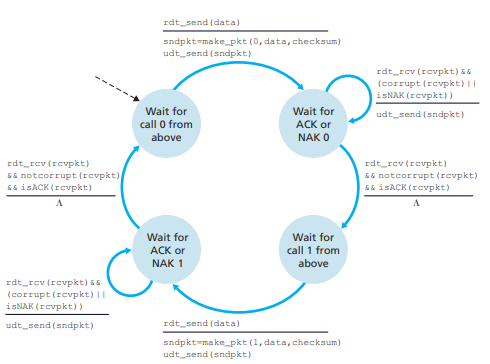

##### receiver

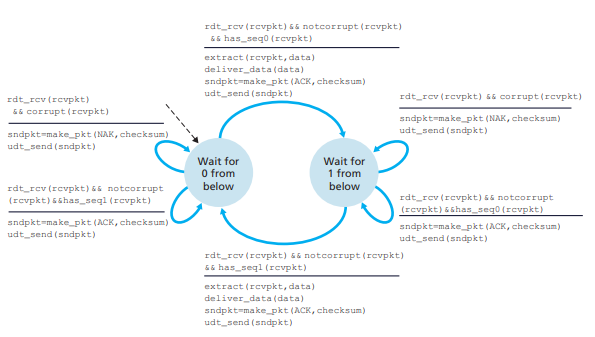

#### rdt2.2: a NAK-free protocol

##### sender

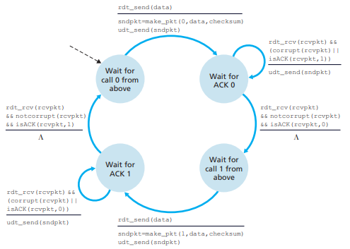

##### receiver

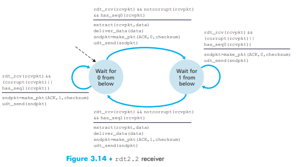

#### rdt3.0

-   new assumption:
    -   underlying channel can also lose packets (data, ACKs)
        -   checksum, seq. #, ACKs, retransmissions will be of help ... but not enough
-   timer가 필요해진다.
    -   얼마나 기다릴 것인가?

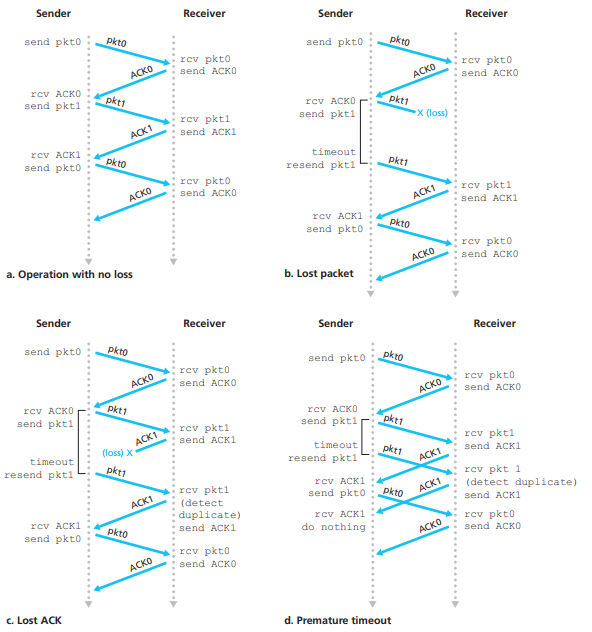

### Pipelined protocols

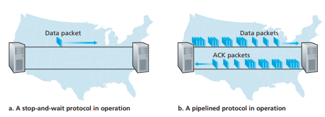

-   pipelining: sender allows multiple, 'in-flight', yet-to-be-acknowledged pkts
-   two generic forms of pipelined protocols: *go-Back-N, selective repeat*

### TCP: overview

-   **point-to-point:**
    -   one sender, one receiver
    -   socket 한 쌍을 위해서만 동작한다.
-   **reliable, in-order byte steam:**
    -   no "message boundaries"
    -   유실이 없다 (reliable)
    -   application에서 내려온 순서대로 (in-order)
-   **pipelined:**
    -   TCP congestion and flow control set window size
    -   한번에 많은 메시지가 전달될 수 있다.
-   **full duplex data:**
    -   bi-directional data flow in same connection
    -   각 socket이 sender이자 receiver로 작동
    -   MSS: maximum segment size
-   **connection-oriented:**
    -   handshaking (exchange of control msgs) inits sender, receiver state before data exchange
-   **flow controlled:**
    -   segment transport 속도는 상대방 machine의 처리량에 맞게 조절해야한다.

#### TCP segment structure

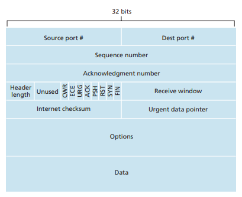

##### sequence numbers:

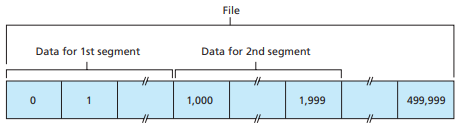

-   byte stream "number" of first byte in segment's data
-   각 segment의 첫번째 byte의 seq #가 그 seg의 representive sequence number가 된다.

##### acknowledgements:

-   seq # of next byte expected from other side
-   cumulative ACK

##### Q: how receiver handles out-of-order segments?

-   A: TCP spec doesn't say, - up to implementor

#### TCP Round Trip Time (RTT)

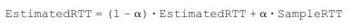

-   **exponential weighted moving average**
-   **influence of past sample decreases exponentially fast**
-   typical value: *alpha* = 0.125

-   recommended value: *beta* = 0.25

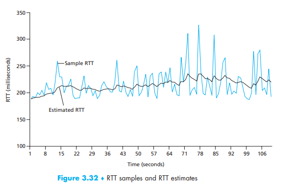

-   같은 경로의 router를 따라가더라도 queueing delay가 다르다.

-   `RTT (EstimatedRTT) + margin (4 * DevRTT)`을 `TimeoutInterval`로 설정
-   seg를 보낸 시간부터 응답 ACK가 도착한 시간까지가 **SAMPLE RTT**
    -   재전송된 segment의 경우는 SAMPLE RTT에 포함시키지 않는다. (이상한 값이 포함될 가능성이 있기 때문)

#### Reliable data transfer

-   TCP connection이 생기면 각 socket마다 **SEND buffer와 RECEIVE buffer가** 생성된다.
-   한 번에 window의 크기만큼의 데이터만 전송할 수 있다.
-   ACK#xxxx 를 받은 후, 이 **ACK#xxxx 이전의 seq #를 가진 데이터들은 재전송할 일이 없으므로 버퍼에서 내보내고, SEND_BASE, timer, window 포인터가 #xxxx segment로 이동한다.**
-   즉, *SEND buffer*는 재전송을 구현, *RECEIVE buffer*는 in-order transfer를 구현

#### Fast retransmit

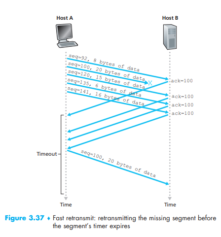

-   time-out period often relatively long:
    -   long delay before resending lost packet
-   detect lost segments via duplicate ACKs
    -   sender often sends many segments back-to-back
    -   if segment is lost, there will likely be many duplicate ACKs
        -   **if sender receives 3 ACKs for same data, resend unacked segment with smallest seq #**

