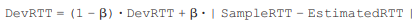

# 네트워크(Network)_03

## Chapter 3. Transport Layer

-   인터넷은 IP라는 protocol을 사용하는 device들의 연결 (모래시계 형태)
-   APP MESSAGE가 TCP, UDP SEGMENT의 DATA 부분에 들어가고, DATA에 대한 부가설명이 HEADER에 들어간다.
-   SEGMENT는 그 아래계층인 IP PACKET에 담기고, PACKET은 그 아래 링크계층의 FRAME에 담기고... 계속해서 내려간다.

<br>

<br>

### Multiplexing/Demultiplexing

-   목적 process에 알맞게 전달해주는 일


<br>

#### Connectionless demux:


-   UDP segment가 사용하는 방식
-   Connection이 없다. (socket 간 1:1 mapping이 아님)

<br>

#### Connection-oriented demux:


-   TCP segment
-   Connection (socket 이 1:1 관계)
-   TCP socket들은 고유의 port #가 아닌 고유 ID를 가진다.
    -   source port + source IP + dest. port + dest. IP: `socket ID`
-   socket API의 accept 메서드의 리턴값이 new socket ID이다.
-   같은 machine에서 naver 창을 4개 띄웠을 때, source port가 다르므로 다른 socket ID를 갖는다.

<br><br>

### UDP: segment header


-   no connection establishment (which can add delay)
-   simple: no connection state at sender, receiver
-   small header size
-   no congestion control: UDP can blast away as fast as desired
-   checksum: error detection
-   유실될 수는 있지만, 엉뚱한 데이터를 demultiplexing 하지 않는다.

<br>

<br>

### Principles of reliable data transfer


-   important in application, transport, link layers
    -   top-10 list of important networking topics!
    -   하위 계층은 Unreliable channel (Error & Loss)임에도 사용자에게 Reliable channel처럼 보이게 해주는 방법

<br>

<br>

### RDT(Reliable Data Transfer)

-   incrementally develop sender, receriver sides of RDT protocol
-   consider only unidirectional data transfer
    -   but control info will flow on both directions!
-   use finite state machines (FSM) to specify sender, receiver

<br>

#### rdt1.0


-   underlying channel perfectly reliable
    -   no bit errors
    -   no loss of packets

<br>

-   separate FSMs for sender, receiver
    -   sender sends data into underlying channel
    -   receiver reads data from underlying channel

<br>

#### rdt2.0


-   underlying channel may flip bits in packet
    -   checksum to detect bit errors

<br>

-   *the question:* how to recover from errors
    -   **acknowledgements (ACKs):** receiver explicitly tells sender that pkt received OK
    -   **negative acknowledgements (NAKs):** receiver explicitly tells sender that pkt had errors
    -   sender retransmits pkt on receipt of NAK

<br>

-   new mechanisms in **rdt2.0** (beyond **rdt1.0**)
    -   error detection
    -   feedback: control msgs (ACK, NAK) from receiver to sender (NAK 받으면 재전송)

<br>

-   rdt2.0 has a fatal flaw!
    -   what happens if ACK/NAK corrupted?
        -   sender doesn't know what happened at receiver!
        -   can't just retransmit: possible duplicate
    -   handling duplicates:
        -   sender retransmits current pkt if ACK/NAK corrupted
        -   sender adds *sequence number* to each pkt
            -   receiver가 받은 메시지가 새로운 메시지인지, 중복된 메시지인지 판단하기 위함
            -   sequence number는 2개면 충분하다. (1 bit)
        -   receiver discards (doesn't deliver up) duplicate pkt

<br>

#### rdt2.1

##### sender


##### receiver


<br>

#### rdt2.2: a NAK-free protocol

##### sender


##### receiver


<br>

#### rdt3.0

-   new assumption:
    -   underlying channel can also lose packets (data, ACKs)
        -   checksum, seq. #, ACKs, retransmissions will be of help ... but not enough

<br>

-   timer가 필요해진다.
    -   얼마나 기다릴 것인가?


<br><br>

### Pipelined protocols


-   pipelining: sender allows multiple, 'in-flight', yet-to-be-acknowledged pkts
-   two generic forms of pipelined protocols: *go-Back-N, selective repeat*

<br>

<br>

### TCP: overview

-   **point-to-point:**
    -   one sender, one receiver
    -   socket 한 쌍을 위해서만 동작한다.

<br>

-   **reliable, in-order byte steam:**
    -   no "message boundaries"
    -   유실이 없다 (reliable)
    -   application에서 내려온 순서대로 (in-order)

<br>

-   **pipelined:**
    -   TCP congestion and flow control set window size
    -   한번에 많은 메시지가 전달될 수 있다.

<br>

-   **full duplex data:**
    -   bi-directional data flow in same connection
    -   각 socket이 sender이자 receiver로 작동
    -   MSS: maximum segment size

<br>

-   **connection-oriented:**
    -   handshaking (exchange of control msgs) inits sender, receiver state before data exchange

<br>

-   **flow controlled:**
    -   segment transport 속도는 상대방 machine의 처리량에 맞게 조절해야한다.

<br>

<br>

#### TCP segment structure


<br>

##### sequence numbers:


-   byte stream "number" of first byte in segment's data
-   각 segment의 첫번째 byte의 seq #가 그 seg의 representive sequence number가 된다.

<br>

##### acknowledgements:

-   seq # of next byte expected from other side
-   cumulative ACK

<br>

##### Q: how receiver handles out-of-order segments?

-   A: TCP spec doesn't say, - up to implementor

<br>

<br>

#### TCP Round Trip Time (RTT)


-   **exponential weighted moving average**
-   **influence of past sample decreases exponentially fast**
-   typical value: *alpha* = 0.125



-   recommended value: *beta* = 0.25


-   같은 경로의 router를 따라가더라도 queueing delay가 다르다.

-   `RTT (EstimatedRTT) + margin (4 * DevRTT)`을 `TimeoutInterval`로 설정
-   seg를 보낸 시간부터 응답 ACK가 도착한 시간까지가 **SAMPLE RTT**
    -   재전송된 segment의 경우는 SAMPLE RTT에 포함시키지 않는다. (이상한 값이 포함될 가능성이 있기 때문)

<br>

<br>

#### Reliable data transfer

-   TCP connection이 생기면 각 socket마다 **SendBuffer와 RcvBuffer가** 생성된다.
-   한 번에 window의 크기만큼의 데이터만 전송할 수 있다.
-   ACK#xxxx 를 받은 후, 이 **ACK#xxxx 이전의 seq #를 가진 데이터들은 재전송할 일이 없으므로 버퍼에서 내보내고, SEND_BASE, timer, window 포인터가 #xxxx segment로 이동한다.**
-   즉, *SendBuffer*는 재전송을 구현, *RcvBuffer*는 in-order transfer를 구현
-   `SOCK_WRITE`할 때 App layer에서 SendBuffer로, `SOCK_READ`할 때 RcvBuffer에서 App layer로 올라간다.

<br>

<br>

#### Fast retransmit


```pseudocode
event: ACK received, with ACK field value of y
	if (y > SendBase) {
	SendBase = y
	if (there are currently any not yet acknowledged segments)
		start timer
	} else {/* a duplicate ACK for already ACKed segment */
		increment number of duplicate ACKs received for y
		if (number of duplicate ACKs received for y == 3)
		/* TCP fast retransmit */
		resend segment with sequence number y
		}
	break;
```


-   time-out period often relatively long:
    -   long delay before resending lost packet

<br>

-   detect lost segments via duplicate ACKs
    -   sender often sends many segments back-to-back
    -   if segment is lost, there will likely be many duplicate ACKs
        -   **if sender receives 3 ACKs for same data, resend unacked segment with smallest seq #**

<br>

<br>

#### TCP Flow Control

-   `SOCK_READ` system call을 너무 빠르게 하거나, 너무 느리게 하는 경우 buffer의 용량이 문제가 된다.
-   따라서 보내는 속도는 receiver가 읽어가는 속도(`rwnd`)에 맞춰야 함
-   Header의 receive window가 이를 위한 영역
-   `rwnd = 0`인데, 보낼 segment가 없는 경우가 문제가 된다.
    -   segment가 나가는 경우는 `SOCK_WRITE`를 해서 SEND buffer에서 보내거나, 상대방에게 받아서 ACK를 보내는 경우 뿐이다.
    -   따라서 상대방의 `rwnd = 0`이라고 report된 경우, SEND buffer에서 prove라는 1byte의 segment를 주기적으로 보낸다. (header가 40byte, body가 1byte)

<br>

-   Clark's solution
    -   Receiving TCP announces rwnd = 0 until:
        -   Enough space to accommodate a segment of maximum size
        -   Or half of the buffer is empty

<br>

-   Delayed ACK
    -   Wait up to 500ms for next segment. If no next segment. send ACK

<br>

<br>

#### Connection Management

##### 2-way handshake:

-   variable delays
-   retransmitted messages (e.g., req_conn(x)) due to message loss
-   message reordering
-   can't "see" other side

<br>

##### TCP 3-way handshake


-   **SYN** message는 header만 나간다.
-   3번째 message는 일반적인 TCP segment이다.

<br>

##### TCP: closing a connection


-   client, server each close their side of connection
    -   send TCP segment with `FIN` bit = 1
-   respond to received `FIN` with `ACK`
    -   on receiving `FIN, ACK` can be combined with own `FIN`
-   simultaneous `FIN` exchanges can be handled
-   **마지막 ACK 유실의 가능성** 때문에 Timed wait가 존재한다.

<br>

#### Principles of congestion control

-   **congestion:**
    -   informally: "too many sources sending too much data too fast for *network* to handle"
    -   **different from flow control!**
    -   manifestations:
        -   lost packets (buffer overflow at routers)
        -   long delays (queueing in router buffers)
    -   a top-10 problem!

<br>

##### Causes/costs of congestion: scenario 1


-   two senders, two receivers
-   one router, infinite buffers
-   output link capacity: R
-   no retransmission

<br>

##### Causes/costs of congestion: scenario 2


-   one router, *finite* buffers
-   sender retransmission of timed-out packet
    -   application-layer input = application-layer output
    -   transport-layer input includes *retransmissions*

<br>

-   **idealization: perfect knowledge**
    -   sender sends only when router buffers available

<br>

-   **idealization: known loss**
    -   packets can be lost, dropped at router due to full buffers
    -   sender only resends if packet *known* to be lost

<br>

-   **Realistic: duplicates**
    -   packets can be lost, dropped at router due to full buffers
    -   sender times out prematurely, sending *two* copies, both of which are delivered

<br>

-   "costs" of congestion:
    -   more work (retrans) for given "goodput"
    -   unneeded retransmissions: link carries multiple copies of pkt
        -   decreasing goodput
    -   패킷을 많이 보내서 경로가 막혔는데 더 보내는 문제가 존재

<br>

##### Causes/costs of congestion: scenario 3


-   four senders
-   multihop paths
-   timeout/retransmit
-   another "cost" of congestion:
    -   when packet dropped, any **"upstream"** transmission capacity used for that packet was wasted!
    -   역설적이게도, 패킷을 많이 보내면 많이 보낼수록 적게(심지어는 아예 못) 받는다.

<br>

#### TCP congestion control: additive increase multiplicative decrease


-   **approach:** sender increases transmission rate (window size), probing for usable bandwidth, until loss occurs
    -   **additive increase:** increase `cwnd (congestion window size)` by 1 `MSS (Maximum Segment Size: 1500bytes)` every `RTT` until loss detected
    -   **multiplicative decrease:** cut `cwnd` in half after loss

<br>

##### TCP Slow Start


-   when connection begins, increase rate exponentially until first loss event:
    -   initially `cwnd` = 1 `MSS`
    -   double `cwnd` every `RTT`
    -   done by incrementing `cwnd` for every `ACK` received
-   **summary:** initial rate is slow but ramps up exponentially fast

<br>

##### TCP: switching from slow start to CA


-   when should the exponential increase switch to linear?
    -   when `cwnd` gets to 1/2 of its value before timeout.

<br>

-   **Implementation:**
    -   variable `ssthresh`
    -   on loss event, `ssthresh` is set to 1/2 of `cwnd` just before loss event
        -   Timer expire과 3 dup ACK는 모두 loss event지만, timer expire의 경우가 네트워크가 혼잡하다고 판단 가능하다.
        -   TCP Reno는 3 dup ACK의 경우 window를 다시 1부터 시작하지 않는다.

<br>

#### TCP throughput

-   avg. TCP thruput as function of window size, RTT?

    -   ignore slow start, assume always data to send

-   W: window size (measured in bytes) where loss occurs (congestion window size)

    -   avg. window size (# in-flight bytes) is 3/4 W
    -   avg. thruput is 3/4 W per RTT

    


<br>

#### TCP Fairness

-   **fairness goal:** if K TCP sessions share same bottleneck link of bandwidth R, each should have average rate of R/K

<br>

##### Why is TCP fair?


-    two competing sessions:
-   additive increase gives slope of 1, as throughout increases
-   multiplicative decrease decreases throughput proportionally
-   connection 단위에서 공평하다는 것 (호스트가 10배의 커넥션을 사용한다면 당연히 10배의 rate를 가짐)

<br><br>

## Reference

[컴퓨터네트워크: 이석복 교수님](http://www.kocw.net/home/cview.do?cid=6b984f376cfb8f70)

