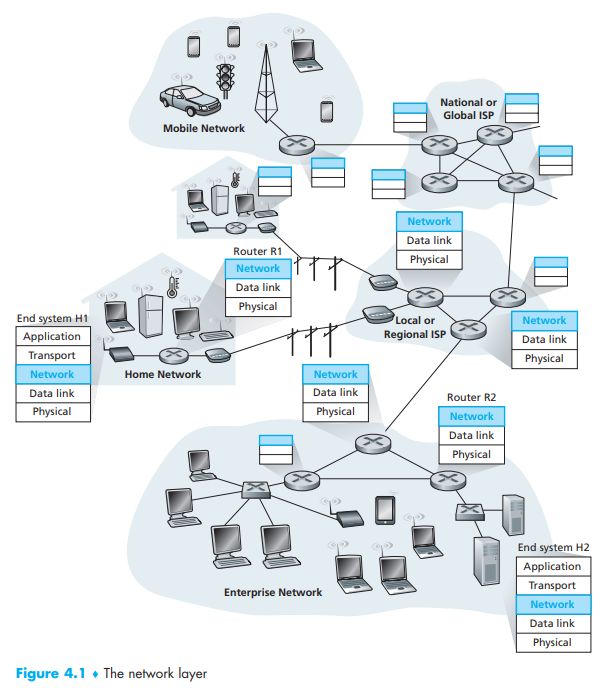
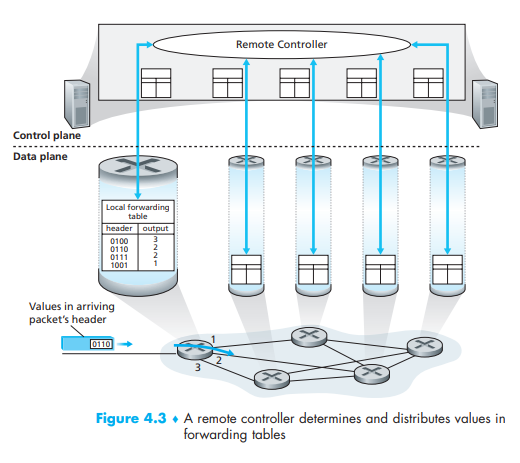
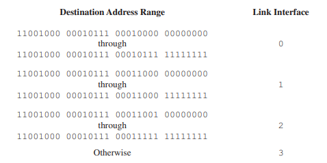
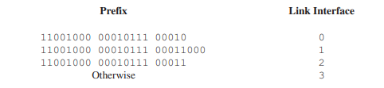

# Chapter 4. The Network Layer

-   transport segment from sending to receiving host
-   on sending side encapsulates segments into datagrams
-   on receiving side, delivers segments to transport layer
-   network layer protocols in *every* host, router
-   router examines header fields in all IP datagrams passing through it

## Two key network-layer functions

-   **forwarding:** move packets from router's input to appropriate router output
-   **routing:** determine route taken by packets from source to destination. (by *routing algorithms*)

## Network layer service models:

| Network Architecture | Service Model | Guarantees Bandwidth \| Loss \| Order \| Timing |  Congestion feedback   |
| :------------------: | :-----------: | :--------------------------------------------------: | :--------------------: |
|       Internet       |  best effort  |                none \| no \| no \| no                | no (inferred via loss) |
|         ATM          |      CBR      |          constant rate \| yes \| yes \| yes          |     no congestion      |
|         ATM          |      VBR      |         guaranteed rate \| yes \| yes \| yes         |     no congestion      |
|         ATM          |      ABR      |        guaranteed minimum \| no \| yes \| no         |          yes           |
|         ATM          |      UBR      |               none \| no \| yes \| no                |           no           |

-   best effort (= 아무것도 보장하지 않음): 따라서 TCP에서 이를 보완했던 것

## Datagram forwarding table

## Longest prefix matching

-   when looking for forwarding table entry for given destination address, use *longest* address prefix that matches destination address.
