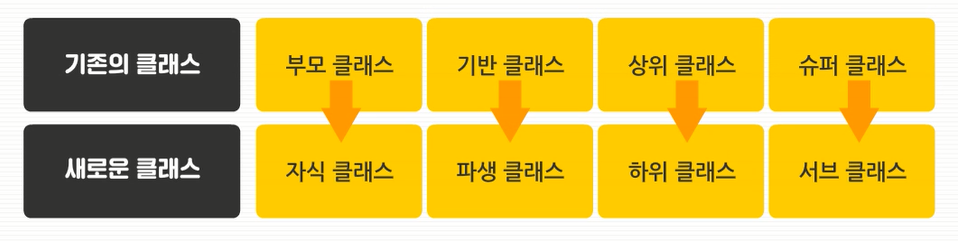
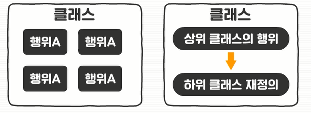

# 객체지향 프로그래밍(Object-Oriented Programming)

-   대규모 프로그램 효율적 코딩 가능

-   객체를 이용해 문제를 해결하려는 프로그래밍 방법

1.   객체 형성(상태와 행위로 이루어짐)
2.   객체 조립
3.   프로그램 형성

## 객체란?

-   **변수**와 **메서드**를 서로 묶어 만든 것
-   `메서드`: 변수와 연관된 기능
-   서로 연관된 변수와 메서드를 잘 파악하고 묶어 객체를 형성하는 것이 중요
-   부품화 & 재사용성

### 클래스(Class)

-   같은 문제 도메인에 속하는 속성(`attribute`)과 행위(`behavior`)를 정의
-   **객체지향 프로그램의 기본적인 사용자 정의 데이터 타입**
-   *추상 데이터 타입*

### 객체(Object)

-   메모리에 로딩된 클래스를 통해 클래스를 템플릿으로 하여 메모리 상에 생성된 정보 → `인스턴스`
-   **자신 고유의 속성**을 가지며 **클래스에서 정의한 행위 수행**
-   객체의 행위는 클래스에서 정의된 행위에 대한 정의를 공유함으로써 메모리를 효율적으로 사용
-   *추상 데이터 타입의 인스턴스*

### 메서드(Method)

-   메시지(Message)라고도 부름
-   클래스로부터 생성된 객체 사용 시 **객체에 명령을 내리는 행위** → '객체가 가지고 있는 메서드를 호출한다', '객체에 메시지를 전달한다'
-   한 객체의 속성을 조작할 목적으로 사용
-   객체간의 통신은 메시지의 전달을 통해 이루어짐
-   *추상 데이터 타입에서 정의된 연산*

## 객체지향 프로그램의 특징

### 추상화

-   객체에서 **공통된 속성과 행위를 추출**하는 것
-   공통의 속성과 행위를 찾아서 타입을 정의하는 과정

#### 추상 데이터 타입

-   데이터 타입의 표현과 연산을 캡슐화
-   접근 제어를 통해 데이터의 정보를 은닉할 수 있음

### 상속

-   새로운 클래스가 **기존 클래스의 데이터와 연산을 이용**할 수 있게 하는 기능

1.   하위 클래스를 이용해 프로그램의 요구에 맞춰 클래스 수정 가능

2.   클래스 간의 종속 관계를 형성하여 객체 조직화

3.   재사용으로 인해 코드가 줄어듦

4.   범용적인 사용을 가능케 함

5.   자료와 메서드의 자유로운 사용 및 추가 가능

### 다형성

-   다양한 형태로 나타날 수 있는 특징

-   어떤 한 요소에 여러 개념을 넣어 놓는 것

#### 메서드 오버라이딩

-   상속으로 물려 받은 자료나 메서드를 그대로 사용하지 않고 하위 클래스에서 새로 정의해 사용하는 기법 
1. 상위 클래스의 메서드와 **동일한 서명(매개변수의 타입, 개수, 리턴 타입)을 가져야 함** → 코드의 재사용성 향상

#### 메서드 오버로딩

-   클래스 내부에 동일한 이름의 행위를 여러 개 정의하는 것

1.   메서드의 이름이 같고, **매개변수의 타입과 수는 서로 달라야 함**
1.   리턴 타입은 관계하지 않음
1.   메서드 이름을 하나로 통일 가능하며, 같은 이름의 메서드에 여러 종류의 매개변수를 받을 수 있음

