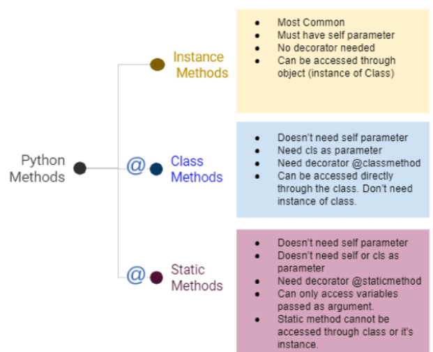

# 객체지향 프로그래밍(Object-Oriented Programming)_02

-   파이썬은 모든 것이 **객체(Object)**
-   **객체(Computer Science)**
    -   클래스에서 정의한 것을 토대로 메모리(실제 저장공간)에 할당된 것
-   **객체 지향 프로그래밍**
    -   컴퓨터 프로그래밍의 패러다임 중 하나
    -   `컴퓨터 프로그램`을 `명렁어의 목록`으로 보는 시각에서 벗어나 여러 개의 독립된 단위, 즉 `객체`들의 모임으로 파악하고자 하는 것
-   **객체의 정보와 동작**을 다루는 것

-   `객체(object)`는 특정 타입의 `인스턴스(instance): 사례`이다.


## 객체지향 프로그래밍이 필요한 이유

-   현실 세계를 프로그램 설계에 반영(**추상화**)

```python
class Person:
    
    def __init__(self, name, gender):
        self.name = name
        self.gender = gender
        
    def greeting(self):
        print(f'안녕하세요, {self.name}입니다.')
```


## 객체의 특징

```python
class Rectangle:
    
    def __init__(self, width, height):
        self.width = width
        self.height = height
        
    def area(self):
        return self.width * self.height
```

-   사각형 : `클래스(class): 관념`
-   각 사각형 (R1, R2) : `인스턴스(instance): 실존하는 것`
-   사각형의 정보 : `속성(attribute)`
-   사각형의 행동 : `메서드(method)`


## 기본 문법

-   클래스 정의
    -   `class MyClass:`
    -   객체들의 분류
-   인스턴스 생성
    -   `my_instance = MyClass()`
    -   하나하나의 실체/예
-   메서드 호출
    -   `my_instance.my_method()`
    -   특정 데이터 타입/클래스의 객체에 공통적으로 적용 가능한 행위(**함수**)
-   속성
    -   `my_instance.my_attribute`
    -   특정 데이터 타입/클래스의 객체들이 가지게 될 상태/데이터를 의미

>   객체 비교하기

-   `==`
    -   동등한(equal)
    -   변수가 참조하는 객체가 동등한(내용이 같은) 경우 `True`
    -   두 객체가 같아 보이지만 실제로 동일한 대상을 가리키고 있다고 확인해 준 것은 아님
-   `is`
    -   동일한(identical)
    -   두 변수가 동일한 객체를 가리키는 경우 `True`

### 변수 & 메서드



>   인스턴스 변수

-   인스턴스 변수란?
    -   인스턴스가 개인적으로 가지고 있는 속성
    -   각 인스턴스들의 고유한 변수
-   생성자 메서드에서 `self.<name>`으로 정의
-   인스턴스가 생성된 이후 `<instance>.<name>`으로 접근 및 할당

>   인스턴스 메서드

-   인스턴스 변수를 사용하거나, 인스턴스 변수에 값을 설정하는 메서드

-   클래스 내부에 정의되는 메서드의 기본
-   호출 시, 첫번째 인자로 **인스턴스 자기자신(self)이 전달됨**

>   self

-   인스턴스 자기자신
-   파이썬에서 인스턴스 메서드는 호출 시 첫번째 인자로 인스턴스 자신이 전달되게 설계
    -   매개변수 이름으로 `self`를 첫번째 인자로 정의
    -   다른 단어로 써도 작동하지만, 파이썬의 암묵적인 규칙

```python
class Person:
    
    def test(self):
        return self
    
p1  # <__main__.Person at 0x239f785f580>
Person.test(p1)  # 내부적으로는 이렇게 실행됨
```

>   생성자(constructor) 메서드

-   인스턴스 객체가 생성될 때 자동으로 호출되는 메서드
-   인스턴스 변수들의 초기값을 설정
    -   인스턴스 생성
    -   `__init__`메서드 자동 호출

```python
class Person:
    
    def __init__(self, name, age):
        self.name = name
        self.age = age
```

>   소멸자(destructor) 메서드

-   인스턴스 객체가 소멸(파괴)되기 직전에 호출되는 메서드

```python
class Person:
    
    def __del__(self):
        print('인스턴스가 사라졌습니다.')
```

>   매직 메서드

-   `Double underscore(__)`가 있는 메서드는 특수한 동작을 위해 만들어진 메서드로, 스페셜 메서드 혹은 매직 메서드라고 불림
-   특정 상황에 자동으로 불리는 메서드
-   `__str`, `__gt__`, `__len__`, etc.,

>   클래스 변수

-   클래스 변수
    -   한 클래스의 모든 인스턴스라도 똑같은 값을 가지고 있는 속성
-   클래스 이름 대신 인스턴스 이름을 쓰면?
    -   인스턴스 변수
-   클래스 속성(attribute)
    -   한 클래스의 모든 인스턴스라도 똑같은 값을 가지고 있는 속성
-   클래스 선언 내부에서 정의
-   `<classname>.<name>`으로 접근 및 할당

>   클래스 메서드

-   클래스가 사용할 메서드
-   `@classmethod` 데코레이터를 사용하여 정의
    -   데코레이터: 함수를 어떤 함수로 꾸며서 새로운 기능을 부여
-   호출 시, 첫번째 인자로 클래스(cls)가 전달됨

>   인스턴스와 클래스 간의 이름 공간(namespace)

-   클래스를 정의하면, 클래스와 해당하는 이름 공간 생성
-   인스턴스를 만들면, 인스턴스 객체가 생성되고 이름 공간 생성
-   인스턴스에서 특정 속성에 접근하면, **인스턴스-클래스 순으로 탐색**

>   스태틱 메서드

-   인스턴스 변수, 클래스 변수를 전혀 다루지 않는 메서드
-   속성을 다루지 않고 단지 기능(행동)만을 하는 메서드를 정의할 떄, 사용
-   클래스가 사용할 메서드
-   `@staticmethod` 데코레이터를 사용하여 정의
-   호출 시, **어떠한 인자도 전달되지 않음**


## 객체 지향의 핵심개념

### 추상화

-   현실 세계를 프로그램에 반영

```python
class Student:
    
    def __init__(self, name, age, gpa):
        self.name = name
        self.age = age
        self.gpa = gpa
        
    def talk(self):
        print(f'반갑습니다. {self.name}입니다.')
        
    def study(self):
        self.gpa += 0.1
```

```python
class Professor:
    
    def __init__(self, name, age, department):
        self.name = name
        self.age = age
        self.department = department
        
    def talk(self):
        print(f'반갑습니다. {self.name}입니다.')
        
    def teach(self):
        self.age += 1
```

### 상속

-   두 클래스 사이에 부모 - 자식 관계를 정립하는 것
-   클래스는 상속이 가능함
    -   모든 파이썬 클래스는 object를 상속받음

```python
class ChildClass(ParentClass):
    pass
```

-   하위 클래스는 상위 클래스에 정의된 속성, 행동, 관계 및 제약 조건을 모두 상속받음
-   부모클래스의 속성, 메서드가 자식클래스에 상속되므로, 코드 재사용성이 높아짐

#### 상속 관련 함수와 메서드

-   `isinstance(object, classinfo)`
    -   `classinfo`의 instance거나 **subclass**인 경우 `True`
-   `issubclass(class, classinfo)`
    -   `class`가 `classinfo`의 **subclass**면 `True`
    -   `classinfo`는 클래스 객체의 튜플일 수 있으며, `classinfo`의 모든 항목을 검사

```python
# bool 0, 1
# int 1, 2, 3, 4, 5, ...
issubclass(bool, int)  # True
issubclass(float, int)  # False
```

-   `super()`
    -   자식클래스에서 부모클래스를 사용하고 싶은 경우

```python
class Student(Person):
    
    def __init__(self, name, age, student_id):
        super().__init__(name, age)
        self.student_id = student_id
```

-   `mro 메서드 (Method Resolution Order)`
    -   해당 **인스턴스의 클래스**가 어떤 **부모 클래스**를 가지는지 확인하는 메서드
    -   기존의 `인스턴스 > 클래스` 순으로 이름 공간을 탐색하는 과정에서 상속 관계에 있으면 `인스턴스 > 자식 클래스 > 부모 클래스`로 확장

#### 다중 상속

-   두개 이상의 클래스를 상속받는 경우
-   상속받은 모든 클래스의 요소를 활용 가능
-   중복된 속성이나 메서드가 있는 경우 상속 순서에 의해 결정됨

### 다형성

-   여러 모양을 뜻하는 그리스어
-   동일한 메서드가 클래스에 따라 다르게 행동할 수 있음
-   즉, 서로 다른 클래스에 속해있는 객체들이 동일한 메시지에 대해 다른 방식으로 응답될 수 있음

#### 메서드 오버라이딩

-   상속받은 메서드를 재정의
    -   클래스 상속 시, 부모 클래스에서 정의한 메서드를 자식 클래스에서 변경
    -   **부모 클래스의 메서드 이름과 기본 기능은 그대로 사용하지만, 특정 기능을 바꾸고 싶을 때** 사용
    -   상속받은 클래스에서 같은 이름의 메서드로 덮어씀
    -   부모 클래스의 메서드를 실행시키고 싶은 경우 `super`를 활용

### 캡슐화

-   객체의 일부 구현 내용에 대한 외부로부터 직접적인 액세스를 차단
    -   `ex. 주민등록번호`
-   파이썬으로 암묵적으로 존재하지만, 언어적으로는 존재하지 않음

#### Public Access Modifier

-   언더바 없이 시작하는 메서드나 속성
-   어디서나 호출 가능, `override` 허용

#### Protected Access Modifier

-   **언더바 1개**로 시작하는 메서드나 속성
-   암묵적 규칙에 의해 부모 클래스 내부와 자식 클래스에서만 호출 가능
-   하위 클래스 `override` 허용

#### Private Access Modifier

-   **언더바 2개**로 시작하는 메서드나 속성
-   본 클래스 내부에서만 사용이 가능
-   하위클래스 상속 및 호출 불가능 (오류)
-   외부 호출 불가능 (오류)

#### getter 메서드 & setter 메서드

-   변수에 접근할 수 있는 메서드를 별도로 생성
    -   `getter` 메서드: 변수의 값을 **읽는** 메서드
        -   `@property` 데코레이터 사용
    -   `setter` 메서드: 변수의 값을 **설정**하는 성격의 메서드
        -   `@<variable>.setter` 사용

```python
class Person:
    
    def __init__(self, age):
        self._age = age
        
    @property  # 메서드를 정의했는데 속성처럼 쓰도록 한다.
    def age(self):
        return self._age
    
    @age.setter
    def age(self):
        return self._age - 10
```

