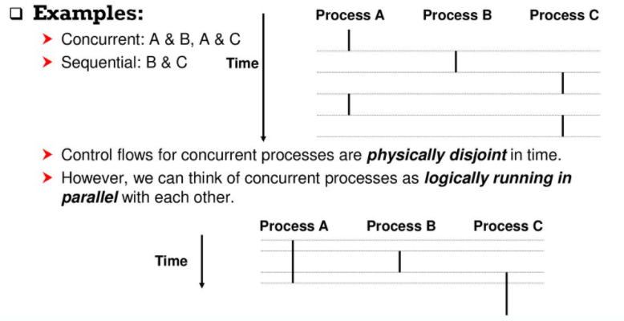

# Operating System_02

## Chapter 2. Operating System Overview

### Alan Turing, Bombe and Colossus

#### Turing Machine

-   A new mathematical computing model
-   A symbol manipulating device that can simulate the logic of any computer
-   Theoretical background to modern computers

 

#### Bombe (1940)

-   A electromechanical machine to decipher German's Enigma

 

#### Colossus (1943)

-   The 1st programmable digital (electronic) computer built by Thomas Flowers in London

 

#### Turing Test (1950)

-   A computer could be said to "think" if a human interrogator could not tell it apart, through conversation, from a human being

  

### ENIAC

#### ENIAC (Electronic Numerical Integrator And Computer)

-   Designed by **John Mauchly** and **John Presper Eckert** at University of Pennsylvania
-   Funded by US BRL (Ballistic Research Lab) to develop range and trajectory tables for new weapons
-   Used for H-bomb research
-   Characteristics
    -   30 tons, 15000 square feet, 18000 vacuum tubes, 140 KW power dissipation
    -   Decimal machine
    -   Manually programmed by setting switches and plugging unplugging cables
    -   5,000 additions per second

  

### The Von Neumann Machine & IAS

  

### Simple Batch Systems

#### Monitor

-   User submits the job on cards or tape to a computer operator, who batches them together sequentially and places them on an input device
-   Monitor is a resident software in main memory
-   Monitor reads in jobs one at a time from the input device
-   The current job is placed in the user program area
-   The control is passed to the job
-   When the job is completed, it returns control to the monitor

 

#### History

-   The first batch OS was developed by GM in the mid-1950s for use on IBM 701
-   By the early 1960s, a number of vendors developed batch OS for their computer systems

 

#### Batch Systems: Problems

-   Even with automatic job sequencing
-   **I/O devices are slow compared to processor**

  

### Multiprogrammed Batch System

-   **When one job needs to wait for I/O, the processor can switch to the other job, which is likely not waiting for I/O**
    -   Also known as multitasking
    -   Memory can be expanded to hold three, four, or more programs

  

### Time-Sharing Systems

-   Can be used to handle multiple interactive jobs
    -   In a time-sharing system, several users share a computer system through terminals at the same time.
    -   **In this system, *minimizing response time is more important* than maximizing throughput (processor utilization)**
    -   OS interleaves the execution of each user program in *time slice*
        -    **Context switching** occurs every time slice. The currently running job is suspended and a previously suspended job (or a new job) is resumed (register에 진행사항을 저장함)
    -   Short jobs or I/O intensive jobs do not have to wait for long compute intensive jobs

 

#### Compatible Time-Sharing Systems

-   **CTSS: One of the first time-sharing OS**
    -   Ran on a computer with 32,000 36-bit words of main memory, with the resident monitor consuming 5000 words
    -   To simplify both the monitor and memory management a program was always loaded to start at the location of the 5000th word

 

-   **Time Slicing**
    -   System clock generates interrupts at a rate of approximately one every 0.2 seconds
    -   At each interrupt OS regained control and could assign processor to another user
    -   Old user programs and data were written out to disk (Overhead가 상당함)

  

## Chapter 3. Process

### Process

-   A process is **an instance of a program in execution**
    -   One of the most profound ideas in computer science.
    -   Not the same as "program" or "processor"

 

-   Process provides two key abstractions
    -   **Logical control flow**
        -   Each process has an exclusive use of the processor
    -   **Private address space**
        -   Each process has an exclusive use of private memory

 

-   How are these Illusions maintained?
    -   Multiprogramming (multitasking)
        -   Processes take turns in using the processor
    -   Virtual memory
        -   예시는 Linux on 32-bit OS이며, kernel이 1/4, user가 3/4 정도를 차지한다.

    

  

### Life and Scope of an Object

-   Life vs. scope
    -   Life of an object determines whether the object is still in memory whereas the scope of an object determines whether the object can be accessed at this position

 

-   **Local variables**
    -   Variables defined inside a function
    -   The scope of these variables is only within this function
    -   The life of these variables ends when **this function completes**
    -   So when we call the function again, storage for variables is created and values are reinitialized.
    -   Static local variables - If we want the value to be extent throughout the life of a program, we can define the local variable as "static."
        -   Initialization is performed only at the first call and data is retained between func calls.

 

-   **Global variables**
    -   Variables defined outside a function
    -   The scope of these variables is throughout the entire program
    -   The life of these variables ends when ends **the program completes**

 

-   **Static variables**
    -   Static variables are local in scope to their module in which they are defined, but life is throughout the program
    -   *Static local variables*: static variables inside a function **cannot be called from outside the function** (because it's not in scope) **but is alive and exists in memory**
    -   *Static variables*: if a static variable is defined in a global space (say at beginning of file) then **this variable will be accessible only in this file** (file scope)

  

### Concurrent processes

-   Two processes *run concurrently (are concurrent)* if their flows overlap in time

-   Otherwise, they are sequential

    

  

### Context Switching

-   Processes are managed by OS code called the *kernel* (항상 실행되는 OS의 core)
    -   Important: *the kernel is not a separate process*, but rather runs as part of some user process

 

-   User mode and kernel mode
    -   If the mode bit is set, the process is running in *kernel mode*, and can execute any instruction and can access any memory location
    -   If the mode bit is not set, the process is running in *user mode* and is not allowed to execute *privileged instructions*

 

-   Context
    -   The kernel maintains a *context* for each process
    -   Registers에 저장된 내용은 따로 저장하지 않으면 휘발되므로, 진행 상황을 저장해야 하는데, Registers의 상태를 Context라고 한다.

 

-   Context switching
    -   The OS kernel implements multitasking using an exceptional control flow
    -   At certain points during the execution of a process, **the kernel decide to preempt the current process and restart a previously preempted process**
        -   This is called **scheduling and handled by code in the kernel called scheduler (or dispatcher)**
    -   Context switching의 과정
        1.   **The kernel first saves the context of the current process**
        2.   **The kernel restores the context of some previously preempted process**
        3.   **Then, the kernel passes control to this newly restored process**

  

## Reference

[운영체제: 최린 교수님](https://youtu.be/JaP6jnvE3RE)
