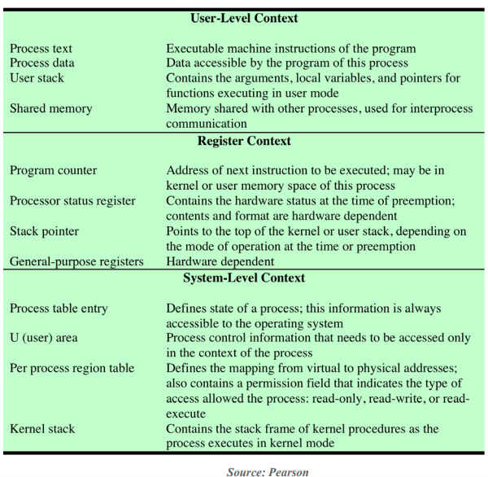
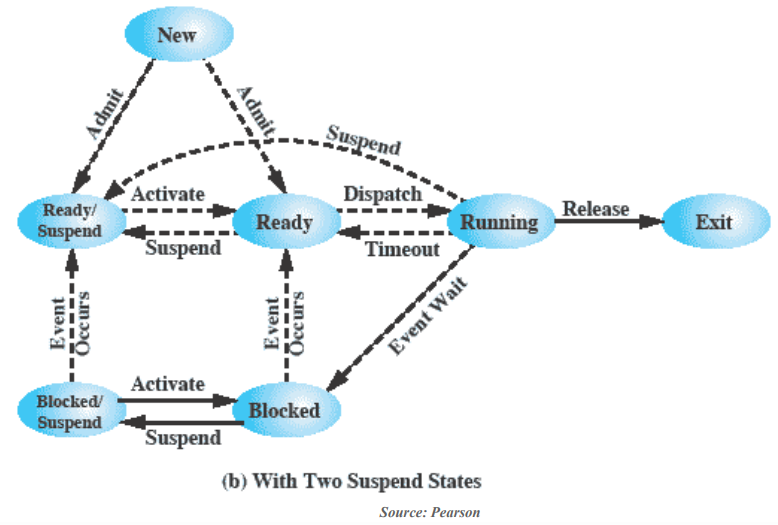

# Operating System_03

## Chapter 3. Process

-   컴퓨터의 state는 `memory + register`
-   **The state of a process that the kernel needs to restart a preempted process를** 가리켜 `context`라고 함

### Process Control Block


-   A data structure in the OS kernel that contains the information needed to manage a particular process
-   Process ID, state, priority, pointer to register save area, and status as page tables, file tables, IO tables, etc.
-   Created and managed by the operating system




-   Integer 연산을 하는 register와 float 연산을 하는 register가 따로 존재한다.
-   **Program counter**
    -   다음 실행할 명령어의 주소를 가지고 있음
-   **Scheduling**
    -   최근에 CPU를 많이 사용하지 못한 Process에 우선순위 부여
-   **Resource Ownership and Utilization**
    -   Printer를 두 Process가 동시에 사용한다면 프로그램의 결과가 논리적으로 전개되지 않고 뒤섞이는 결과가 초래될 수 있으므로 이를 관리해야 한다.


### Process Status Word (PSW)

-   Readable한 register가 아닌, Process의 상태를 저장하기 위한 특수한 목적의 register
-   Contains condition codes and other status information of the currently running process
-   Example: EEFLAGS register on Intel x86 processors


### Two-State Process Model

-   **A process may be in one of two states:**


### Process Creation and Termination

-   Process spawning
    -   OS may create a process at the explicit request of another process
        -   A new process becomes a *child process* of the *parent process*
-   Process termination
    -   A process may terminate itself by calling a system call called **EXIT**
    -   A process may terminate due to an erroneous condition such as memory unavailable, arithmetic error(*ZeroDivisionError* or *Overflow* or *Underflow*), or parent process termination, etc.

#### Creating new processes

-   Process control

    -   Unix provides a number of system calls for manipulating processes
    -   Obtain Process ID, Create/Terminate Process, etc.

-   *`int fork(void)`*

    -   Creates a new process (child process) that is identical to the calling process (parent process)
    -   Returns 0 to the child process
    -   Returns child's `pid` to the parent process
    -   Fork is interesting (and often confusing) because it is called *once* but returns *twice*

    ```C
    if (fork() == 0) {
        printf("hello from child\n");
    } else {
        printf("hello from parent\n");
    }
    ```

-   **Fork Example #1**

    -   Parent and child both run the same code
        -   Distinguish parent from child by return value from `fork`
    -   Duplicate but separate address space
        -   Start with same state, but each has private copy
        -   print statements의 상대적인 순서는 undefined이다. (OS의 스케줄링에 따라 변한다)
    -   Shared files
        -   Both parent and child print their output on the same screen

```C
void fork1() {
    int x = 1;
    pid_t pid = fork();
    if (pid == 0) {
        printf("Child has x = %d\n", ++x);  // 2
    } else {
        printf("Parent has x = %d\n", --x);  // 0
    }
    printf("Bye from process %d with x = %d\n", getpid(), x);
}
```

-   **Fork Example #2**
    -   Both parent and child can continue forking
    -   Process graph
        -   Each horizontal arrow corresponds to a process
        -   Each vertical arrow corresponds to the execution of a *fork* function

```C
void fork2() {
    printf("L0\n");
    fork();
    printf("L1\n");
    fork();
    printf("Bye\n");
}
```


-   `exec()`
    -   overlay new image
-   `wait()`
    -   sleep until child is done

#### Destroying Process

-   *`void exit(int status)`*
    -   Terminate a process with an *exit status*
        -   Normally with status 0
    -   `atexit()` registers functions to be executed upon exit

```C
void cleanup(void) {
    printf("cleaning up\n");
}

void fork6() {
    atexit(cleanup);
    fork();
    exit(0);
}
```


### Five-State Process Model


#### Example


#### Using Two Queues


#### Multiple Blocked Queues


### Suspended Processes

-   여기서의 suspend는 context switching 할 때 잠시 정지시키는 것이 아닌 메모리 밖으로 쫓아내는 것
-   **Swapping**
    -   Sometimes, all the processes in memory are waiting for I/O
    -   Involves moving part or all of a process from main memory to disk
    -   Then, OS brings in another (new or suspended) process into memory
-   **Suspended Process**
    -   The process is swapped out and is not immediately available for execution


### Suspend State


### Two Suspend States

-   OS에서 가장 일반적인 state model




### Processes and Resources


### Interrupt/Exception

-   둘의 메커니즘은 거의 같지만, 발생 원인은 다르다.

-   Interrupts
    -   Forced transfer of control to a procedure (*handler*) due to external events (*interrupt*) or due to an internal erroneous condition during program execution (*exception*)
    -   **Exception**
        -   Generated by an instruction in the currently running process due to an erroneous condition
        -   Synchronous (프로세스를 동일한 환경에서 실행하면 exception도 동일하게 발생한다), internal (CPU 내부에서 실행중인 프로세스)
    -   **Interrupt**
        -   Asynchronous, external events
-   Interrupt handling mechanism
    -   Should allow interrupts/exceptions to be handled transparently to the executing process (application programs and operating system)
    -   Procedure


### Exceptions

-   Caused by an event that occurs as a result of executing an instruction
-   **Traps**
    -   Intentional exceptions
    -   Examples: system calls (OS의 code를 불러오는 것), breakpoints (debug)
    -   Returns control to "*next*" instruction
-   **Faults**
    -   Unintentional but possibly recoverable
    -   Examples: page faults (recoverable), protection faults (unrecoverable), arithmetic exception.
    -   Either re-executes faulting ("*current*") instruction or terminate the process
-   **Aborts**
    -   Unintentional and *unrecoverable fatal* errors
    -   Examples: parity error, machine check abort.
    -   Aborts the current process, and probably the entire system
    -   Intel에서는 MCA(Machine Check Abort)라고 칭한다.


### Interrupts

-   Caused by an event external to the processor

    -   Indicated by setting the processor's interrupt pins (#INT, #NMI)
    -   Handler returns to "*next*" instruction.

-   **Interrupt Classification**

    -   Maskable interrupt
        -   Can be disabled/enabled by an instruction
        -   Generated by asserting INT pin
        -   External interrupt controllers
    -   Non-maskable interrupt (NMI)
        -   Cannot be disabled by program
        -   Received on the processor's NMI pin

-   Examples:

    -   I/O interrupts
        -   Hitting ctrl + c at the keyboard, arrival of a packet from the network, arrival of a data sector from a disk
        -   Hard reset interrupt: hitting the reset button
        -   Soft reset interrupt: hitting ctrl + alt + delete on a PC

    

-   Forced transfer of control to a procedure (*handler*) due to external events (*interrupt*) or due to an erroneous condition (*exception*)
-   **Interrupt handling mechanism**
    -   Should allow interrupts/exceptions to be handled transparently to the executing process (application programs and operating system)
    -   Procedure
        -   When an interrupt is received or an exception condition is detected, the current task is suspended (paused) and the control automatically transfers to a handler (event code를 통해 처리한다.)
        -   After the handler is complete, the interrupted task resumes without loss of continuity, unless recovery is not possible or the interrupt causes the currently running task to be terminated. (*ex. arithmetic exception*, read를 해야하는데 write를 한다든지 하는 protection 상황)


### UNIX System V Process Management

-   Two categories of processes
    -   System Process
        -   Run in kernel mode and execute OS code
        -   Perform administrative and housekeeping functions such as memory allocation and process swapping
    -   User Process
        -   Run in user mode to execute user programs
        -   Enter kernel mode by issuing a system call, by an exception or by an interrupt


### UNIX Process States


