# Operating System_04

## Chapter 4. Threads

-   So far, we assumed that a process is running with a single thread of control
-   However, most SW applications that run on modern computers are **multithreaded**
    -   An application is typically implemented as a separate process with several threads of control.
        -   **A web browser might have one thread display portal news site while another thread shows a baseball broadcast**
        -   A word processor may have a thread for displaying graphics. another thread for responding to keystrokes from the user. and a third thread for performing grammar checking in the background
        -   **A web server may create a separate thread that can handle each individual request from clients and resume listening for additional requests**
            -   If the web server run as a single-threaded process. it would be able to service only one client at a time and a client may have to wait for a long time

 

-   Threads는 메모리와 자원을 공유하지만, fork된 process들은 그렇지 않다. (heavy하다.)

  

### Process Characteristics

#### Resource ownership

-   A process may be allocated control or ownership of resources including main memory, I/O devices, and files
    -   OS performs protection to prevent unwanted interferences among processes with respect to resources
-   A process includes a virtual address space (process image)

 

#### Scheduling unit

-   Process is the entity that is scheduled and dispatched by OS
-   Resource는 process 별로 할당하지만, scheduling은 threads 별로 할당한다.
-   즉, Threads는 memory와 resource를 모두 공유하지만 scheduling만 각자 할당되므로 process에 비해 가볍다.

 

#### Two characteristics are independent

-   The scheduling unit can be treated independently by OS
    -   **In OS that supports threads, the scheduling unit is usually referred to as a *thread* or *lightweight process***
    -   **The unit of resource ownership is referred to as a *process* or *task***

  

### Multithreading

#### The ability of an OS to support multiple, concurrent paths of execution within a single process

-   Process is the unit of resource allocation and protection
-   Thread is the unit of dispatching with the following state
    -   **Thread execution state (Ready, Run)**
    -   **Thread context**
    -   **Thread execution stack**

 

#### Single-threaded approach

-   Traditional approach of a single thread of execution per process
-   No concept of thread
    -   Examples: MS-DOS, old UNIX

 

#### Multi-threaded approach

-   One process with multiple threads of execution
    -   Example: Java run-time environment (자바 컴파일러가 번역한 Java bytecode를 JVM이 machine instruction으로 번역해준다.)
-   Multiple processes with each of which supports multiple threads
    -   Example: Windows, Solaris, modern UNIX

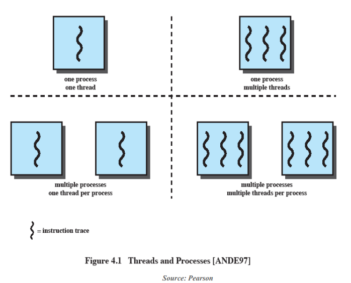

 

#### Advantages of threads compared to process

-   Less time to create a new thread in an existing process
    -   **Thread creation is 10 times faster than process creation in UNIX**
-   Less time to terminate a thread
    -   **You don't have to release I/O devices or memory**
-   Less time to switch between two threads
-   Less time to communicate between two threads
    -   Communication between processes require the kernel intervention to provide protection and communication (signal)
    -   **Threads can communicate without kernel through shared memory**

  

### Multithreaded Process Model

#### A process is a unit of resource allocation & protection, and has

-   Virtual address space (process image on memory)
-   Protected access to processors, files, and I/O devices

 

#### Each thread within a process has

-   Thread control block
    -   Thread context: register values (PC, stack pointers)
    -   Thread state, priority, and other thread-related state information
-   Execution stack (user stack, kernel stack)

 

#### Threads가 자원을 공유한다는 것의 의미

-   When one thread alters the data item in memory, other threads see the results when they access the item.
-   If one thread opens a file with read privileges, other threads can also read from that file.

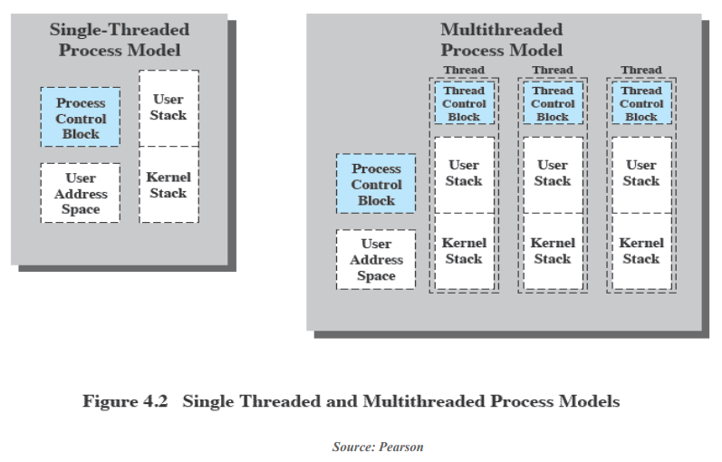

  

### Multithreaded Applications

#### File server

-   A new thread can be spawned for each new file request
    -   Since a server handles many requests, many threads will be created/destroyed
-   On a multiprocessor environment, multiple threads within the same process can run simultaneously on different processors
-   Faster to use threads to share files and coordinate their actions through shared memory
    -   Processes/threads in a file server must share file data and coordinate actions

 

#### Other examples in a single-user system

-   Foreground and background jobs
    -   In a spreadsheet program, one thread can display menus and read user input while another thread executes user commands and update the spreadsheet (이전 작업이 완료되기 전에 다음 명령을 받음으로써 응답 속도를 높인다.)
-   Asynchronous processing
    -   In a word processor, a separate thread can perform periodic backup from RAM buffer to disk
-   Batch processing
    -   One thread may process a batch job while another is reading the next batch (one thread가 I/O때문에 blocked 되더라도, another thread가 실행될 수 있다.)

  

### Thread State

-   Ready, Run, Blocked
-   **Suspended: does not make sense since it is process-level state**

 

#### Thread operations that affects the state

-   Spawn
    -   When a new process is spawned, a thread for that process is also spawned
    -   A thread may spawn another thread within the same process
        -   The new thread is provided with its own register context and stack space and placed on the ready queue

-   Block
    -   When a thread needs to wait for an event, it will block (save its PC and registers)
    -   The processor may switch to another ready thread in the same or different process

-   Unblock
    -   When the event occurs, the thread moves to the ready queue
-   Finish
    -   When a thread completes, the register context and stacks are deallocated

  

### RPC Using Single Thread

-   2 RPCs to 2 hosts to obtain a combined result

-   Single-threaded program

    -   Each RPC has to wait for a response from each server seqyentially

    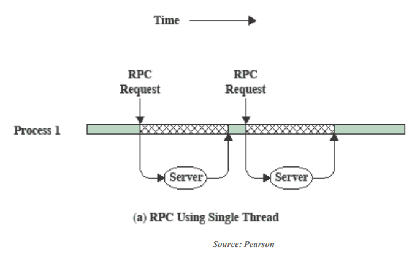

-   Multi-threaded program

    -   Each RPC request must be generated sequentially
    -   Each request wait concurrently for the two replies

    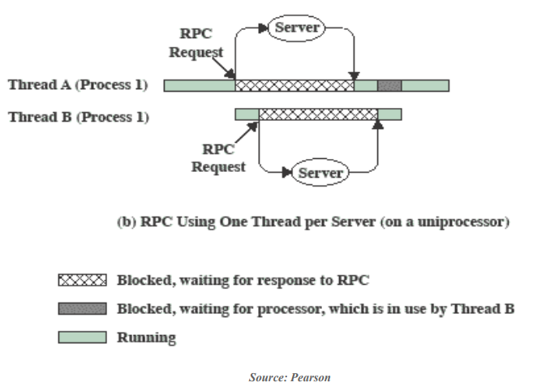

-   3 threads of 2 processes are interleaved on a processor

-   Thread switching occurs when the current thread is blocked or its time slice expires

    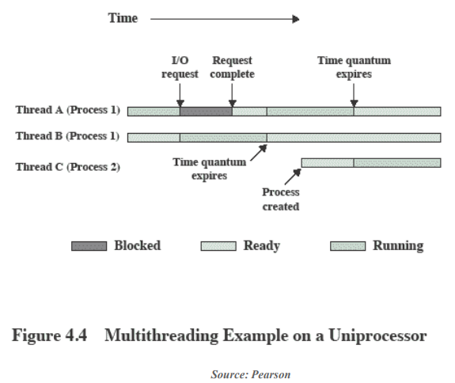

  

### User-Level Threads (ULTs)

#### All threads management is done by the application

-   The threads library contains code for creating and destroying threads, scheduling thread execution, saving and restoring thread contexts, and passing messages between threads
-   Library에서 지원하는 threads

 

#### The kernel is not aware of the existence of threads

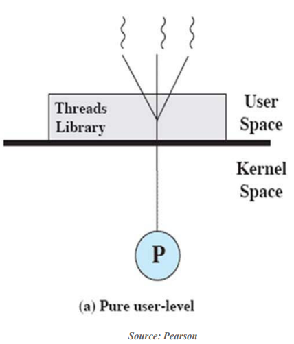

 

#### ULT States and Process States

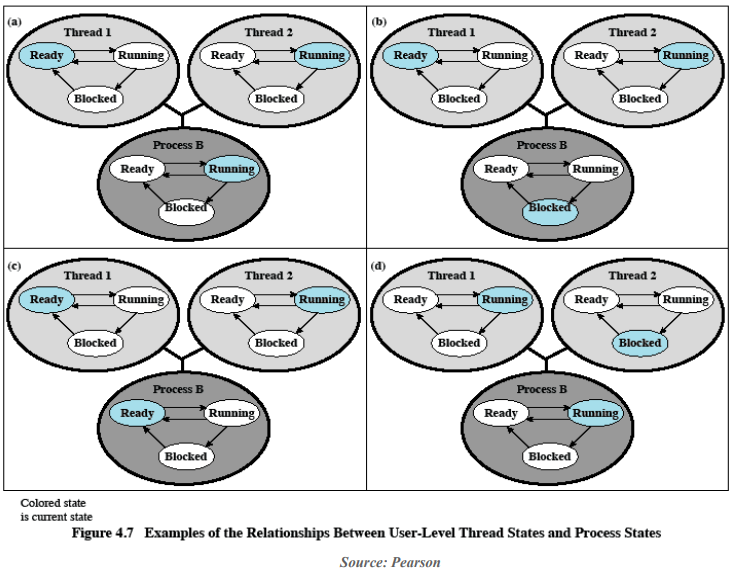

 

#### Advantages

-   Thread switching does not require kernel mode privileges (faster switching) -> KLT보다 가볍다
-   Scheduling algorithm can be tailored to the application without disturbing OS scheduler
    -   One application may benefit most from a simple round robin scheduling while another might benefit from a priority-based scheduling
-   ULTs can run on any OS, No changes are required to the underlying kernel

 

#### Disadvantages

-   In a typical OS, many system calls are blocked
    -   As a result, when a ULT executes a system call, not only the thread is blocked, but also all the other threads within the process are blocked (system call을 할 때마다 concurrency를 잃게 된다.)
-   A multithreaded application cannot take advantage of multiprocessing
    -   A kernel assigns one process to only one processor. Therefore, only a single thread can execute at a time

  

### Kernel-Level Threads (KLTs)

#### Thread management is done by the kernel

-   No thread management is done by the application
    -   Simply an API to the kernel thread facility
    -   Example: Windows

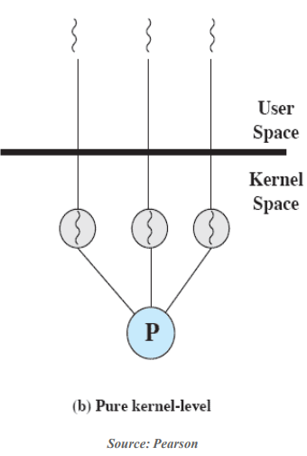

 

#### Advantages

-   The kernel can simultaneously schedule multiple threads from the same process on multiple processors
-   If one thread is blocked, the kernel can schedule another thread of the same process
-   Kernel routines can be multithreaded

 

#### Disadvantages

-   Thread switching within the same process requires a mode switch to the kernel

-   More than an order of (10배) magnitude difference between ULTs and KLTs and similarly between KLTs and processes

    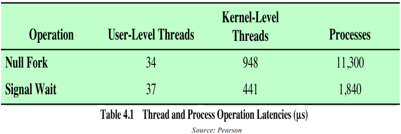

  

### Combined Approach

#### Thread creation is done completely in the user space

-   Multiple ULTs from a single application are mapped onto the same or smaller number of KLTs

-   Multiple threads within the same process can run in parallel on multiple processors

    -   A blocking system call need not block the entire process

-   Example: Solaris

    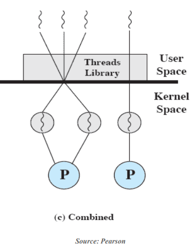

  

### Performance Impact of Multicores

#### Amdahl's law

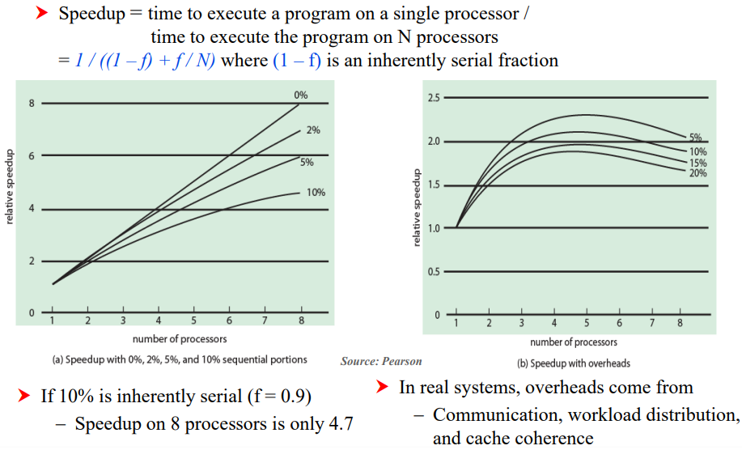

 

#### Database Workloads on Multicores

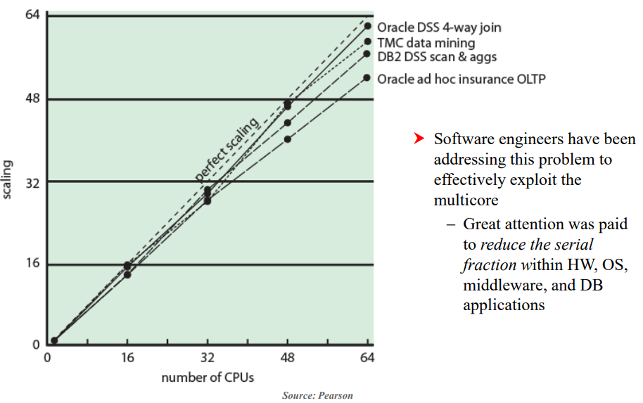

 

#### Applications for Multicores

##### Multithreaded native applications

-   Characterized by having a small number of highly threaded processes
    -   IBM (Lotus) Domino, Oracle (Siebel) CRM (Customer Relationship Manager)

##### Multiprocess applications

-   Characterized by the presense of many single-threaded processes
    -   Oracle database, SAP

##### Java applications

-   Java language facilitate multithreaded applications
-   Java Virtual Machine is also a multithreaded process that provides scheduling and memory management for Java applications

##### Multi-instance applications

-   Can achieve speedup by running multiple instances of the same application in parallel

  

### Solaris

#### Solaris provides four thread-related objects

-   Process
    -   Normal UNIX process
    -   Includes user's address space, stack, and process control block
-   User-level thread (ULT)
    -   Implemented by a threads library at the application level
    -   Invisible to the OS
-   Lightweight process (LWP)
    -   Can be viewed as a mapping between ULTs and kernel threads
-   Kernel thread
    -   There are kernel threads that are not associated with LWPs

 

#### Processes and Threads in Solaris

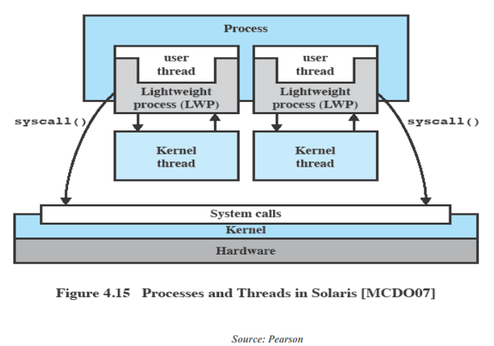

 

#### Traditional UNIX vs. Solaris

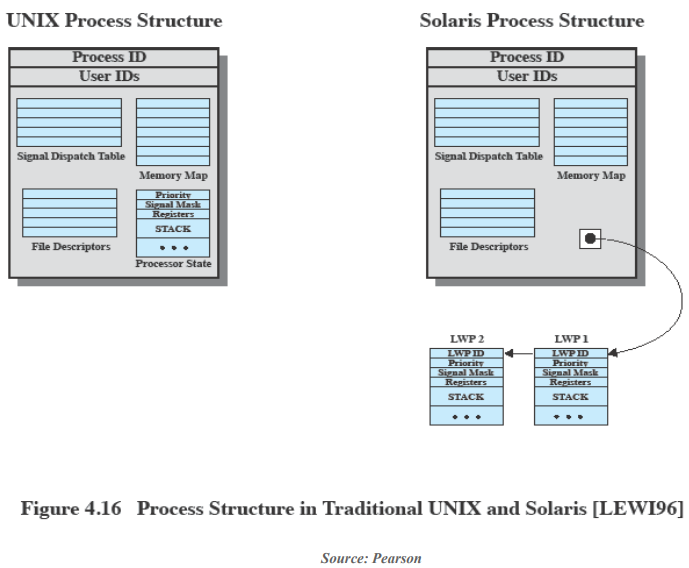

 

#### Solaris Thread States

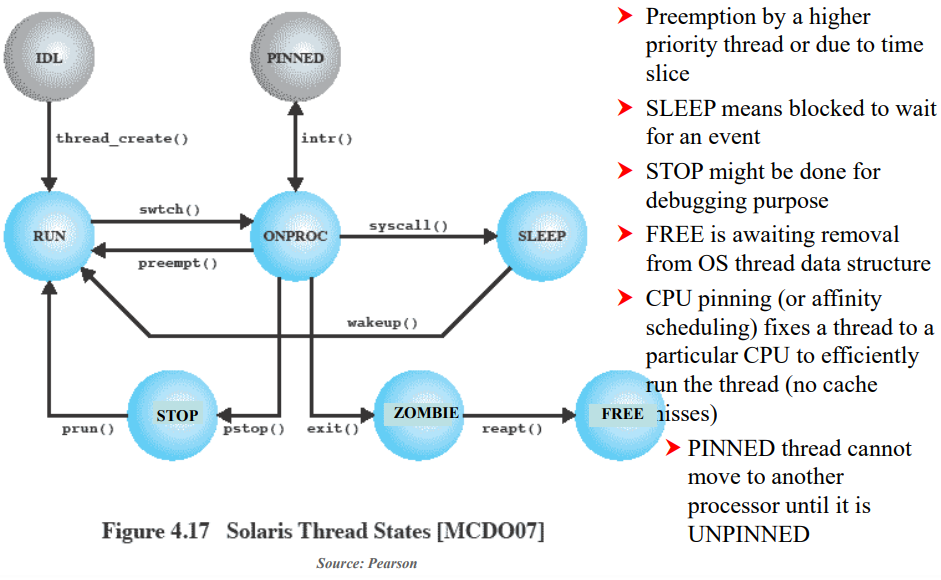

  

## Reference

[운영체제: 최린 교수님](https://youtu.be/tkVF4E3H_M4)
