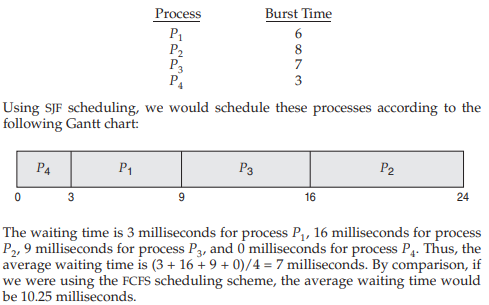

# Operating System_05

## Chapter 5. CPU Scheduling

### CPU and I/O Bursts in Program Execution

  

### CPU-burst Time의 분포

-   여러 종류의 job(=process)이 섞여 있기 때문에 CPU 스케줄링이 필요하다.
-   Interactive job에게 적절한 response 제공 요망
-   CPU와 I/O 장치 등 시스템 자원을 골고루 효율적으로 사용

  

### 프로세스의 특성

-   프로세스는 그 특성에 따라 다음 두 가지로 나뉨
    -   **I/O-bound process**
        -   CPU를 잡고 계산하는 시간보다 I/O에 많은 시간이 필요한 job
        -   Many short CPU bursts
    -   **CPU-bound process**
        -   계산 위주의 job
        -   few very long CPU bursts

  

### CPU Scheduler & Dispatcher

-   CPU Scheduler

    -   Ready 상태의 프로세스 중에서 이번에 CPU를 줄 프로세스를 고른다.
-   Dispatcher

    -   CPU의 제어권을 CPU scheduler에 의해 선택된 프로세스에게 넘긴다.
    -   이 과정을 context switching(문맥 교환)이라고 한다.

 

-   CPU 스케줄링이 필요한 경우는 프로세스에게 다음과 같은 상태 변화가 있는 경우이다.

    1.   Running -> Blocked (ex. I/O 요청하는 시스템 콜)
    2.   Running -> Ready (ex. 할당시간만료로 timer interrupt)
    3.   Blocked -> Ready (ex. I/O 완료 후 인터럽트)
    4.   Terminate

    -   i, iv의 스케줄링은 **nonpreemptive (=자진반납)**
    -   All other scheduling is **preemptive**

  

### Scheduling Criteria

#### CPU utilization (이용률)

-   Keep the *CPU as busy as possible*

#### Throughput (처리량)

-   *number of processes* that *complete* their execution per time unit

#### Turnaround time (소요시간, 반환시간)

-   amount of time to *execute a particular process*

#### Waiting time (대기 시간)

-   amount of time a process has been *waiting in the ready queue*

#### Response time (응답 시간)

-   amount of time it takes *from when a request was submitted until the first response is produced*, **not** output (for time-sharing environment)

  

### Scheduling Algorithms

#### FCFS (First-Come First-Served)

 

#### SJF (Shortest-Job-First)

-   각 프로세스의 다음번 CPU burst time을 가지고 스케줄링에 활용

-   CPU burst time이 가장 짧은 프로세스를 제일 먼저 스케줄링

-   **Two schemes:**
    
    -   **Nonpreemptive**
        
        -   일단 CPU를 점유하면 이번 CPU burst가 완료될 때까지 CPU를 선점당하지 않음
        
            
    
     
    
    -   **Preemptive**
    
        -   현재 수행중인 프로세스의 남은 burst time보다 더 짧은 CPU burst time을 가지는 새로운 프로세스가 도착하면 CPU를 빼앗김
    
        -   이 방법을 Shortest-Remaining-Time-First (SRTF)라고도 부른다.
    
            

 

-   SJF is optimal
    -   주어진 프로세스들에 대해 minimum average waiting time을 보장
-   Long process가 starvation 문제를 가질 수 있다.

 

#### 다음 CPU Burst Time의 예측

-   다음번 CPU burst time을 어떻게 알 수 있는가? (input data, branch, user, ...)
-   추정(estimate)만이 가능
-   과거의 CPU burst time을 이용해 추정 (exponential averaging)

 

#### Priority Scheduling

-   A priority number (integer) is associated with each process
-   highest priority를 가진 프로세스에게 CPU 할당
    -   (smallest integer = highest priority)
        -   Preemptive
        -   Nonpreemptive

 

-   SJF는 일종의 priority scheduling이다.
    -   priority = predicted next CPU burst time
-   Problem
    -   Starvation: low priority processes **may never execute**
-   Solution
    -   Aging: as time progresses increase the priority of the process

 

#### Round Robin (RR)

-   각 프로세스는 동일한 크기의 할당 시간(time quantum)을 가짐
    -   일반적으로 10-100 milliseconds
-   할당 시간이 지나면 프로세스는 preempted당하고 ready queue의 제일 뒤에 가서 줄을 선다.
-   n개의 프로세스가 ready queue에 있고 할당 시간이 q time unit인 경우 각 프로세스는 최대 q time unit 단위로 CPU 시간의 1/n을 얻는다.
    -   즉, 어떤 프로세스도 (n-1)q time unit 이상 기다리지 않는다.
-   Performance
    -   q large -> FIFO
    -   q small -> context switch 오버헤드가 커진다.
-   일반적으로 SJF보다 average turnaround time이 길지만 **response time은 더 짧다.**

  

### Multilevel Queue

-   highest priority가 있으면 CPU가 우선적으로 배정됨
-   Ready queue를 여러 개로 분할
    -   foreground (interactive)
    -   background (batch - no human interaction)

 

-   각 큐는 독립적인 스케줄링 알고리즘을 가진다.
    -   foreground - RR
    -   background - FCFS

 

-   큐에 대한 스케줄링이 필요
    -   Fixed priority scheduling
        -   serve **all from foreground then** from background
        -   Possibility of **starvation**
    -   Time slice
        -   각 큐에 CPU time을 적절한 비율로 할당
        -   e.g., 80% to foreground in RR, 20% to background in FCFS

  

### Multilevel Feedback Queue

-   프로세스가 다른 큐로 이동 가능
-   에이징(aging)을 이와 같은 방식으로 구현할 수 있다.
-   Multilevel-feedback-queue scheduler를 정의하는 파라미터들
    -   Queue의 수
    -   각 큐의 scheduling algorithm
    -   Process를 상위 큐로 보내는 기준
    -   Process를 하위 큐로 내쫓는 기준
    -   프로세스가 CPU 서비스를 받으려 할 때 들어갈 큐를 결정하는 기준

  

### Multiple-Processor Scheduling

-   CPU가 여러 개인 경우 스케줄링은 더욱 복잡해짐

#### Homogeneous processor인 경우

-   Queue에 한 줄로 세워서 각 프로세서가 알아서 꺼내가게 할 수 있다.
-   반드시 특정 프로세서에서 수행되어야하는 프로세스가 있는 경우에는 문제가 더 복잡해짐

#### Load sharing

-   일부 프로세서에 job이 몰리지 않도록 부하를 적절히 공유하는 메커니즘
-   별개의 큐를 두는 방법 vs. 공동 큐를 사용하는 방법

#### Symmetric Multiprocessing (SMP)

-   각 프로세서가 각자 알아서 스케줄링 결정

#### Asymmetric multiprocessing

-   하나의 프로세서가 시스템 데이터의 접근과 공유를 책임지고 나머지 프로세서는 거기에 따름

  

### Real-Time Scheduling

#### Hard real-time systems

-   Hard real-time task는 정해진 시간 안에 반드시 끝내도록 스케줄링

#### Soft real-time computing

-   Soft real-time task는 일반 프로세스에 비해 높은 priority를 갖도록 해야 함

  

### Thread Scheduling

#### Local Scheduling

-   User level thread의 경우 사용자 수준의 thread library에 의해 어떤 thread를 스케줄할지 결정

#### Global Scheduling

-   Kernel level thread의 경우 일반 프로세스와 마찬가지로 커널의 단기 스케줄러가 어떤 thread를 스케줄할지 결정

  

### Algorithm Evaluation

#### Queueing models

-   **확률 분포로** 주어지는 **arrival rate와 service rate** 등을 통해 각종 **performance index 값을 계산**

#### Implementation & Measurement

-   **실제 시스템에** 알고리즘을 **구현하여** 실제 작업(workload)에 대해서 성능을 **측정, 비교**

#### Simulation

-   알고리즘을 **모의 프로그램으로** 작성 후 **trace를 입력으로** 하여 결과 비교

  

## Reference

[운영체제: 반효경 교수님](http://www.kocw.net/home/cview.do?cid=3646706b4347ef09)
