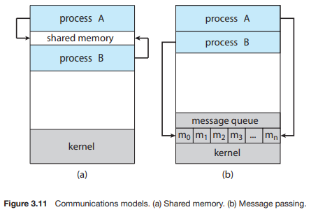
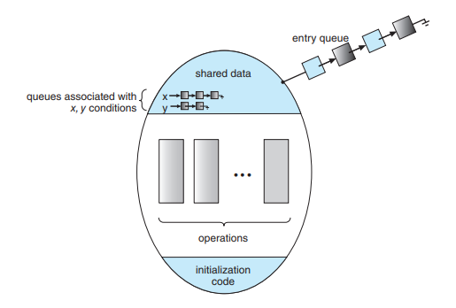
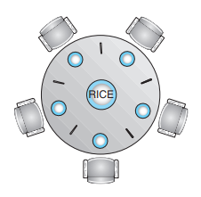

# Operating System_06

## Chapter 6. Process Synchronization

-   shared data의 concurrent access는 데이터의 inconsistency를 발생시킬 수 있다.
-   consistency 유지를 위해서는 cooperating process 간의 orderly execution을 정해주는 메커니즘이 필요
-   race condition을 막기 위해서 concurrent process는 synchronize 되어야 한다.

<br><br>

### Process Interaction

#### In a single-processor system,

-   Process executions are interleaved to increase CPU utilization
-   The relative speed of execution of processes cannot be predicted
    -   It depends on the activities of other processes, the way OS handles interrupts, and the scheduling policies
-   The following difficulties arise
    -   Mutual exclusion
    -   Deadlock (모든 프로세스들이 다른 프로세스의 자원을 할당받기 위해 대기하는 상태)
    -   Starvation (자원을 요청한 프로세스가 소외되어 계속 대기하는 상태)
    -   Race condition

<br>


#### The same problems exist in a multiprocessor system

<br><br>

### Mutual exclusion

-   Suppose two processes require access to a single printer
-   Printer is a nonsharable resource
    -   Without care, line from competing processes will be interleaved
-   During the course of execution, only one process should be allowed to access the resource at a time.
    -   The portion of program that accesses the resource is called a ***critical section*** of the program.
    -   Only one process at a time allowed in its critical section

<br><br>

### Deadlock

-   Consider two processes P1 and P2, and two resources R1 and R2
-   Each process needs to access both resources to complete its function
-   Suppose the following scenario:
    -   OS assigns R1 to P2 and R2 to P1
    -   Each process is waiting for the other resource
    -   Neither will release the resource until it acquires the other resource
    -   Two processes are deadlocked!

<br><br>

### Starvation (Indefinite postponement)

-   Consider 3 processes P1, P2, and P3.
-   Each process requires access to resource R
-   Suppose the following scenario:
    -   P1 has R and both P2 and P3 wait for R
    -   OS grants access to P3, then P1, then P3, ...
    -   P2 may be indefinitely postponed to access the resource

<br><br>

### Cooperating Processes

#### 독립적 프로세스 (Independent process)

-   프로세스는 각자의 주소 공간을 가지고 수행되므로 원칙적으로 하나의 프로세스는 다른 프로세스의 수행에 영향을 미치지 못함

<br>

#### 협력 프로세스 (Cooperating process)

-   프로세스 협력 메커니즘을 통해 하나의 프로세스가 다른 프로세스의 수행에 영향을 미칠 수 있음

<br>

#### 프로세스간 협력 메커니즘 (IPC: Interprocess Communication)

-   메시지를 전달하는 방법

    -   Message passing: kernel을 통해 메시지 전달

        -   Message system: 프로세스 사이에 공유 변수(shared variable)를 일체 사용하지 않고 통신하는 시스템

        -   Direct communication: 통신하려는 프로세스의 이름을 명시적으로 표시

        -   Indirect communication: mailbox (or port)를 통해 메시지를 간접 전달

<br>

-   주소 공간을 공유하는 방법

    -   Shared memory: 서로 다른 프로세스 간에도 일부 주소 공간을 공유하게 하는 shared memory 메커니즘이 존재

        

<br>

-   **Thread**
    -   Thread는 사실상 하나의 프로세스이므로 프로세스간 협력으로 보기는 어렵지만 동일한 process를 구성하는 thread들 간에는 주소 공간을 공유하므로 협력 가능

<br>

#### Sharing of global data may lead to *race condition*

<br><br>

### Race condition

|       Execution-box        |      Storage-box       |
| :------------------------: | :--------------------: |
|            CPU             |         Memory         |
| 컴퓨터 내부 (CPU & Memory) |  디스크 (I/O Device)   |
|          프로세스          | 그 프로세스의 주소공간 |

-   S-box를 공유하는 E-box가 여럿 있는 경우 **Race Condition의** 가능성이 있음
-   커널모드 수행 중 인터럽트로 커널모드의 다른 루틴 수행
    -   커널 모드 수행 중이면 인터럽트 처리 X
-   Process가 system call을 하여 kernel mode로 수행 중인데 context switching이 일어나는 경우
    -   커널 모드 수행 중이면 Preempted X
-   Multiprocessor에서 shared memory 내의 kernel data
    -   한번에 하나의 CPU만이 커널모드로 진입할 수 있게 하는 방법 (비효율적)
    -   커널 내부에 있는 각 공유 데이터에 접근할 때마다 그 데이터에 대한 lock/unlock을 수행
-   **The problem can be avoided by declaring the entire sequence in each process to be a critical section**

<br><br>

### The Critical-Section Problem

-   n개의 프로세스가 공유 데이터를 동시에 사용하기를 원하는 경우
-   각 프로세스의 code segment에는 공유 데이터를 접근하는 코드인 **critical section이** 존재
-   하나의 프로세스가 critical section에 있을 때 다른 모든 프로세스는 그 공간에 접근할 수 없어야 한다.

```pseudocode
do {
	entry section
	critical section
	exit section
	remainder section
} while (1);
```

<br>

#### 프로그램적 해결법의 충족 조건

-   **Mutual Exclusion(상호 배제)**
    -   프로세스 Pi가 ciritical section 부분을 수행 중이면 다른 모든 프로세스들은 그들의 critical section에 들어가서는 안된다.
-   **Progress**
    -   아무도 critical section에 있지 않은 상태에서 critical section에 들어가고자 하는 프로세스가 있다면 들어가게 해주어야 한다.
-   **Bounded Waiting**
    -   프로세스가 critical section에 들어가려고 요청한 이후부터 그 요청이 허용될 때까지 다른 프로세스들이 critical section에 들어가는 횟수에 한계가 있어야 한다.
-   가정
    -   모든 프로세스의 수행 속도는 0보다 크다.
    -   프로세스들 간의 상대적인 수행 속도는 가정하지 않는다.

<br>

#### Algorithm 1

-   Synchorinization variable

    -   **int turn;**
    -   initially **turn = 0;** => Pi can enter its ciritical section **if (turn == i)**

-   Process P0

    ```pseudocode
    do {
        while (turn != 0);
        critical section
        turn = 1;
        remainder section
    } while (1);
    ```

-   Progress 조건을 만족하지 못한 algorithm

<br>

#### Algorithm 2

-   **boolean flag[2];** initially **flag[all] = false;**

-   Pi ready to enter its ciritical section **if (flag[i] == true)**

-   Process Pi

    ```pseudocode
    do {
    	flag[i] = true;
    	while (flag[j]);
    	critical section
    	flag[i] = false;
    	remainder section
    } while (1);
    ```

-   Satisfies mutual exclusion, but *not progress requirement*

-   둘다 2행까지 수행 후 끊임없이 양보하는 상황 발생 가능

<br>

#### Algorithm 3 (Peterson's Algorithm)

-   Combined synchronization variables of algorithms 1 and 2

-   Process Pi

    ```pseudocode
    do {
    	flag[i] = true;
    	turn = j;
    	while (flag[j] && turn == j);
    	critical section
    	flag[i] = false;
    	remainder section
    } while (1);
    ```

-   *Meets all three requirements;* solves the critical section problem for two processes

-   **Busy Waiting(=spin lock)!** (계속 CPU와 memory를 점유하면서 wait)

<br><br>

### Synchronization Hardware

-   하드웨어적으로 Test & modify를 **atomic하게** 수행할 수 있도록 지원하는 경우 앞의 문제는 간단히 해결

-   Mutual Exclusion with Test & Set

    ```pseudocode
    Synchronization variable:
    	boolean lock = false;
    	
    Process Pi
    	do {
    		while (Test_and_Set(lock));
    		critical section
    		lock = false;
    		remainder section
    	}
    ```

<br><br>

### Atomic Operation

#### "Atomic" means

-   Indivisible, uninterruptable
-   Must be performed atomically, which means either "success" or "failure"
    -   Success: successfully change the system state
    -   Failure: no effect on the system state

<br>

#### Atomic operation

-   A function or action implemented as a single instruction or as a sequence of instructions that appears to be indivisible
-   Can be implemented by HW or by SW
-   HW-level atomic operations
    -   Test-and-set, fetch-and-add, compare-and-swap, load-link/store-conditional
-   SW-level solutions
    -   Running a group of instructions in a *critical section*

<br><br>

### Semaphore

-   A variable that provides a simple abstraction for controlling access to a common resource in a programming environment

-   앞에서 소개된 방식들을 추상화시킨 것 **(일종의 추상 자료형)**

-   **Integer variable**

-   **The value of the semaphore variable can be changed by only 2 "atomic" operations**
    
    -   P operation (also known as "wait")
        -   Decrement the semaphore
        
        ```pseudocode
        P(S):	while (S<=0) do no-op;  /* i.e. wait */
        		S--;
        ```
        
    -   V operation (also known as "signal")
    
        -   Increment the semaphore
    
        ```pseudocode
        V(S):	S++;
        ```
    
    -   The value of the semaphore **S** is usually the number of units of the resource that are currently available.

<br>

#### Critical Section of n Processes

```C
// Synchronization variable
semaphore mutex; /* initially 1: 1개가 CS에 들어갈 수 있다. */

// Process Pi
do {
    P(mutex);
    critical section
    V(mutex);
    remainder section
} while(1);
```

-   Busy-wait는 효율적이지 못함(=spin lock)
    -   Block & Wakeup 방식의 구현(=sleep lock)

<br>

#### Block/Wakeup Implementation

-   Semaphore를 다음과 같이 정의

    ```pseudocode
    typedef struct
    {	int value;	/* semaphore */
    	struct process *L;	/* process wait queue */
    } semaphore;
    ```

-   block과 wakeup을 다음과 같이 가정

-   **block**

    -   커널은 block을 호출한 프로세스를 suspend시킴
    -   이 프로세스의 PCB를 semaphore에 대한 wait queue에 넣음

<br>

-   **wakeup(P)**

    -   block된 프로세스 P를 wakeup시킴
    -   이 프로세스의 PCB를 ready queue로 옮김

<br>

-   Semaphore 연산이 이제 다음과 같이 정의됨

    ```C
    P(S):	S.value--;
    		if(S.value < 0) {
                add this process to S.L;
             	block();
            }
    ```

    ```C
    V(S):	S.value++;
    		if(S.value <= 0) {
                remove a process P from S.L;
                wakeup(P);
            }
    ```

<br>

#### Busy-wait vs. Block/Wakeup

-   Block/Wakeup overhead vs. Critical section 길이
    -   Critical section의 길이가 긴 경우 Block/Wakeup이 적당
    -   Critical section의 길이가 매우 짧은 경우 Block/Wakeup 오버헤드가 busy-wait 오버헤드보다 더 커질 수 있음
    -   일반적으로는 Block/Wakeup 방식이 더 뛰어남

<br>

#### Type of Semaphore

-   Binary semaphore(=mutex)

    -   주로 mutual exclusion (lock/unlock)에 사용

    -   Have a value of 0 or 1
        -   0 (locked, unavailable)
        -   1 (unlocked, available)

-   Counting semaphore

    -   Can have an arbitrary **resource count**
    -   도메인이 0 이상인 임의의 정수

<br><br>

### Deadlock & Starvation

-   **Deadlock**

    -   **둘 이상의 프로세스가 서로 상대방에 의해 충족될 수 있는 event를 무한히 기다리는 현상**

    -   S와 Q가 1로 초기화된 semaphore라고 해보자.

    ```pseudocode
    P0:	P(S); P(Q); ... V(S); V(Q);	/* 자원을 하나씩 차지하고 상대방 것을 요구함 */
    P1:	P(Q); P(S); ... V(Q); V(S);
    ```

-   **Starvation**

    -   **Indefinite blocking**
    -   프로세스가 suspend된 이유에 해당하는 semaphore queue에서 빠져나갈 수 없는 현상

<br><br>

### Semaphore의 문제점

-   코딩이 어렵다
-   정확성(correctness)의 입증이 어렵다
-   자발적 협력(voluntary cooperation)이 필요하다
-   한번의 실수가 모든 시스템에 치명적인 영향을 줌

```pseudocode
/* Mutual exclusion 깨짐 */
V(mutex)
critical section
P(mutex)

/* Deadlock */
P(mutex)
critical section
P(mutex)
```

<br><br>

### Monitor



-   동시 수행중인 프로세스 사이에서 abstract data type의 안전한 공유를 보장하기 위한 high-level synchronization construct

```pseudocode
monitor monitor-name {
	shared variable delarations
	procedure body P1 (...) {
		...
	}
	procedure body P2 (...) {
		...
	}
	{
		initialization code
	}
}
```

-   모니터 내에서는 한번에 하나의 프로세스만이 활동 가능
-   프로그래머가 동기화 제약 조건을 명시적으로 코딩할 필요가 없음
-   프로세스가 모니터 안에서 기다릴 수 있도록 하기 위해 **condition variable** 사용
-   condition variable은 **wait와 signal** 연산에 의해서만 접근 가능
    -   **x.wait();**
        -   x.wait()을 invoke한 프로세스는 다른 프로세스가 x.signal()을 invoke하기 전까지 suspend된다.
    -   **x.signal();**
        -   x.signal()은 정확하게 하나의 **suspend된** 프로세스를 resume한다.
        -   suspend된 프로세스가 없으면 아무 일도 일어나지 않는다.

<br><br>

## Chapter 7. Synchronization Examples

### Bounded-Buffer Problem

-   두 개의 producer나 consumer들이 하나의 자원에 동시에 접근할 경우 문제가 됨
    -   Mutual exclusion -> Need binary semaphore
-   Producer나 consumer가 요구하는 자원이 하나도 없을 경우 문제가 됨
    -   Resource count -> Need integer semaphore

<br>

#### Producer

1.   Empty 버퍼가 있나요? (없으면 기다림)
2.   공유 데이터에 lock을 건다.
3.   Empty buffer에 데이터 입력 및 buffer 조작
4.   Lock을 푼다
5.   Full buffer 하나 증가

<br>

#### Consumer

1.   Full 버퍼가 있나요? (없으면 기다림)
2.   공유 데이터에 lock을 건다.
3.   Full buffer에서 데이터 꺼내고 buffer 조작
4.   Lock을 푼다
5.   Empty buffer 하나 증가

<br>

#### Implementation with Semaphore

```C
// Synchronization variables
semaphore full = 0, empty = n, mutex = 1;

// Producer
do {
    ...
    produce an item in x
    ...
    P(empty);
    P(mutex);
    ...
    add x to buffer
    ...
    V(mutex);
    V(full);
} while(1);

// Consumer
do {
    P(full);
    P(mutex);
    ...
    remove an item from buffer to y
    ...
    V(mutex);
    V(empty);
    ...
    consume the item in y
    ...
} while(1);
```

<br>

#### Implementation with Monitor

```pseudocode
monitor bounded_buffer {
	int buffer[N];
	condition full, empty; /* condition var.은 값을 가지지 않고 자신의 큐에 프로세스를 매달아서 sleep 시키거나, 큐에서 프로세스를 깨우는 역할만 함 */
	
	void produce (int x) {
		if there is no empty buffer
			empty.wait();
		add x to an empty buffer
		full.signal();
	}
	
	void consume (int *x) {
		if there is no full buffer
			full.wait();
		remove an item from buffer and store it to *x
		empty.signal();
	}
}
```

<br><br>

### Readers-Writers Problem

-   한 process가 DB에 write 중일 때 다른 process가 접근하면 안 됨
-   Read는 동시에 가능

<br>

#### Solution

-   Writer가 DB에 접근 허가를 아직 얻지 못한 상태에서는 모든 대기중인 Reader들을 다 DB에 접근하게 해준다.
-   Writer는 대기중인 Reader가 하나도 없을 때 DB 접근이 허용된다.
-   일단 Writer가 DB에 접근 중이면 Reader들은 접근이 금지된다.
-   Writer가 DB에서 빠져나가야만 Reader의 접근이 허용된다.

<br>

#### Implementation

```C
// Shared data
int readCount = 0;
DB;

// Synchronization variables
semaphore mutex = 1, db = 1;

// Writer
P(db);
...
writing DB is performed
...
V(db);

/* ! Starvation 발생 가능 */

// Reader
P(mutex);
readCount++;
if (readCount == 1) P(db); /* Block writer */
V(mutex);
...
reading DB is performed
...
P(mutex);
readCount--;
if (readCount == 0) V(db); /* Enable writer */
V(mutex);
```

<br><br>

### Dining-Philosophers Problem



```C
// Synchronization variables
Semaphore chopstick[5];
/* Initially all values are 1 */

// Philosopher i
do {
    P(chopstick[i]);
    P(chopstick[(i+1) % 5]);
    ...
    eat();
    ...
    V(chopstick[i]);
    V(chopstick[(i+1) % 5]);
    ...
    think();
    ...
} while(1);
```

-   위 Solution의 문제점
    -   Deadlock의 가능성
    -   모든 철학자가 동시에 배가 고파져 왼쪽 젓가락을 집어버린 경우
-   해결 방안
    -   4명의 철학자만이 테이블에 동시에 앉을 수 있도록 한다.
    -   젓가락을 두 개 모두 집을 수 있을 때만 젓가락을 집게 한다.
    -   비대칭
        -   짝수(홀수) 철학자는 왼쪽(오른쪽) 젓가락부터 집도록

<br>

#### Implementation with Semaphore

```C
enum {thinking, hungry, eating} state[5];
semaphore self[5] = 0;
semaphore mutex = 1;

// Philosopher i
do {
    pickup(i);
    eat();
    putdown(i);
    think();
} while(1);

void putdown(int i) {
    P(mutex);
    state[i] = thinking;
    test((i+4) % 5);
    test((i+1) % 5);
    V(mutex);
}

void pickup(int i) {
    P(mutex);
    state[i] = hungry;
    test(i);
    V(mutex);
    P(self[i]);
}

void test(int i) {
    if(state[(i+4) % 5] != eating && state[i] == hungry && state[(i+1) % 5] != eating) {
        state[i] = eating;
        V(self[i]);
    }
}
```

<br>

#### Implementation with Monitor

```C
monitor dining_philosopher {
    enum {thinking, hungry, eating} state[5];
    condition self[5];
    
    void pickup(int i) {
        state[i] = hungry;
        test(i);
        if(state[i] != eating)
            self[i].wait();
    }
    
    void putdown(int i) {
        state[i] = thinking;
        /* test left and right neighbors */
        test((i+4) % 5); /* if L is waiting */
        test((i+1) % 5);
    }
    
    void test(int i) {
        if((state[(i+4) % 5] != eating) && (state[i] == hungry) && (state[(i+1) % 5] != eating)) {
            state[i] = eating;
            self[i].signal(); /* wake up Pi */
        }
    }
    
    void init() {
        for(int i = 0; i < 5; i++) {
            state[i] = thinking;
        }
    }
}

Each philosopher:
{
    pickup(i);
    eat();
    putdown(i);
    think();
} while(1);
```

<br><br>

## Reference

[운영체제: 반효경 교수님](http://www.kocw.net/home/cview.do?cid=3646706b4347ef09)
