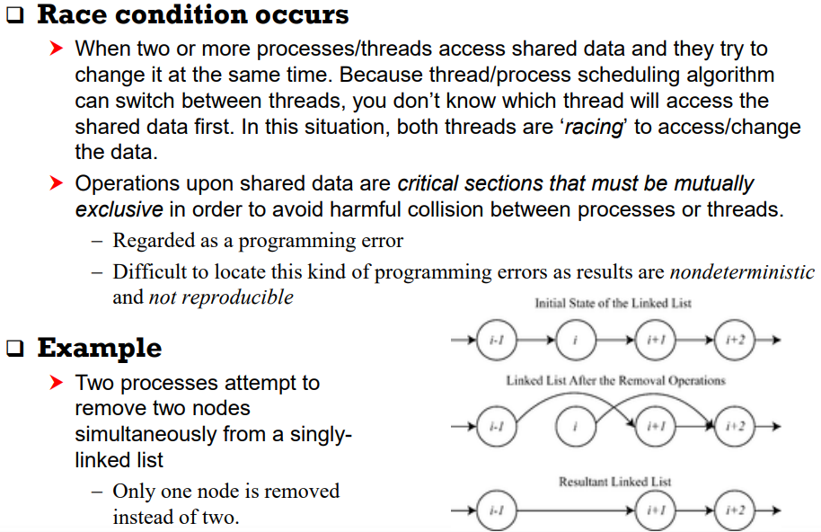
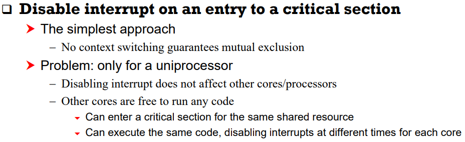
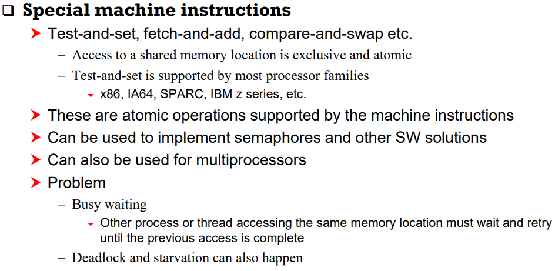
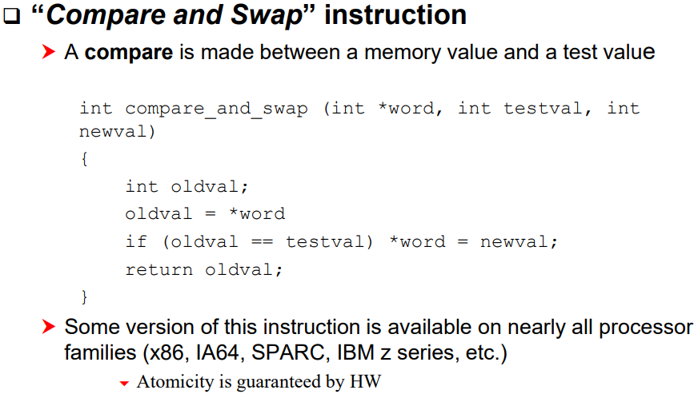
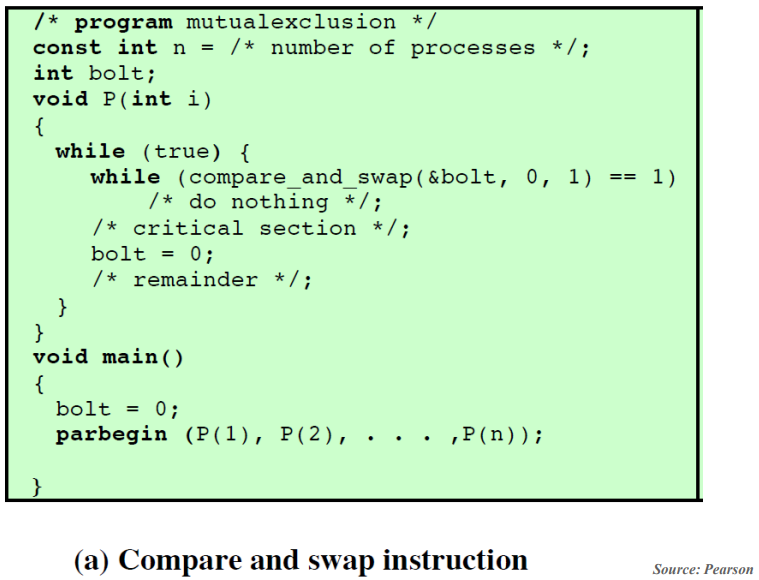
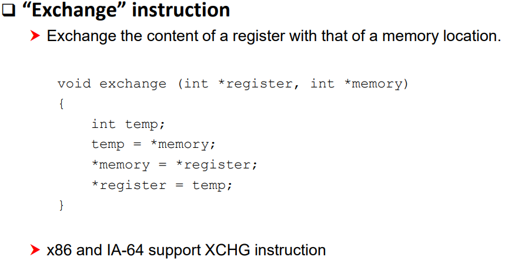
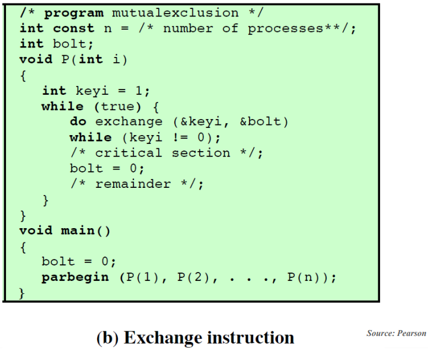
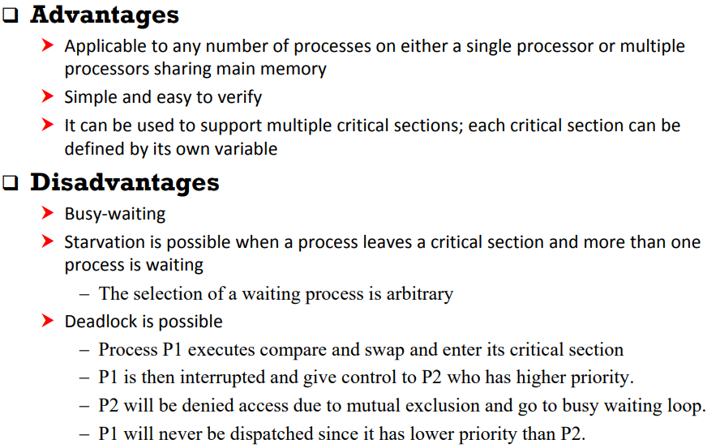

# Operating System_06

## Chapter 6. Process Synchronization

### Process Interaction

#### In a single-processor system,

-   Process executions are interleaved to increase CPU utilization
-   The relative speed of execution of processes cannot be predicted
    -   It depends on the activities of other processes, the way OS handles interrupts, and the scheduling policies
-   The following difficulties arise
    -   Mutual exclusion
    -   Deadlock (모든 프로세스들이 다른 프로세스의 자원을 할당받기 위해 대기하는 상태)
    -   Starvation (자원을 요청한 프로세스가 소외되어 계속 대기하는 상태)
    -   Race condition

#### The same problems exist in a multiprocessor system


### Competing Processes

#### Sharing of global resources can create

-   Need for *mutual exclusion*
-   *Deadlock*
-   *Starvation*

#### Mutual exclusion

-   Suppose two processes require access to a single printer
-   Printer is a nonsharable resource
    -   Without care, line from competing processes will be interleaved
-   During the course of execution, only one process should be allowed to access the resource at a time.
    -   The portion of program that accesses the resource is called a ***critical section*** of the program.
    -   Only one process at a time allowed in its critical section

#### Deadlock

-   Consider two processes P1 and P2, and two resources R1 and R2
-   Each process needs to access both resources to complete its function
-   Suppose the following scenario:
    -   OS assigns R1 to P2 and R2 to P1
    -   Each process is waiting for the other resource
    -   Neither will release the resource until it acquires the other resource
    -   Two processes are deadlocked!

#### Starvation (Indefinite postponement)

-   Consider 3 processes P1, P2, and P3.
-   Each process requires access to resource R
-   Suppose the following scenario:
    -   P1 has R and both P2 and P3 wait for R
    -   OS grants access to P3, then P1, then P3, ...
    -   P2 may be indefinitely postponed to access the resource


### Cooperating Processes

#### 독립적 프로세스 (Independent process)

-   프로세스는 각자의 주소 공간을 가지고 수행되므로 원칙적으로 하나의 프로세스는 다른 프로세스의 수행에 영향을 미치지 못함

#### 협력 프로세스 (Cooperating process)

-   프로세스 협력 메커니즘을 통해 하나의 프로세스가 다른 프로세스의 수행에 영향을 미칠 수 있음

#### 프로세스간 협력 메커니즘 (IPC: Interprocess Communication)

-   메시지를 전달하는 방법

    -   Message passing: kernel을 통해 메시지 전달

        -   Message system: 프로세스 사이에 공유 변수(shared variable)를 일체 사용하지 않고 통신하는 시스템

        -   Direct communication: 통신하려는 프로세스의 이름을 명시적으로 표시

        -   Indirect communication: mailbox (or port)를 통해 메시지를 간접 전달

-   주소 공간을 공유하는 방법

    -   Shared memory: 서로 다른 프로세스 간에도 일부 주소 공간을 공유하게 하는 shared memory 메커니즘이 존재

        

-   **Thread**

    -   Thread는 사실상 하나의 프로세스이므로 프로세스간 협력으로 보기는 어렵지만 동일한 process를 구성하는 thread들 간에는 주소 공간을 공유하므로 협력 가능

#### Sharing of global data may lead to *race condition*

#### Race condition

-   Consider the following two processes

    ```
    P1:	a = a + 1;
    	b = b + 1;
    P2:	b = 2 * b;
    	a = 2 * a;
    ```

-   If we start with a = b, each process taken separately will leave a = b

-   Now consider the following concurrent execution:

    -   Two processes respect mutual exclusion on each individual data item

    ```
    a = a + 1;
    b = 2 * b;
    b = b + 1;
    a = 2 * a;
    ```

-   If we start with a = b = 1, at the end we have a = 4, b = 3.

-   **The problem can be avoided by declaring the entire sequence in each process to be a critical section**




### Atomic Operation

#### "Atomic" means

-   Indivisible, uninterruptable
-   Must be performed atomically, which means either "success" or "failure"
    -   Success: successfully change the system state
    -   Failure: no effect on the system state

#### Atomic operation

-   A function or action implemented as a single instruction or as a sequence of instructions that appears to be indivisible
-   Can be implemented by HW or by SW
-   HW-level atomic operations
    -   Test-and-set, fetch-and-add, compare-and-swap, load-link/store-conditional
-   SW-level solutions
    -   Running a group of instructions in a *critical section*


### HW Support for Mutual Exclusion





#### Compare and Swap Instruction



#### Critical Section using Compare and Swap



#### Exchange Instruction



#### Critical Section using Exchange



#### Special Instructions: +/-




### Semaphore

-   A variable that provides a simple abstraction for controlling access to a common resource in a programming environment
-   The value of the semaphore variable can be changed by only 2 operations
    -   V operation (also known as "signal")
        -   Increment the semaphore
    -   P operation (also known as "wait")
        -   Decrement the semaphore
    -   The value of the semaphore **S** is usually the number of units of the resource that are currently available.

#### Type of Semaphore

-   Binary semaphore
    -   Have a value of 0 or 1
        -   0 (locked, unavailable)
        -   1 (unlocked, available)
-   Counting semaphore
    -   Can have an arbitrary resource count