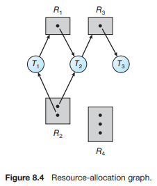
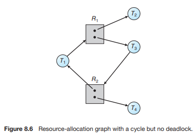
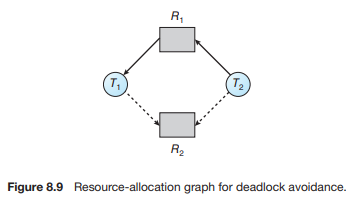
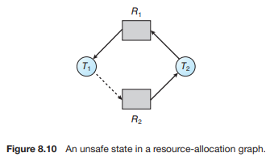
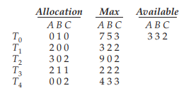
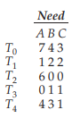
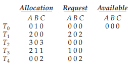
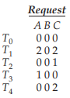
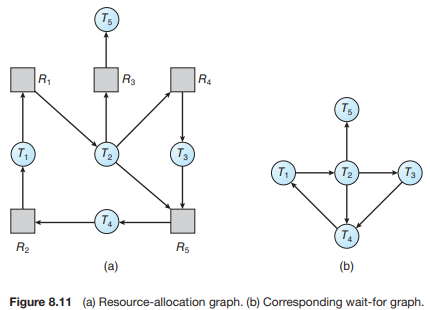

# Operating System_07

## Chapter 8. Deadlocks

### Deadlock

-   일련의 프로세스들이 서로가 가진 자원을 기다리며 block된 상태
-   **Deadlock 발생의 4가지 조건**
    -   Mutual exclusion
        -   매 순간 하나의 프로세스만이 자원을 사용할 수 있음
    -   No preemption
        -   프로세스는 자원을 스스로 내어놓을 뿐 강제로 빼앗기지 않음
    -   Hold and wait
        -   자원을 가진 프로세스가 다른 자원을 기다릴 때 보유 자원을 놓지 않고 계속 가지고 있음
    -   Circular wait
        -   자원을 기다리는 프로세스간에 사이클이 형성되어야 함
        -   프로세스 P0, P1, ..., Pn이 있을 때
            -   P0은 P1이 가진 자원을 기다림
            -   P1은 Pn이 가진 자원을 기다림
            -   Pn은 P0가 가진 자원을 기다림

<br><br>

### Resource

-   하드웨어, 소프트웨어를 포함하는 개념
-   e.g., I/O Device, CPU cycle, memory space, semaphore 등
-   프로세스가 자원을 사용하는 절차
    -   Request, Allocate, Use, Release

<br><br>

### Deadlock Example 1

-   시스템에 2개의 tape drive가 있다.
-   프로세스 P1과 P2 각각이 하나의 tape drive를 보유한 채 다른 하나를 기다리고 있다.

<br><br>

### Deadlock Example 2

-   Binary semaphores A and B

```pseudocode
P0: P(A); P(B);
P1: P(B); P(A);
```

<br><br>

### Resouce-Allocation Graph



-   그래프에 cycle이 없으면 deadlock이 아니다.

-   그래프에 cycle이 있다면

    -   If **only one instance** per resource type, **then deadlock**

    -   If **several instances** per resource type, **possibility of deadlock**

        

        

<br><br>

### Deadlock의 처리방법

#### Deadlock Prevention

-   자원 할당 시 deadlock의 4가지 필요 조건 중 어느 하나가 만족되지 않도록 하는 것

##### Mutual exclusion

-   공유해서는 안되는 자원의 경우 반드시 성립해야 함

<br>

##### Hold and wait

-   프로세스가 자원을 요청할 때 다른 어떤 자원도 가지고 있지 않아야 한다
-   방법 1. 프로세스 시작 시 모든 필요한 자원을 할당받게 하는 방법 (비효율적)
-   방법 2. 자원이 필요할 경우 보유 자원을 모두 놓고 다시 요청

<br>

##### No Preemption

-   process가 어떤 자원을 기다려야 하는 경우 이미 보유한 자원이 선점됨
-   모든 필요한 자원을 얻을 수 있을 때 그 프로세스는 다시 시작된다
-   State를 쉽게 save하고 restore할 수 있는 자원에서 주로 사용 (CPU, memory)

<br>

##### Circular Wait

-   모든 자원 유형에 할당 순서를 정하여 정해진 순서대로만 자원 할당
-   예를 들어 순서가 3인 자원 Ri를 보유 중인 프로세스가 순서가 1인 자원 Rj를 할당받기 위해서는 우선 Ri를 release해야 한다

-   **Utilization 저하, throughput 감소, starvation 문제**

<br><br>

#### Deadlock Avoidance

-   자원 요청에 대한 부가적인 정보를 이용해서 deadlock의 가능성이 없는 경우에만 자원을 할당
-   시스템 state가 원래 state로 돌아올 수 있는 경우에만 자원 할당
-   safe state
    -   시스템 내의 프로세스들에 대한 safe sequence가 존재하는 상태

<br>

-   safe sequence
    -   프로세스의 sequence <P1, P2, ..., Pn>이 safe하려면 Pi의 자원 요청이 **"가용 자원 + 모든 Pj (j < i)의 보유 자원"** 에 의해 충족되어야 함
    -   조건을 만족하면 다음 방법으로 모든 프로세스의 수행을 보장
        -   Pi의 자원 요청이 즉시 충족될 수 없으면 모든 Pj가 종료될 때까지 기다린다
        -   P(i-1)이 종료되면 Pi의 자원요청을 만족시켜 수행한다

<br>

-   2가지 경우의 avoidance algorithm
    -   Single instance per resource types
        -   **Resource Allocation Graph algorithm 사용**
    -   Multiple instances per resource types
        -   **Banker's Algorithm 사용**

<br>

##### Resource Allocation Graph Algorithm





-   **Claim edge** Pi -> Rj
    -   프로세스 Pi가 자원 Rj를 미래에 요청할 수 있음을 뜻함 (점선으로 표시)
    -   프로세스가 해당 자원 요청시 request edge로 바뀜 (실선)
    -   Rj가 release되면 assignment edge는 다시 claim edge로 바뀐다

<br>

-   Request edge의 assignment edge 변경시 (점선을 포함하여) cycle이 생기지 않는 경우에만 요청 자원을 할당한다
-   Cycle 생성 여부 조사시 프로세스의 수가 n일 때 O(n^2) 시간이 걸린다.

<br>

##### Banker's Algorithm

-   5 processes <P0, P1, ..., P4>

-   3 resource types A(10), B(5), and C(7) instances

-   Snapshot at time T0

    

    

<br>

-   Check Need <= Available
-   sequence <P1, P3, P4, P2, P0>가 존재하므로 시스템은 safe state

<br>

#### Deadlock Detection and recovery

-   Deadlock 발생은 허용하되 그에 대한 detection 루틴을 두어 deadlock 발견시 recover

<br>

##### Deadlock Detection

-   Resource type 당 single instance인 경우

    -   **자원할당 그래프에서의** cycle이 곧 deadlock을 의미

<br>

-   Resource type 당 multiple instance인 경우

    -   **Banker's algorithm과 유사한 방법** 활용

    -   "Request"는 추가요청가능량이 아니라 현재 실제로 요청한 자원량을 나타냄

        -   5 processes <P0, ..., P4>
        -   3 resource types A(7), B(2), and C(6) instances
        -   Snapshot at time T0

        <br>

        

        -   No deadlock: sequence <P0, P2, P3, P1, P4> will work!

        
        
        -   Deadlock

<br>

##### Wait-for graph algorithm

-   Resource type 당 single instance인 경우
-   Wait-for graph
    -   자원할당 그래프의 변형
    -   프로세스만으로 node 구성
    -   Pj가 가지고 있는 자원을 Pk가 기다리는 경우 Pk -> Pj

<br>

-   Algorithm
    -   Wait-for graph에 사이클이 존재하는지를 주기적으로 조사
    -   O(n^2)
        -   n개의 vertex에 대해 최대 (n-1)개의 edge를 조사해야하므로



<br>

-   자원의 최대 사용량을 미리 알릴 필요 없음 -> 그래프에 점선이 없음

<br>

##### Recovery

-   **Process termination**
    -   Abort all deadlocked processes
    -   *Abort one process at a time until the deadlock cycle is eliminated*

<br>

-   **Resource Preemption**
    -   비용을 최소화할 victim의 선정
    -   safe state로 rollback하여 process를 restart
    -   Starvation 문제
        -   동일한 프로세스가 계속해서 victim으로 선정되는 경우
        -   cost factor에 rollback 횟수도 같이 고려 (특정 프로세스가 몇 번 victim으로 선정되었는지)

<br>

#### Deadlock Ignorance

-   Deadlock을 시스템이 책임지지 않음
    -   Deadlock이 매우 드물게 발생하므로 deadlock에 대한 조치 자체가 더 큰 overhead일 수 있음
    -   만약, 시스템에 deadlock이 발생한 경우 시스템이 비정상적으로 작동하는 것을 사람이 느낀 후 직접 process를 죽이는 등의 방법으로 대처
-   UNIX, Windows 등 대부분의 범용 OS가 채택

<br><br>

## Reference

[운영체제: 반효경 교수님](http://www.kocw.net/home/cview.do?cid=3646706b4347ef09)
