# Chapter 9. Main Memory

## Logical vs. Physical Address

-   주소 바인딩: 주소를 결정하는 것
    -   Symbolic Address -> Logical Address -> Physical Address


### Logical address (=Virtual address)

-   프로세스마다 독립적으로 가지는 주소 공간
-   각 프로세스마다 0번지부터 시작
-   CPU가 보는 주소


### Physical address

-   메모리에 실제 올라가는 위치


## Address Binding

### Compile time binding

-   physical address가 컴파일 시 알려짐
-   시작 위치 변경시 재컴파일
-   컴파일러는 **절대 코드(absolute code)** 생성


### Load time binding

-   Loader의 책임하에 물리적 메모리 주소 부여
-   컴파일러가 **재배치가능 코드(relocatable code)를** 생성한 경우 가능


### Execution time binding (=Run time binding)

-   수행이 시작된 이후에도 프로세스의 메모리 상 위치를 옮길 수 있음
-   CPU가 주소를 참조할 때마다 binding을 점검 (address mapping table)
-   하드웨어적 지원이 필요
    -   e.g., base and limit registers, MMU


### Memory-Management Unit (MMU)

-   logical address를 physical address로 매핑해주는 Hardware device
-   MMU scheme
    -   사용자 프로세스가 CPU에서 수행되며 생성해내는 모든 주소값에 대해 base register (=relocation register)의 값을 더한다.
-   User program
    -   logical address만을 다룬다.
    -   실제 physical address를 볼 수 없으며, 알 필요가 없다.


## Dynamic Relocation

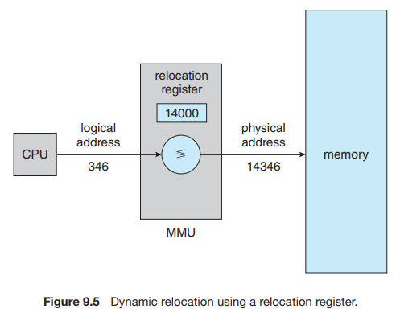

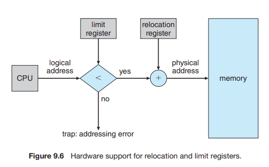

-   Relocation register(=base register)
    -   접근할 수 있는 물리적 메모리 주소의 최소값
-   Limit register
    -   논리적 주소의 범위(=user program이 사용하는 메모리 주소의 범위)


## Dynamic Loading

-   프로세스 전체를 메모리에 미리 다 올리는 것이 아니라 해당 루틴이 불려질 때 로드하는 것
    -   Loading: 메모리로 올리는 것
-   Memory utilization의 향상
-   가끔씩 사용되는 많은 양의 코드인 경우 유용
    -   e.g., 오류 처리 루틴
-   운영체제의 특별한 지원 없이 프로그램 자체에서 구현 가능 (OS는 라이브러리를 통해 지원 가능)


## Overlays

-   메모리에 프로세스의 부분 중 실제 필요한 정보만을 올림
-   프로세스의 크기가 메모리보다 클 때 유용
-   운영체제의 지원없이 사용자에 의해 구현
-   작은 공간의 메모리를 사용하던 초창기 시스템에서 수작업으로 프로그래머가 구현
    -   "Manual Overlay"
    -   프로그래밍이 매우 복잡


## Swapping

-   프로세스를 일시적으로 메모리에서 backing store로 쫓아내는 것

    

-   **Backing store (=swap area)**
    
    -   디스크
    -   많은 사용자의 프로세스 이미지를 담을 만큼 충분히 빠르고 큰 저장 공간
    
    
    
-   **Swap in / Swap out**
    
    -   일반적으로 중기 스케줄러(swapper)에 의해 swap out 시킬 프로세스 선정
    -   Priority-based CPU scheduling algorithm
        -   priority가 낮은 프로세스를 swapped out 시킴
        -   priority가 높은 프로세스를 메모리에 올려놓음
    -   Compile time 혹은 load time binding에서는 원래 메모리 위치로 swap in 해야 함
    -   Execution time binding에서는 추후 빈 메모리 영역 아무 곳에나 올릴 수 있음
    -   Swap time은 대부분 transfer time (swap되는 양에 비례하는 시간)임


## Dynamic Linking

-   Linking을 실행시간(execution time)까지 미루는 기법

    

-   **Static linking**
    
    -   라이브러리가 프로그램의 실행 파일 코드에 포함됨
    -   실행 파일의 크기가 커짐
    -   동일한 라이브러리를 각각의 프로세스가 메모리에 올리므로 메모리 낭비 (e.g., `printf` 함수의 라이브러리 코드)
    
    
    
-   **Dynamic linking**
    
    -   라이브러리가 실행시 연결됨
    -   라이브러리 호출 부분에 라이브러리 루틴의 위치를 찾기 위한 stub이라는 작은 코드를 둠
    -   라이브러리가 이미 메모리에 있으면 그 루틴의 주소로 가고 없으면 디스크에서 읽어옴
    -   운영체제의 도움이 필요


## Allocation of Physical Memory

-   메모리는 일반적으로 두 영역으로 나뉘어 사용

    

-   **OS 상주 영역**
    
    -   interrupt vector와 함께 낮은 주소 영역
    
    
    
-   **사용자 프로세스 영역**
    
    -   높은 주소 영역
    
    
    
-   사용자 프로세스 영역의 할당 방법
    
    -   **Contiguous allocation**
        -   각각의 프로세스가 메모리의 연속적인 공간에 적재되도록 하는 것
        -   Fixed partition allocation
        -   Variable partition allocation
    -   **Noncontiguous allocation**
        -   하나의 프로세스가 메모리의 여러 영역에 분산되어 올라갈 수 있음
        -   Paging
        -   Segmentation
        -   Paged Segmentation


### Contiguous Allocation

-   Hole

    -   가용 메모리 공간
    -   다양한 크기의 hole들이 메모리 여러 곳에 흩어져 있음
    -   프로세스가 도착하면 수용가능한 hole을 할당
    -   운영체제는 다음의 정보를 유지
        -   할당 공간
        -   가용 공간(hole)

    

-   **Dynamic Storage-Allocation Problem**

    -   가변 분할 방식에서 size n인 요청을 만족하는 가장 적절한 hole을 찾는 문제

    -   **First-fit**
        -   Size가 n 이상인 것 중 최초의 hole에 할당
    -   **Best-fit**
        -   Size가 n 이상인 가장 작은 hole을 찾아서 할당
        -   Hole들의 리스트가 크기순으로 정렬되지 않은 경우 모든 hole의 리스트를 탐색해야 함
        -   많은 수의 아주 작은 hole들이 생성됨
    -   **Worst-fit**
        -   가장 큰 hole에 할당
        -   모든 리스트를 탐색해야 함
        -   상대적으로 아주 큰 hole들이 생성됨
    -   First-fit과 best-fit이 worst-fit보다 속도와 공간 이용률 측면에서 효과적인 것으로 알려짐 (실험적 결과)

    

-   **Compaction**

    -   External fragmentation 문제를 해결하는 한 가지 방법
    -   사용 중인 메모리 영역을 한군데로 몰고 hole들을 다른 한 곳으로 몰아 큰 block을 만드는 것
    -   매우 비용이 많이 드는 방법
    -   최소한의 메모리 이동으로 compaction하는 방법 (매우 복잡한 문제)
    -   Compaction은 프로세스의 주소가 실행 시간에 동적으로 재배치 가능한 경우에만 수행될 수 있다.


#### Fixed partition allocation

-   External fragmentation
    -   분할된 곳이 작아 프로그램이 올라가지 못해 남은 잉여 공간
-   Internal fragmentation
    -   분할된 곳에 프로그램이 들어가고 남은 잉여 공간


#### Variable partition allocation

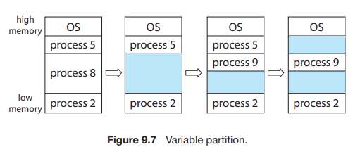


### Paging

-   Process의 virtual memory를 동일한 사이즈의 page 단위로 나눔
-   Virtual memory의 내용이 page 단위로 *noncontiguous* 하게 저장됨
-   일부는 backing storage에, 일부는 physical memory에 저장


#### Basic Method

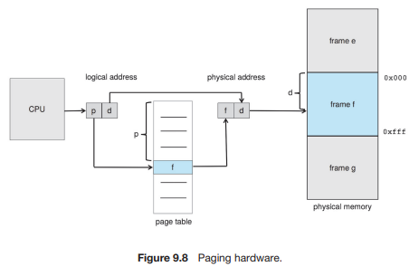

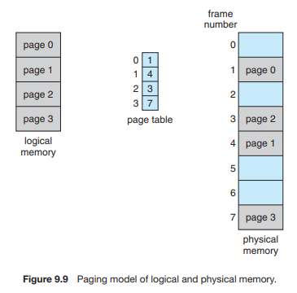

-   physical memory를 동일한 크기의 `frame`으로 나눔
-   logical memory를 동일 크기의 `page`로 나눔 (frame과 같은 크기)
-   모든 가용 frame들을 관리
-   page table을 사용하여 logical address를 physical address로 변환
-   External fragmentation 발생 안함
-   Internal fragmentation 발생 가능


#### Implementation of Page Table

-   Page table은 register에 저장하기에는 너무 크다

-   Page table은 *main memory에* 상주

-   **Page-table base register (PTBR)가** page table을 가리킴 (base register에 대응됨)

-   **Page-table length register (PTLR)가** 테이블 크기를 보관 (limit register에 대응됨)

-   모든 메모리 접근 연산에는 *2번의 memory access* 필요

    -   *page table* 접근, 실제 *data/instruction* 접근

-   속도 향상을 위해 *associative register* 혹은 *translation look-aside buffer **(TLB)*** 라고 불리는 고속의 lookup hardware cache 사용

-   Page table은 프로세스마다 존재

    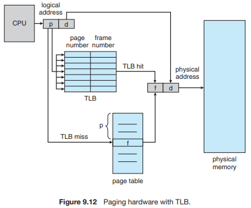

>   Associative Register

-   **Associative registers** (TLB): parallel search가 가능
    -   *TLB에는 page table 중 일부만 존재*
    
    
    
-   Address translation
    
    -   page table 중 일부가 associative register에 보관되어 있음
    -   만약 해당 page #가 associative register에 있는 경우 곧바로 frame #를 얻음
    -   그렇지 않은 경우 main memory에 있는 page table로부터 frame #를 얻음
    -   TLB는 context switch 때 flush (remove old entries)


>   Effective Access Time

-   Associative register lookup time = epsilon

-   memory cycle time = 1

-   **Hit ratio** = alpha
    
    -   associative register에서 찾아지는 비율
    
-   Effective Access Time (EAT)

    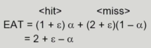


#### Two-Level Page Table

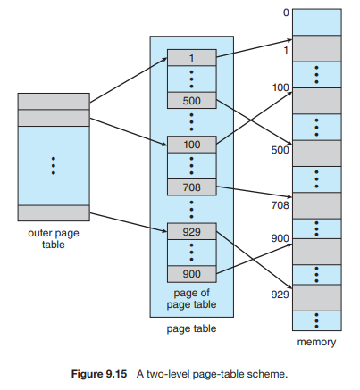

-   현대의 컴퓨터는 address space가 매우 큰 프로그램 지원
    -   32-bit address 사용시: 2^(32)B (4GB)의 주소 공간
        -   page size가 4KB일 때 1M개의 page table entry 필요
        -   각 page entry가 4B일 때 프로세스당 4M의 page table 필요
        -   그러나, 대부분의 프로그램은 4GB의 주소 공간 중 지극히 일부분만 사용하므로 page table 공간이 심하게 낭비됨
    
    
    
-   page table 자체를 page로 구성

    

-   **사용되지 않는 주소 공간에 대한 outer page table의 엔트리 값은 NULL**


>   Two-Level Paging Example

-   logical address (on 32-bit machine with *4K page* size)의 구성

    -   *20-bit*의 *page number*
    -   *12-bit*의 *page offset*

    

-   page table 자체가 page로 구성되기 때문에 page number는 다음과 같이 나뉜다. (각 page table entry가 4B)

    -   *10-bit*의 *page number*
    -   *10-bit*의 *page offset*

    

-   따라서, logical address는 다음과 같다.

    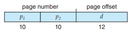

    -   P1은 outer page table의 index
    -   P2는 outer page table의 page에서의 변위 (displacement)

    

-   2단계 페이징에서의 Address-translation scheme

    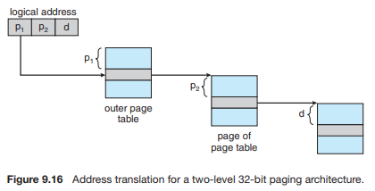


#### Multilevel Paging and Performance

-   Address space가 더 커지면 다단계 페이지 테이블 필요
-   각 단계의 페이지 테이블이 메모리에 존재하므로 logical address의 physical address 변환에 더 많은 메모리 접근 필요
-   TLB를 통해 메모리 접근 시간을 줄일 수 있음
-   4단계 페이지 테이블을 사용하는 경우
    -   **메모리 접근 시간이 100ns, TLB 접근 시간이 20ns이고, TLB hit ratio가 98%인 경우**
    -   effective memory access time = 0.98 * 120 + 0.02 * 520 = 128 nanoseconds
    -   결과적으로 주소 변환을 위해 28ns만 소요


#### Valid (v) / Invalid (i) Bit in a Page Table

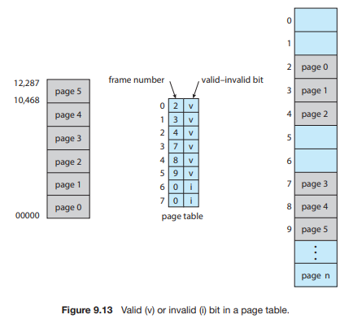

-   실제 주소를 나타내는 값인지 표시하는 비트


#### Memory Protection

-   Page table의 각 entry마다 아래의 bit를 둔다
    -   Protection bit
        -   page에 대한 접근 권한 (read/write/read-only)
        -   연산에 대한 권한을 나타내는 비트
        
        
        
    -   Valid-invalid bit
        
        -   "valid"는 해당 주소의 frame에 그 프로세스를 구성하는 유효한 내용이 있음을 뜻함 (접근 허용)
        -   "invalid"는 해당 주소의 frame에 유효한 내용이 없음*을 뜻함 (접근 불허)
            -   *i) 프로세스가 그 주소 부분을 사용하지 않는 경우
            -   *ii) 해당 페이지가 메모리에 올라와 있지 않고 swap area에 있는 경우


#### Inverted Page Table

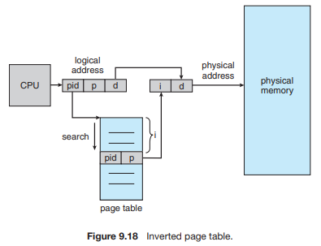

-   page table이 매우 큰 이유
    -   모든 process 별로 그 logical address에 대응하는 모든 page에 대해 page table entry가 존재
    -   대응하는 page가 메모리에 있든 아니든 page table에는 entry로 존재
    
    
    
-   Inverted page table
    
    -   Page frame 하나당 page table에 하나의 entry를 둔 것 (system-wide)
    -   각 page table entry는 각각의 물리적 메모리의 page frame이 담고 있는 내용 표시 (process-id, process의 logical address)
    -   단점
        -   테이블 전체를 탐색해야 함
    -   조치
        -   associative register 사용 (expensive)
            -   병렬적으로 검색할 수 있게 됨


#### Shared Page

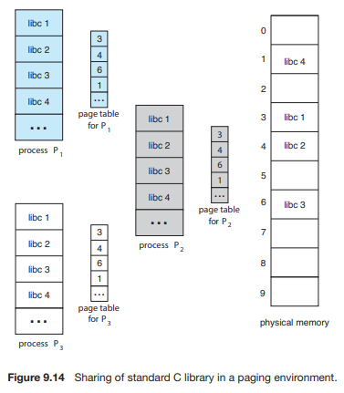

-   **Shared code**

    -   **Re-entrant Code (=Pure code)**

    -   **read-only로 하여** 프로세스 간에 하나의 code만 메모리에 올림 (e.g., text editors, compilers, window systems)

    -   Shared code는 **모든 프로세스의 *logical address space* 에서 동일한 위치에 있어야 함**


-   **Private code and data**
    -   각 프로세스들은 독자적으로 메모리에 올림
    -   Private data는 logical address space의 아무 곳에 와도 무방함


### Segmentation

-   프로그램은 의미 단위인 여러 개의 segment로 구성
    -   작게는 프로그램을 구성하는 함수 하나하나를 세그먼트로 정의
    -   크게는 프로그램 전체를 하나의 세그먼트로 정의 가능
    -   일반적으로는 code, data, stack 부분이 하나씩의 세그먼트로 정의됨


-   Segment는 다음과 같은 *logical unit* 들임

    ```
    main (),
    function,
    global variables,
    stack,
    symbol table, arrays
    ```


#### Segmentation Architecture

-   Logical address는 다음의 두 가지로 구성
    -   segment-number, offset
    
    
    
-   **Segment table**
    
    -   each table entry has:
        -   **base** - *starting physical address* of the segment
        -   **limit** - *length* of the segment
    
    
    
-   **Segment-table base register (STBR)**
    
    -   물리적 메모리에서의 *segment table의 위치*
    
    
    
-   **Segment-table length register (STLR)**
    
    -   프로그램이 사용하는 *segment의 수*
        -   segment number *s* is legal if s < STLR
    
    
    
-   **Protection**

    -   각 세그먼트 별로 protection bit가 있음
    -   Each entry:
        -   Valid bit = 0 => illegal segment
        -   Read/Write/Execution 권한 bit

    

-   **Sharing**

    -   shared segment
    -   same segment number
    -   segment는 의미 단위이기 때문에 sharing과 protection에 있어 paging보다 훨씬 효과적이다.

    

-   **Allocation**

    -   first fit / best fit
    -   external fragmentation 발생
    -   segment의 길이가 동일하지 않으므로 가변분할 방식에서와 동일한 문제점 발생


### Segmentation with Paging

-   pure segmentation과의 차이점
    -   *segment-table entry* 가 segment의 *base address* 를 가지고 있는 것이 아니라 segment를 구성하는 *page table* 의 *base address* 를 가지고 있음


