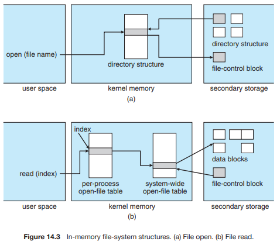
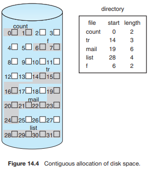
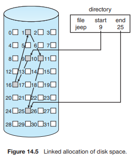
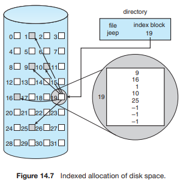
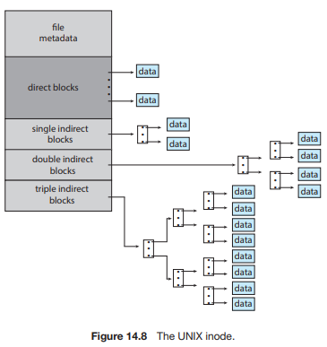
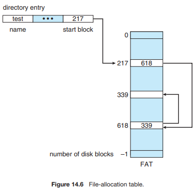
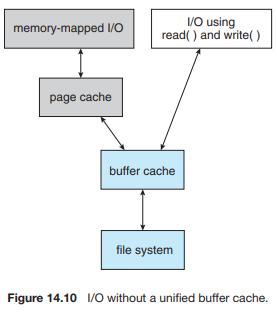
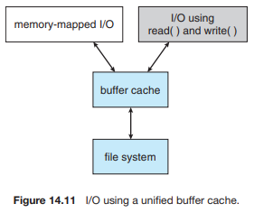

# Chapter 11. File Systems

## File and File System

#### File

-   **"A named collection of related information"**
-   일반적으로 비휘발성의 보조기억장치에 저장
-   운영체제는 다양한 저장 장치를 file이라는 동일한 논리적 단위로 볼 수 있게 해 줌
-   Operation
    -   create, read, write, reposition (lseek), delete, open, close 등

 

### File attribute (혹은 파일의 metadata)

-   파일 자체의 내용이 아니라 파일을 관리하기 위한 각종 정보들
    -   파일 이름, 유형, 저장된 위치, 파일 사이즈
    -   접근 권한 (읽기/쓰기/실행), 시간 (생성/변경/사용), 소유자 등

 

### File system

-   운영체제에서 파일을 관리하는 부분
-   파일 및 파일의 메타데이터, 디렉토리 정보 등을 관리
-   파일의 저장 방법 결정
-   파일 보호 등

  

## Directory and Logical Disk

### Directory

-   파일의 메타데이터 중 일부를 보관하고 있는 일종의 특별한 파일
-   그 디렉토리에 속한 파일 이름 및 파일 속성 등
-   operation
    -   search for a file, create a file, delete a file
    -   list a directory, rename a file, traverse the file system

 

### Partition (=Logical Disk)

-   하나의 (물리적) 디스크 안에 여러 파티션을 두는 게 일반적
-   여러 개의 물리적인 디스크를 하나의 파티션으로 구성하기도 함
-   (물리적) 디스크를 파티션으로 구성한 뒤 각각의 파티션에 **file system을** 깔거나 **swapping** 등 다른 용도로 사용할 수 있음

 

 

## open()

### open("/a/b/c")

-   디스크로부터 파일 c의 메타데이터를 메모리로 가지고 옴
-   이를 위해 directory path를 search
    -   루트 디렉토리 `/`를 open하고 그 안에서 파일 `a`의 위치 획득
    -   파일 `a`를 open한 후 read하여 그 안에서 파일 `b`의 위치 획득
    -   파일 `b`를 open한 후 read하여 그 안에서 파일 `c`의 위치 획득
    -   파일 `c`를 open한다.

 

-   Directory path의 search에 너무 많은 시간 소요
    -   Open을 read / write와 별도로 두는 이유
    -   한번 open한 파일은 read / write 시 directory search 불필요

 

-   Open file table
    -   현재 open된 파일들의 메타데이터 보관소 (in memory)
    -   디스크의 메타데이터보다 몇가지 정보가 추가
        -   Open한 프로세스의 수
        -   File offset: 파일 어느 위치에 접근 중인지 표시 (별도 테이블 필요)

 

-   File descriptor (file handle, file control block)
    -   Open file table에 대한 위치 정보 (프로세스 별)

  

## File Protection

-   각 파일에 대해 누구에게 어떤 유형의 접근(read/write/execution)을 허락할 것인가?

 

### Access control 방법

#### Access control matrix

-   **Access control list:** 파일별로 누구에게 어떤 접근 권한이 있는지 표시
-   **Capability:** 사용자별로 자신이 접근 권한을 가진 파일 및 해당 권한 표시

 

### Grouping

-   **전체 user를 owner, group, public의 세 그룹으로 구분**
-   **각 파일에 대해 세 그룹의 접근 권한(rwx)을 3비트로 표시**
-   e.g., UNIX

 

### Password

-   **파일마다 password를 두는 방법 (디렉토리 파일에 두는 방법도 가능)**
-   모든 접근 권한에 대해 하나의 password: all-or-nothing
-   접근 권한별 password: 암기 문제, 관리 문제

 

## Access Methods

-   시스템이 제공하는 파일 정보의 접근 방식

    -   순차 접근 (sequential access)
        -   카세트 테이프를 사용하는 방식처럼 접근
        -   읽거나 쓰면 offset은 자동적으로 증가

     

    -   직접 접근 (direct access, random access)
        -   LP 레코드 판과 같이 접근하도록 함
        -   파일을 구성하는 레코드를 임의의 순서로 접근할 수 있음

  

## Contiguous Allocation

-   **장점**

    -   Fast I/O
        -   한 번의 seek/rotation으로 많은 bite transfer
        -   Realtime file 용, 또는 already running process의 swapping

    -   Direct access(=random access) 가능

 

-   **단점**

    -   external fragmentation

    -   File grow가 어려움
        -   file 생성시 얼마나 큰 hole을 배당할 것인가?
            -   grow 가능 vs 낭비 (internal fragmentation)

  

## Linked Allocation

-   **장점**
    -   External fragmentation 발생 안함

 

-   **단점**
    -   No random access
    -   Reliability 문제
        -   한 sector가 고장나 pointer가 유실되면 많은 부분을 잃음
    -   Pointer를 위한 공간이 block의 일부가 되어 공간 효율성을 떨어뜨림
        -   512 bytes/sector, 4 bytes/pointer

 

-   **변형**
    -   File-allocation table (FAT) 파일 시스템
        -   포인터를 별도의 위치에 보관하여 reliability와 공간효율성 문제 해결

  

## Indexed Allocation

-   **장점**
    -   External fragmentation이 발생하지 않음
    -   Direct access 가능

 

-   **단점**
    -   Small file의 경우 공간 낭비 (실제로 많은 file들이 small)
    -   Too large file의 경우 하나의 block으로 index를 저장하기에 부족
        -   해결 방안
            1.   Linked scheme
            2.   Multi-level index

  

## UNIX File System

-   유닉스 파일 시스템의 중요 개념
    -   **Boot block**
        -   부팅에 필요한 정보 (bootstrap loader)
    -   **Superblock**
        -   파일 시스템에 관한 총제적 정보를 담고 있음
    -   **Inode**
        -   파일 이름을 제외한 파일의 모든 메타 데이터 저장
            -   direct blocks, single indirect, double indirect, triple indirect.
    -   **Data block**
        -   파일의 실제 내용 보관

  

## FAT File System

-   **Direct access 가능**
    -   FAT을 메모리에 올린 후 FAT만 참조하면 그 파일의 위치를 파악 가능하므로
-   **Reliability 해결**
    -   Disk sector가 유실되어도 FAT만 참조하면 되므로

  

## Free-Space  Management

### Bit map or bit vector

-   Bit map은 **부가적인 공간을 필요로 함**
    -   bit[i] = 0 => block[i] free
    -   bit[i] = 1 => block[i] occupied
-   **연속적인 n개의 free block을 찾는데 효과적**

 

### Linked list

-   모든 free block들을 링크로 연결 (free list)
-   연속적인 가용공간을 찾는 것은 쉽지 않다
-   공간의 낭비가 없음

 

### Grouping

-   Linked list 방법의 변형
-   첫번째 free block이 n개의 pointer를 가짐
    -   n-1 pointer는 free data block을 가리킴
    -   마지막 pointer가 가리키는 block은 또다시 n pointer를 가짐

 

### Counting

-   프로그램들이 종종 여러 개의 연속적인 block을 할당하고 반납한다는 성질에 착안
-   (first free block, # of contiguous free blocks) 를 유지

 

 

## Directory Implementation

-   **Linear list**
    -   <file name, file의 metadata>의 list
    -   구현이 간단
    -   디렉토리 내에 파일이 있는지 찾기 위해서는 linear search 필요 (time-consuming)

 

-   **Hash table**
    -   Linear list + hashing
    -   Hash table은 file name을 이 파일의 linear list의 위치로 바꾸어 줌
    -   Search time을 없앰
    -   Collision 발생 가능

 

-   **File의 metadata의 보관 위치**
    -   디렉토리 내에 직접 보관
    -   디렉토리에는 포인터를 두고 다른 곳에 보관
        -   inode, FAT 등

 

-   **Long file name의 지원**
    -   <file name, file의 metadata>의 list에서 각 entry는 일반적으로 고정 크기
    -   file name이 고정 크기의 entry 길이보다 길어지는 경우 entry의 마지막 부분에 이름의 뒷부분이 위치한 곳의 포인터를 두는 방법
    -   이름의 나머지 부분은 동일한 directory file의 일부에 존재

  

## VFS and NFS

-   **Virtual File System**
    -   서로 다른 다양한 file system에 대해 동일한 시스템 콜 인터페이스 (API)를 통해 접근할 수 있게 해주는 OS의 layer
-   **Network File System**
    -   분산 시스템에서는 네트워크를 통해 파일이 공유될 수 있음
    -   NFS는 분산 환경에서의 대표적인 파일 공유 방법

  

## Page Cache and Buffer Cache

-   **Page Cache**
    -   Virtual memory의 paging system에서 사용하는 page frame을 caching의 관점에서 설명하는 용어
    -   Memory-mapped I/O를 쓰는 경우 file의 I/O에서도 page cache 사용

 

-   **Memory-mapped I/O**
    -   File의 일부를 virtual memory에 mapping시킴
    -   매핑시킨 영역에 대한 메모리 접근 연산은 파일의 입출력을 수행하게 함

 

-   **Buffer Cache**

    

    -   파일시스템을 통한 I/O 연산은 메모리의 특정 영역인 buffer cache 사용
    -   File 사용의 locality 활용
        -   한 번 읽어온 block에 대한 후속 요청시 buffer cache에서 즉시 전달
    -   모든 프로세스가 공용으로 사용
    -   Replacement algorithm 필요 (LRU, LFU etc.,)

 

-   **Unified Buffer Cache**

    

    -   최근의 OS에서는 기존의 buffer cache가 page cache에 통합됨

 

