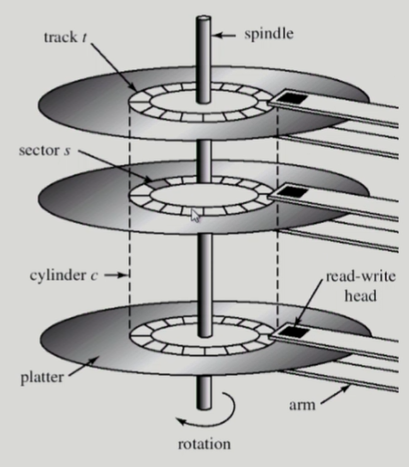
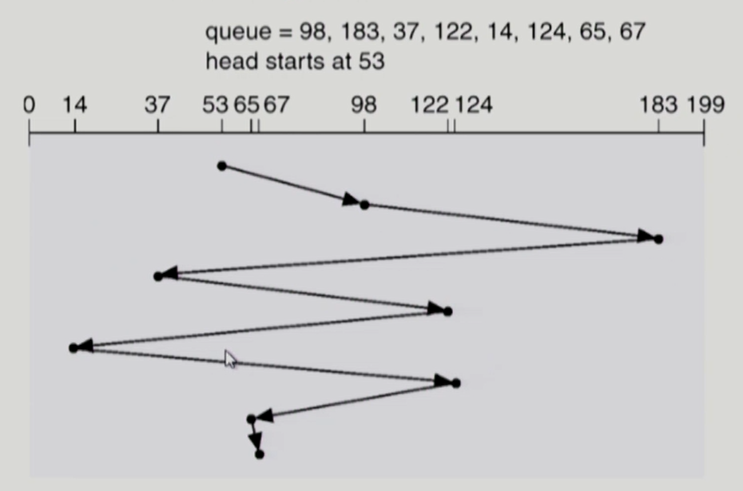
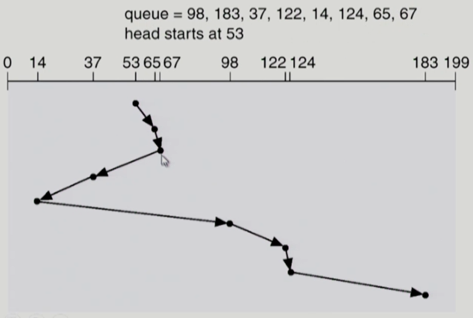
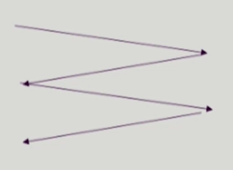
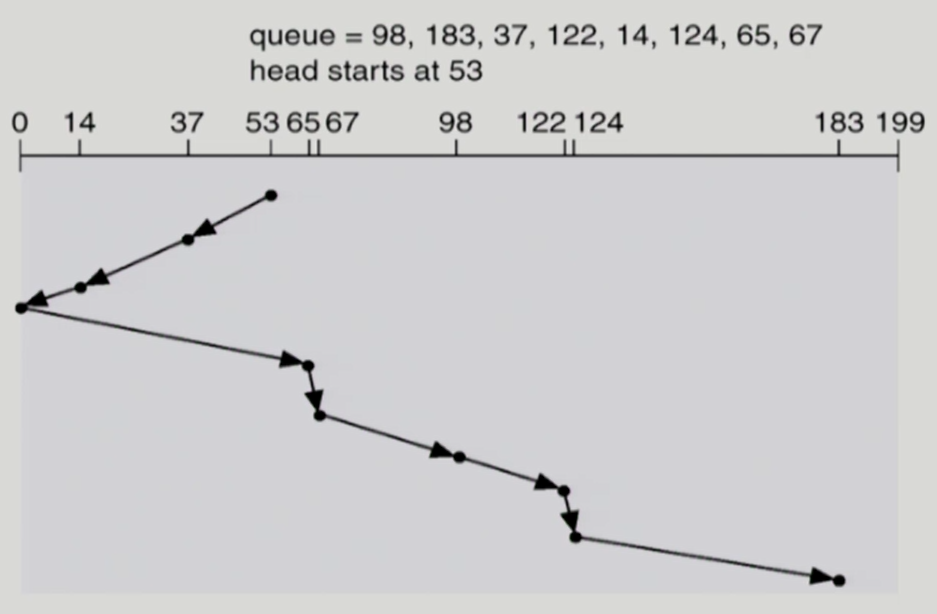
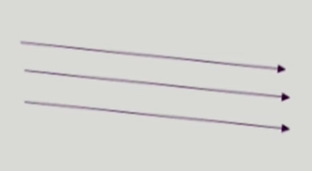
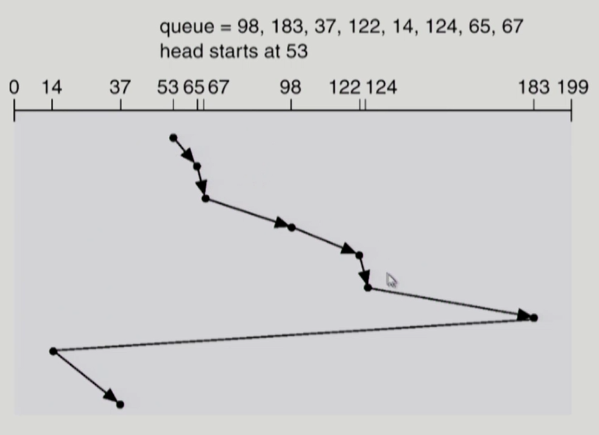
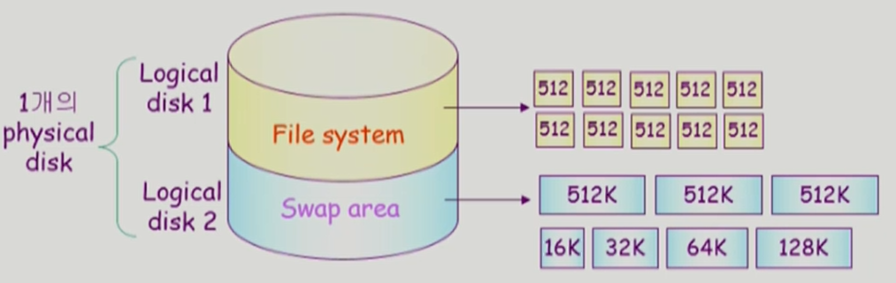

# Chapter 12. Disk Management and Scheduling

## Disk Structure

-   **Logical block**
    -   디스크의 외부에서 보는 디스크의 단위 정보 저장 공간들
    -   주소를 가진 1차원 배열처럼 취급
    -   정보를 전송하는 최소 단위

 

-   **Sector**
    -   Logical block이 물리적인 디스크에 매핑된 위치
    -   Sector 0운 최외곽 실린더의 첫 트랙에 있는 첫 번째 섹터.

  

## Disk Management

-   **Physical formatting** (Low-level formatting)
    -   디스크를 컨트롤러가 읽고 쓸 수 있도록 섹터들로 나누는 과정
    -   각 섹터는 **header + 실제 data(보통 512 bytes) + trailer로** 구성
    -   header와 trailer는 sector number, **ECC (Error-Correcting Code)등의** 정보가 저장되며 controller가 직접 접근 및 운영
    -   **header와 trailer에 저장된 ECC와 실제 data의 ECC가 같으면 배드 섹터가 아닌 것으로 판단 가능**

 

-   **Partitioning**
    -   디스크를 하나 이상의 실린더 그룹으로 나누는 과정
    -   OS는 이것을 독립적 disk로 취급 (logical disk)

 

-   **Logical formatting**
    -   파일시스템을 만드는 것
    -   FAT, inode, free space 등의 구조 포함

 

-   **Booting**
    -   **ROM에** 있는 "small bootstrap loader"의 실행
    -   sector 0 (boot block)을 load하여 실행
    -   sector 0는 "full Bootstrap loader program"
    -   OS를 디스크에서 load하여 실행

  

## Disk Scheduling

-   **Access time의** 구성
    -   Seek time
        -   헤드를 해당 실린더로 움직이는데 걸리는 시간
    -   Rotational latency
        -   헤드가 원하는 섹터에 도달하기까지 걸리는 회전지연시간
    -   Transfer time
        -   실제 데이터의 전송 시간

 

*   **Disk bandwidth**
    -   단위 시간당 전송된 바이트 수

 

-   **Disk Scheduling**
    -   Seek time을 최소화하는것이 목표
    -   Seek time = seek distance

  

## Disk Scheduling Algorithm

-   Queue에 다음과 같은 실린더 위치의 요청이 존재하는 경우 디스크 헤드 53번에서 시작한 각 알고리즘의 수행 결과는? (실린더 위치는 0-199)
-   98, 183, 37, 122, 14, 124, 65, 67

 

### FCFS (First Come First Service)

-   총 head의 이동: 640 cylinders

 

### SSTF(Shortest Seek Time First)

-   **Starvation** 문제
-   총 head의 이동: 236 cylinders

 

### SCAN

-   Disk arm이 디스크 한쪽 끝에서 다른쪽 끝으로 이동하며 가는 길목에 있는 모든 요청을 처리한다.
-   **다른 한쪽 끝에 도달하면 역방향으로 이동하며  오는 길목에 있는 모든 요청을 처리하며 다시 반대쪽 끝으로 이동한다.**
-   **실린더 위치에 따라 대기 시간이 다름**
-   총 head의 이동: 208 cylinders

 

### C-SCAN

-   헤드가 한쪽 끝에서 다른쪽 끝으로 이동하며 가는 길목에 있는 모든 요청을 처리
-   **다른쪽 끝에 도달했으면 요청을 처리하지 않고 곧바로 출발점으로 다시 이동**
-   **SCAN보다 균일한 대기 시간** 제공

 

### N-SCAN

-   **SCAN의** 변형 알고리즘
-   일단 arm이 한 방향으로 움직이기 시작하면 그 시점 이후에 도착한 job은 되돌아올 때 service됨

 

### LOOK and C-LOOK

-   **SCAN이나 C-SCAN은** 헤드가 디스크 **끝에서 끝으로** 이동

-   **LOOK과 C-LOOK은** 헤드가 진행 중이다가 **그 방향에 더 이상 기다리는 요청이 없으면 헤드의 이동방향을 즉시 반대로 이동한다.**

    -   *C-LOOK*

    

  

## Disk-Scheduling Algorithm의 결정

-   SCAN, C-SCAN 및 그 응용 알고리즘 중에서 **LOOK, C-LOOK 등이 일반적으로 디스크 I/O가 많은 시스템에서 효율적인 것으로 알려짐**
-   File의 할당 방법에 따라 디스크 요청이 영향을 받음
-   디스크 스케줄링 알고리즘은 필요할 경우 **다른 알고리즘으로 쉽게 교체할 수 있도록 OS와 별도의 모듈로 작성되는 것이 바람직함**

  

## Swap-Space Management

-   Disk를 사용하는 두 가지 이유
    -   Memory의 volatile한 특성 => File system
    -   프로그램 실행을 위한 memory 공간 부족 => swap space (swap area)

  

## RAID

-   Redundant Array of Independent Disks
    -   여러 개의 디스크를 묶어서 사용

 

-   RAID의 사용 목적
    -   **디스크 처리 속도 향상**
        -   여러 디스크에 block의 내용을 **분산 저장**
        -   병렬적으로 읽어옴 ***(interleaving, striping)***
    -   **신뢰성 (reliability) 향상**
        -   동일 정보를 여러 디스크에 중복 저장
        -   하나의 디스크가 고장시 다른 디스크에서 읽어옴 ***(Mirroring, shadowing)***
        -   단순한 중복 저장이 아니라 일부 디스크에 parity를 저장하여 공간의 효율성을 높일 수 있다

 

-   **Swap-space**
    -   Virtual memory system에서는 디스크를 memory의 연장 공간으로 사용
    -   파일시스템 내부에 둘 수도 있으나 별도 partition 사용이 일반적
        -   공간효율성보다는 속도효율성이 우선
        -   일반 파일보다 훨씬 짧은 시간만 존재하고 자주 참조됨
        -   따라서, block의 크기 및 저장 방식이 일반 파일시스템과는 다름

  

## Reference

[운영체제: 반효경 교수님](http://www.kocw.net/home/cview.do?cid=3646706b4347ef09)

