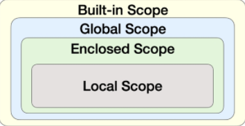

# Python_03

## 함수(`Function`)

-   `Decomposition`: 기능을 분해하고, 재사용 가능하게 만듦
-   `Abstraction`: 복잡한 내용을 모르더라도 사용할 수 있는 블랙박스(재사용성과 가독성, 생산성)
-   특정한 기능을 하는 코드의 조각(묶음)
-   특정 명령을 수행하는 코드를 매번 다시 작성하지 않고, 필요 시에만 호출하여 간편히 사용

### 함수 기본 구조

-   선언과 호출(`define & call`)
-   입력(`input`)
-   문서화(`doc-string`)
-   범위(`scope`)
-   결과값(`output`)

### 선언과 호출(`Define & Call`)

```python
def function_name(parameter):
	# code block
	return returning_value
```

-   함수는 `parameter`를 가질 수 있음
-   `return`으로 결과값을 반환하고 강제종료됨
-   `함수명`만 호출할 경우 객체의 `메모리 주소`를 가리킴

### 함수의 결과값(`Output`)

-   `Void function`
    -   명시적인 `return`값이 없는 경우, `None`을 반환하고 종료
-   `Value returning function`

-   함수는 반드시 하나의 객체를 반환
-   두개 이상의 값을 반환하기 위해서는 튜플 사용

### 함수의 입력(`Input`)

-   `parameter`: 함수를 실행할 때, 함수 내부에서 사용되는 식별자
-   `argument`: 함수를 호출할 때, 넣어주는 값
-   `Positional Arguments`: 기본적으로 함수 호출시, `argument`는 위치에 따라 함수 내에 전달됨
-   `Keyword Arguments`: 직접 변수의 이름으로 특정 `arg`를 전달할 수 있음
    -   `Keyword Arguments`다음에 `Positional Arguments`를 활용할 수 없음

-   `Default Arguments Values`: 기본값을 지정하여 함수 호출 시 args값을 설정하지 않도록 함
-   `Positional Arguments Packing/Unpacking`: `*args`
-   `Keyword Arguments Packing/Unpacking`: `**kwargs`
-   기본 `arg`값을 가지는 `arg`다음에 기본 값이 없는 `arg`정의 불가능
-   `keyword arg`다음에 `positional arg`활용 불가능

### 함수의 범위(`Scope`)

-   함수는 코드 내부에 `local scope`를 생성, 그 외의 공간인 `global scope`로 구분
-   이름 검색 규칙(`Name Resolution`): **LEGB Rule**



-   함수 내에서는 바깥 scope의 변수에 접근 가능하나 수정은 불가능
-    `global`
    -   현재 코드 블록 전체에 적용, 나열된 식별자가 `global variable`임을 나타냄
    -   `global`에 나열된 이름은 같은 코드 블록에서 `global `앞에 등장할 수 없음
    -   `global`에 나열된 이름은 `parameter, for loop, class/function` 등으로 정의되지 않아야 함
-   `nonlocal`
    -   `global`을 제외하고 가장 가까운 `scope`의 변수를 연결하도록 함
    -   `global`에 나열된 이름은 같은 코드 블록에서 `global` 앞에 등장할 수 없음
    -   `global`에 나열된 이름은 `parameter, for loop, class/function` 등으로 정의되지 않아야 함
    -   `global`과는 달리 이미 존재하는 이름과의 연결만 가능

### 함수의 문서화(`Docstring`)

-   함수나 클래스의 설명
-   `Naming Convention`
    -   상수 이름은 영문 전체를 대문자
    -   클래스 및 예외의 이름은 각 단어의 첫 글자만 영문 대문자
    -   외 나머지는 소문자 또는 언더스코어로 구분한 소문자 사용

### 함수의 응용

>   `map`

```python
map(function, iterable)
```

-   순회 가능한 데이터구조의 모든 요소에 함수를 적용하고, 그 결과를 `map object: enumerate`로 반환

>   `filter`

-   순회 가능한 데이터구조의 모든 요소에 함수를 적용하고, 그 결과가 `True`인 것들을 `filter object`로 반환

>   `zip`

-   복수의 `iterable`을 모아 튜플을 원소로 하는 `zip object` 반환

>   `lambda`

```python
lambda [parameter] : <expression>
```

-   표현식을 계산한 결과값을 반환하는 함수로, 익명함수라고도 불림
-   `return`문을 가질 수 없음
-   간편 조건문 외 조건문이나 반복문을 가질 수 없음
-   함수를 정의해 사용하는 것보다 간결하게 사용가능

>   `재귀 함수(recursive function)`

```python
# 팩토리얼 함수
def factorial(n):
	if n == 0 or n == 1:
		return 1
	else:
		return n * factorial(n - 1)

# 1 ~ n 까지의 합
def sum(n):
    if n <= 0:
        return 0
    else:
        return n + sum(n - 1)
```


-   **자기 자신을 호출**하는 함수
-   무한한 호출을 목표로 하는 것이 아니며, 알고리즘 설계 및 구현에서 유용하게 활용
    -   알고리즘 중 재귀 함수로 로직표현이 쉬운 경우 `ex. 점화식`
    -   변수의 사용이 줄어들며, 코드의 가독성이 높아짐
-   **1개 이상의 `base case`가 존재하고, 수렴**하도록 작성
-   `python`에서는 최대 재귀 깊이(`maximum recursion depth`)가 1,000번으로 설정, 호출 횟수가 이를 넘어가면 `Recursion Error`발생


## 모듈(`Module`)

### 모듈과 패키지

-   모듈
    -   특정 기능을 하는 코드를 파이썬 파일(.py) 단위로 작성한 것
-   패키지
    -   특정 기능과 관련된 여러 모듈의 집합
    -   패키지 안에는 또다른 서브 패키지를 포함

-   파이썬 표준 라이브러리(`Python Standard Library`, PSL)

    -   https://docs.python.org/ko/3/library/index.html

### 가상환경

-   외부 패키지와 모듈을 사용하는 경우 `pip`를 통해 설치
-   복수의 프로젝트 진행할 경우 버전이 상이할 수 있음
-   이러한 경우 가상환경을 만들어 프로젝트별로 독립적인 패키지 관리 가능

>   `venv`

```
$ python -m venv <foldername>
```

