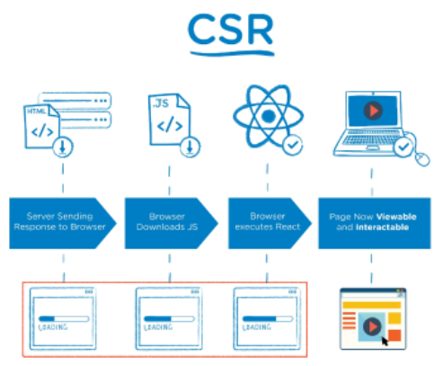
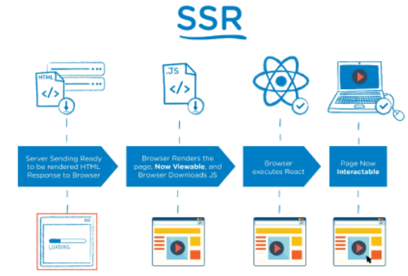
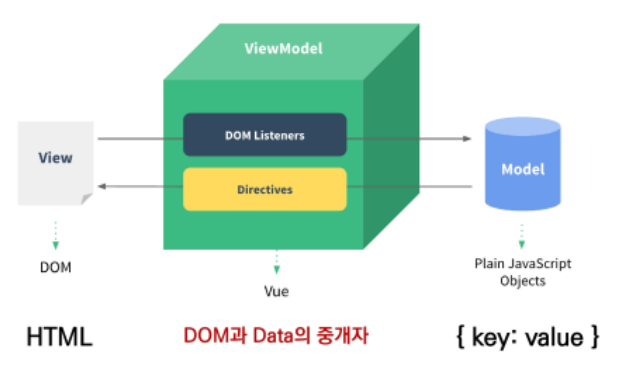
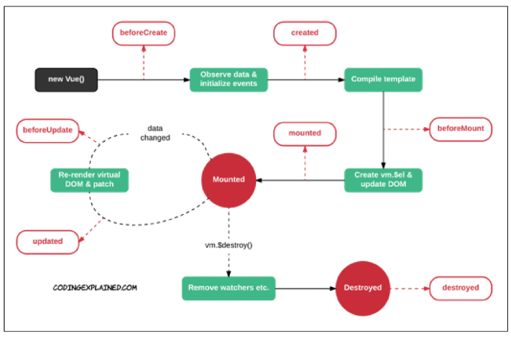

# Vue.js_01

## Intro

-   사용자 인터페이스를 만들기 위한 진보적 JS 프레임워크
-   현대적인 tool과 다양한 라이브러리를 통해 SPA(Single Page Application)를 완벽하게 지원


### SPA

-   Single Page Application (단일 페이지 애플리케이션)
-   현재 페이지를 동적으로 렌더링함으로써 사용자와 소통하는 웹 애플리케이션
-   단일 페이지로 구성되며 서버로부터 최초에만 페이지를 다운로드하고, 이후에는 동적으로 DOM을 구성
    -   처음 페이지를 받은 이후부터는 서버로부터 새로운 전체 페이지를 불러오는 것이 아닌, 현재 페이지 중 필요한 부분만 동적으로 다시 작성함
-   연속되는 페이지 간의 사용자 경험(UX)을 향상
    -   모바일 사용량이 증가하고 있는 현재 트래픽의 감소와 속도, 사용성, 반응성의 향상은 매우 중요하기 때문
-   동작 원리의 일부가 CSR (Client Side Rendering)의 구조를 따름


>   SPA 등장 배경

-   과거 웹 사이트들은 요청에 따라 매번 새로운 페이지를 응답하는 방식
    -   MPA (Multi Page Application)
-   스마트폰이 등장하면서 모바일 최적화의 필요성이 대두됨
    -   모바일 네이티브 앱과 같은 형태의 웹 페이지가 필요해짐
-   이러한 문제를 해결하기 위해 Vue.js와 같은 프론트엔드 프레임워크가 등장
    -   CSR, SPA의 등장
-   1개의 웹 페이지에서 여러 동작이 이루어지며 모바일 앱과 비슷한 형태의 사용자 경험을 제공


### CSR



-   Client Side Rendering
-   서버에서 화면을 구성하는 SSR (Server Side Rendering) 방식과 달리 클라이언트에서 화면을 구성
-   최초 요청 시 HTML, CSS, JS 등 데이터를 제외한 각종 리소스를 응답받고 이후 클라이언트는 필요한 데이터만 요청해 JS로 DOM을 렌더링하는 방식
-   즉, 처음엔 뼈대만 받고 브라우저에서 동적으로 DOM을 그림
-   SPA가 사용하는 렌더링 방식


>   장점

1.   서버와 클라이언트 간 트래픽 감소
     -   웹 애플리케이션에 필요한 모든 정적 리소스를 최초에 한 번 다운로드 후 필요한 데이터만 갱신
2.   사용자 경험 향상
     -   전체 페이지를 다시 렌더링하지 않고 변경되는 부분만을 갱신하기 때문


>   단점

1.   SSR에 비해 전체 페이지 최종 렌더링 시점이 느림
2.   SEO(검색 엔진 최적화)에 어려움이 있음 (최초 문서에 데이터 마크업이 없기 때문)


### SSR



-   Server Side Rendering
-   서버에서 클라이언트에게 보여줄 페이지를 모두 구성하여 전달하는 방식
-   JS 웹 프레임워크 이전에 사용되던 전통적인 렌더링 방식


>   장점

1.   초기 구동 속도가 빠름
     -   클라이언트가 빠르게 컨텐츠를 볼 수 있음
2.   SEO에 적합
     -   DOM에 이미 모든 데이터가 작성되어있기 때문


>   단점

1.   모든 요청마다 새로운 페이지를 구성하여 전달
     -   반복되는 전체 새로고침으로 인해 사용자 경험이 떨어짐
     -   상대적으로 트래픽이 많아 서버의 부담이 클 수 있음


>   [참고] SEO

-   Search Engine Optimization
-   웹 페이지 검색엔진이 자료를 수집하고 순위를 매기는 방식에 맞게 웹 페이지를 구성해서 검색 결과의 상위에 노출될 수 있도록 하는 작업
-   인터넷 마케팅 방법 중 하나
-   구글의 등장 이후 검색엔진들이 컨텐츠의 신뢰도를 파악하는 기초 지표로 사용됨
    -   다른 웹 사이트에서 얼마나 인용되었나를 반영
    -   결국 타 사이트에 인용되는 횟수를 늘리는 방향으로 최적화


>   [참고] SEO 대응

-   Vue.js 또는 React 등의 SPA 프레임워크는 SSR을 지원하는 SEO 대응 기술이 이미 존재
    -   SEO 대응이 필요한 페이지에 대해서는 선별적 SEO 대응 가능
-   혹은 추가로 별도의 프레임워크를 사용하기도 함
    -   Nuxt.js
        -   Vue.js 응용 프로그램을 만들기 위한 프레임워크
        -   SSR 지원
    -   Next.js
        -   React 응용 프로그램을 만들기 위한 프레임워크
        -   SSR 지원


## Why Vue.js?

-   가장 인기있는 프론트엔드 프레임워크
-   현대 웹 페이지는 페이지 규모가 계속해서 커지고 있으며, 그만큼 사용하는 데이터도 늘어나고 사용자와의 상호작용도 많이 이루어짐
-   결국 Vanilla JS 만으로는 관리가 어려움
    -   e.g., 페이스북 친구가 이름을 수정했을 경우, 화면상에서 변경되어야 하는 것들
        -   타임라인의 이름, 페이스북 메시지 상의 이름, 내 주소록에서의 친구 이름 등
        -   페이스북이 React를 개발한 이유


>   비교

-   Vanilla JS
    -   한 유저가 작성한 게시글이 DOM상에 100개 존재
    -   이 유저가 닉네임을 변경하면, DB의 Update와 별도로 DOM상의 100개의 작성자 이름이 모두 수정되어야 함
    -   `모든 요소`를 선택해서 `이벤트`를 등록하고 값을 변경해야 함
-   Vue.js
    -   DOM과 Data가 연결되어 있고
    -   Data를 변경하면 이에 연결된 DOM은 알아서 변경
    -   즉, 우리가 신경쓸 것은 오직 **Data에 대한 관리 (Developer Exp 향상)**


## Concepts of Vue.js

### MVVM Pattern



-   애플리케이션 로직을 UI로부터 분리하기 위해 설계된 디자인 패턴
-   구성 요소
    -   Model
    -   View
    -   View Model


>   Model

-   **Vue에서 Model은 JavaScript Object**
-   `Object === {key: value}`
-   Model은 Vue Instance 내부에서 **data라는** 이름으로 존재
-   이 data가 바뀌면 View(DOM)가 반응


>   View

-   **Vue에서 View는 DOM(HTML)**
-   Data의 변화에 따라서 바뀌는 대상


>   ViewModel

-   **Vue에서 ViewModel은 모든 Vue Instance**
-   View와 Model 사이에서 Data와 DOM에 관련된 모든 일을 처리
-   ViewModel을 활용해 Data를 얼마나 잘 처리해서 보여줄 것인지(DOM)를 고민하는 것


### Vue.js version. 2 vs. 3

>   Vue.js 3

-   2022년 2월부터 Vue.js의 기본 버전이 `3.x`로 전환
-   CDN or npm을 통한 설치시 자동으로 Vue 3로 설정


>   Vue.js 2

-   실무에서 여전히 Vue.js 2가 많이 사용됨 (legacy code)
-   Vue.js 2의 생태계(문서, 튜토리얼, 자료, QnA etc.,)가 더 성숙함
-   코어/커뮤니티 라이브러리의 호환 역시 Vue.js 2가 더 안정적
-   **현 시점에서는 참고자료가 많은 Vue.js 2로 학습 후, Vue 3로 이전(migration)하는게 가장 효과적**


## Basic Syntax

>   Vue Instance

-   모든 Vue 앱은 Vue 함수로 새 인스턴스를 만드는 것부터 시작
-   Vue 인스턴스를 생성할 때는 Options 객체를 전달해야 함
-   여러 Options들을 사용하여 원하는 동작을 구현
-   `Vue Instance === Vue Component`

```javascript
const app = new Vue({
    
})
```


>   Options/DOM - `el`

-   Vue 인스턴스에 연결(마운트)할 기존 DOM 요소가 필요
-   CSS 선택자 문자열 혹은 HTML Element로 작성
-   new를 이용한 인스턴스 생성 때만 사용

```javascript
const app = new Vue({
    el: '#app'
})
```


>   Options/DOM - `data`

-   Vue 인스턴스의 데이터 객체
-   Vue 인스턴스의 상태 데이터를 정의하는 곳
-   Vue template에서 interpolation을 통해 접근가능
-   v-bind, v-on과 같은 directive에서도 사용 가능
-   Vue 객체 내 다른 함수에서 `this` 키워드를 통해 접근 가능

```javascript
const app = new Vue({
    el: '#app',
    data: {
        message: 'Hello',
    }
})
```


>   Options/Data - `methods`

-   Vue 인스턴스에 추가할 메서드
-   Vue template에서 interpolation을 통해 접근 가능
-   v-on과 같은 directive에서도 사용 가능
-   Vue 객체 내 다른 함수에서 `this` 키워드를 통해 접근 가능
-   주의
    -   화살표 함수를 메서드를 정의하는 데 사용하면 안됨
    -   화살표 함수가 부모 컨텍스트를 바인딩하기 때문에, `this`는 Vue 인스턴스가 아님

```javascript
const app = new Vue({
    el: '#app',
    data: {
        message: 'Hello',
    },
    methods: {
        greeting: function () {
            console.log('hello')
        }
    }
})
```


## Template Syntax

>   Interpolation

1.   Text
     -   `<span>{{ msg }}</span>`
2.   Raw HTML
     -   `<span v-html="rawHtml"></span>`
3.   Attributes
     -   `<div v-bind:id="dynamicId"></div>`
4.   JS 표현식
     -   `{{ number + 1}}`
     -   `{{ message.split('').reverse().join('') }}`


>   Directive

-   `v-` 접두사가 있는 특수 속성

-   속성 값은 단일 JS 표현식이 됨 (`v-for`는 예외)

-   표현식의 값이 변경될 때 반응적으로 DOM에 적용하는 역할을 함

-   **전달인자 (Arguments)**

    -   `:`을 통해 전달인자를 받을 수도 있음

    ```html
    <a v-bind:href="url"> ... </a>
    <a v-on:click="doSomething"> ... </a>
    ```

-   **수식어 (Modifiers)**

    -   `.`으로 표시되는 특수 접미사
    -   Directive를 특별한 방법으로 바인딩해야 함을 나타냄

    ```html
    <form v-on:submit.prevent="onSubmit">
        ...
    </form>
    ```


>   v-show와 v-if

-   **v-show (Expensive initial load, cheap toggle)**
    -   CSS `display` 속성을 hidden으로 만들어 토글
    -   실제로 렌더링은 되지만 눈에서 보이지 않는 것이기 때문에 딱 한 번만 렌더링이 되는 경우라면 `v-if`에 비해 상대적으로 렌더링 비용이 높음
    -   하지만, 자주 변경되는 요소라면 한 번 렌더링 된 이후부터는 보여주는지에 대한 여부만 판단하면 되기 때문에 토글 비용이 적음
-   **v-if (Cheap initial load, expensive toggle)**
    -   전달인자가 `false`인 경우 렌더링 되지 않음
    -   화면에서 보이지 않을 뿐만 아니라 렌더링 자체가 되지 않기 때문에 렌더링 비용이 낮음
    -   하지만, 자주 변경되는 요소의 경우 다시 렌더링 해야 하므로 비용이 증가할 수 있음


>   Options/Data - `computed`

-   데이터를 기반으로 하는 계산된 속성
-   함수의 형태로 정의하지만 함수가 아닌 **함수의 반환 값이** 바인딩 됨
-   종속된 데이터에 따라 저장(캐싱)됨
-   **종속된 데이터가 변경될 때만 함수를 실행**
-   즉, **어떤 데이터에도 의존하지 않는 computed 속성의** 경우 절대로 업데이트되지 않음
-   반드시 반환 값이 있어야 함

```javascript
const app = new Vue({
    el: '#app',
    data: {
        num: 2,
    },
    computed: {
        doubleNum: function () {
            return this.num * 2
        }
    },
})
```


>   computed & methods

-   computed 속성 대신 methods에 함수를 정의할 수도 있음
    -   최종 결과에 대해 두 가지 접근 방식은 서로 동일
-   차이점은 computed 속성은 종속 대상을 따라 캐싱됨
-   즉, computed는 종속된 대상이 변경되지 않는 한 computed에 작성된 함수를 여러 번 호출해도 계산을 다시 하지 않고 계산되어 있던 결과를 반환
-   이에 비해 methods를 호출하면 렌더링을 다시 할 때마다 항상 함수를 실행


>   computed & watch

-   **computed**
    -   특정 데이터를 직접적으로 사용/가공하여 다른 값으로 만들 때 사용
    -   속성은 계산해야 하는 목표 데이터를 정의하는 방식
    -   **선언형 프로그래밍**
    -   "특정 값이 변동하면 해당 값을 다시 계산해서 보여준다."
-   **watch**
    -   특정 데이터의 변화 상황에 맞춰 다른 data 등이 바뀌어야 할 때 주로 사용
    -   감시할 데이터를 지정하고 그 데이터가 바뀌면 특정 함수를 실행하는 방식
    -   **명령형 프로그래밍**
    -   "특정 값이 변동하면 다른 작업을 한다."
    -   특정 대상이 변경되었을 때 콜백 함수를 실행시키기 위한 트리거


>   Options/Assets - `filter`

-   텍스트 형식화를 적용할 수 있는 필터
-   interpolation 혹은 v-bind를 이용할 때 사용 가능
-   필터는 자바스크립트 표현식 마지막에 `|`와 함께 추가되어야 함
-   이어서 사용(chaining) 가능

```javascript
const app = new Vue({
    el: '#app',
    data: {
        numbers: [1, 2, 3, 4, 5],
    },
    filters: {
        getOddNums: function (numbers) {
            const oddNums = numbers.filter(num => num % 2)
            return oddNums
        },
        getUnderTenNums: function (numbers) {
            const underTen = numbers.filter(num => num < 10)
            return underTen
        }
    },
})
```


## Lifecycle Hooks



-   각 Vue 인스턴스는 생성될 때 일련의 초기화 단계를 거침
    -   e.g., 데이터 관찰 설정이 필요한 경우, 인스턴스를 DOM에 마운트하는 경우, 데이터가 변경되어 DOM을 업데이트하는 경우 등
-   그 과정에서 사용자 정의 로직을 실행할 수 있는 Lifecycle Hooks도 호출됨
-   [공식문서](https://kr.vuejs.org/v2/guide/instance.html#%EC%9D%B8%EC%8A%A4%ED%84%B4%EC%8A%A4-%EB%9D%BC%EC%9D%B4%ED%94%84%EC%82%AC%EC%9D%B4%ED%81%B4-%ED%9B%85)
-   e.g., `created`를 사용해 애플리케이션의 초기 데이터를 API 요청으로 불러올 수 있음

```javascript
const API_URL = 'https://dog.ceo/api/breeds/image/random'
const app = new Vue({
    el: '#app',
    data: {
        imgSrc: '',
    },
    methods: {
        getImg: function () {
            axios.get(API_URL)
            	.then(response => {
                this.imgSrc = response.data.message
            })
        }
    },
    created: function () {
        this.getImg()
    }
})
```


