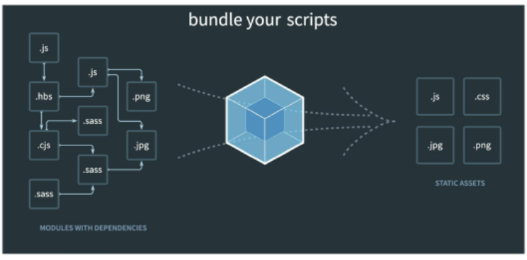

# Vue.js_02

## SFC (Single File Component)

>   Component

-   기본 HTML 엘리먼트를 확장하여 재사용 가능한 코드를 캡슐화 하는데 도움을 줌
-   CS에서는 다시 사용할 수 있는 범용성을 위해 개발된 소프트웨어 구성 요소를 의미
-   `Vue 컴포넌트 === Vue 인스턴스`


>   SFC

-   Vue의 컴포넌트 기반 개발의 핵심 특징
-   하나의 컴포넌트는 `.vue` 확장자를 가진 하나의 파일 안에서 작성되는 코드의 결과물
-   화면의 특정 영역에 대한 HTML, CSS, JS 코드를 하나의 파일(`.vue`)에서 관리
-   즉, `.vue` 확장자를 가진 싱글 파일 컴포넌트를 통해 개발하는 방식
-   `Vue 컴포넌트 === Vue 인스턴스 === .vue 파일`


>   Vue Component Structure

-   한 화면 안에서도 기능 별로 각기 다른 컴포넌트가 존재
    -   하나의 컴포넌트는 여러 개의 하위 컴포넌트를 가질 수 있음
    -   Vue는 컴포넌트 기반의 개발 환경 제공


-   Vue 컴포넌트는 `const app = new Vue({...})` 의 app을 의미하여 이는 Vue 인스턴스

    -   여기서 오해하면 안 되는 것은 컴포넌트 기반의 개발이 **반드시 파일 단위로 구분되어야 하는 것은 아님**

    -   단일 .html 파일 안에서도 여러 개의 컴포넌트를 만들어 개발 가능


## Vue CLI

>   Vue CLI

-   Vue.js 개발을 위한 표준 도구
-   프로젝트의 구성을 도와주는 역할을 하며 Vue 개발 생태계에서 표준 tool 기준을 목표로 함
-   확장 플러그인, GUI, Babel 등 다양한 tool 제공

```
$ node install -g @vue/cli
```

```
$ vue create [app_name]
```

```
$ npm run serve
```


>   Node.js

-   자바스크립트를 브라우저가 아닌 환경에서도 구동할 수 있도록 하는 런타임 환경
    -   브라우저 밖을 벗어날 수 없던 자바스크립트 언어의 태생적 한계를 해결
-   Chrome V8 Engine을 제공하여 여러 OS 환경에서 실행할 수 있는 환경을 제공
-   즉, 단순히 브라우저만 조작할 수 있던 JS를 SSR 아키텍처에서도 사용할 수 있도록 함


>   NPM (Node Package Manager)

-   자바스크립트 언어를 위한 패키지 관리자
-   Node.js의 기본 패키지 관리자
-   Node.js 설치 시 함께 설치됨


>   Babel

-   "JavaScript compiler"
-   자바스크립트의 ECMAScript 2015+ 코드를 이전 버전으로 번역/변환해 주는 도구
-   과거 자바스크립트의 파편화와 표준화의 영향으로 코드의 스펙트럼이 매우 다양
    -   이때문에 최신 문법을 사용해도 이전 브라우저 혹은 환경에서 동작하지 않는 상황이 발생
-   원시 코드(최선 버전)를 목적 코드(구버전)로 옮기는 번역기가 등장하면서 개발자는 더 이상 내 코드가 특정 브라우저에서 동작하지 않는 상황에 대해 걱정하지 않아도 됨


>   Webpack



-   "Static module bundler"
-   모듈 간의 의존성 문제를 해결하기 위한 도구
-   프로젝트에 필요한 모든 모듈을 매핑하고 내부적으로 종속성 그래프를 빌드함


>   Static **Module** Bundler

-   모듈은 단지 파일 하나를 의미 (e.g., js 파일 하나 === 모듈 하나)
-   배경
    -   브라우저만 조작할 수 있었던 시기의 JS는 모듈 관련 문법 없이 사용됨
    -   하지만 JS와 애플리케이션이 복잡해지고 크기가 커지자 전역 scope를 공유하는 형태의 기존 개발 방식의 한계점이 드러남
    -   그래서 라이브러리를 만들어 필요한 모듈을 언제든지 불러오거나 코드를 모듈 단위로 작성하는 등의 다양한 시도가 이루어짐


-   여러 모듈 시스템
    -   **ESM(ECMA Script Module)**
    -   AMD(Asynchronous Module Definition)
    -   CommonJS
    -   UMD(Universal Module Definition)


-   모듈 의존성 문제
    -   모듈의 수가 많아지고 라이브러리 혹은 모듈 간의 의존성이 깊어지면서 특정한 곳에서 발생한 문제가 어떤 모듈의 문제인지 파악하기 어려움
    -   즉, Webpack은 이 모듈 간의 의존성 문제를 해결하기 위해 등장


-   모듈 의존성 문제를 해결해주는 작업을 Bundling이라 함
-   이러한 일을 해주는 도구가 Bundler이고, Webpack은 다양한 번들러 중 하나
-   여러 모듈을 하나로 묶어주고 묶인 파일은 하나(혹은 여러 개)로 합쳐짐
-   Bundling된 결과물은 더 이상 순서에 영향을 받지 않고 동작하게 됨
-   snowpack, parcel, rollup.js 등의 다양한 번들러 존재


## Pass props & Emit event

>   컴포넌트 작성

-   Vue app은 자연스럽게 중첩된 컴포넌트 트리로 구성됨
-   컴포넌트간 부모-자식 관계가 구성되며 이들 사이에 필연적으로 의사소통이 필요함
-   부모는 자식에게 데이터를 전달(Pass props)하며, 자식은 자신에게 일어난 일을 부모에게 알림(Emit event)
    -   부모와 자식이 명확하게 정의된 인터페이스를 통해 격리된 상태를 유지할 수 있음


-   **"props는 아래로, events는 위로"**
-   부모는 props를 통해 자식에게 '데이터'를 전달하고, 자식은 events를 통해 부모에게 '메시지'를 보냄


>   단방향 데이터 흐름

-   모든 props는 하위 속성과 상위 속성 사이의 **단방향** 바인딩을 형성
-   부모의 속성이 변경되면 자식 속성에게 전달되지만, 반대 방향으로는 안 됨
    -   자식 요소가 의도치 않게 부모 요소의 상태를 변경하여 앱의 데이터 흐름을 이해하기 어렵게 만드는 일을 방지


-   부모 컴포넌트가 업데이트될 때마다 자식 요소의 모든 prop들이 최신 값으로 업데이트됨


>   Emit event

-   "Listening to Child Components Events"

-   `$emit(eventName)`
    -   현재 인스턴스에서 이벤트를 트리거
    -   추가 인자는 리스너의 콜백 함수로 전달


-   부모 컴포넌트는 자식 컴포넌트가 사용되는 템플릿에서 `v-on`을 사용하여 자식 컴포넌트가 보낸 이벤트를 청취 (`v-on`을 이용한 사용자 지정 이벤트)


>   event 이름 컨벤션

-   컴포넌트 및 props와는 달리, 이벤트는 자동 대소문자 변환을 제공하지 않음
-   HTML의 대소문자 구분을 위해 DOM 템플릿의 `v-on` 이벤트 리스너는 항상 자동으로 소문자 변환되기 때문에 `v-on:myEvent`는 자동으로 `v-on:myevent`로 변환
-   이러한 이유로 이벤트 이름에는 항상 **kebab-case** 사용을 권장

```html
<!-- components/About.vue -->

<template>

<div>
  <h1>{{ myMessage }}</h1>
  <p></p>
  <input 
    type="text"
    v-model="childInputData"
    @keyup.enter="childInputChange"
  >
</div>

</template>

<script>
export default {
  name: 'TheAbout',
  props: {
    myMessage: String,
  },
  data: function () {
    return {
      childInputData: ''
    }
  },
  methods: {
    childInputChange: function () {
      console.log('Enter:', this.childInputData)
      this.$emit('child-input-change', this.childInputData)
    }
  }
}
</script>
```

```html
<!-- App.vue -->

<template>
  <div id="app">
    
    <!-- <TheAbout :my-message="parentData"/> -->
    <the-about
      :my-message="parentData"
      @child-input-change="parentGetChange"
    ></the-about>
  </div>
</template>

<script>
import TheAbout from './components/TheAbout.vue'

export default {
  name: 'App',
  components: {
    TheAbout,
  },
  data: function () {
    return {
      parentData: 'This is parent data. to child component'
    }
  },
  methods: {
    parentGetChange: function (inputData) {
      console.log('Listen:', inputData)
    }
  },
}
</script>
```


## Vue Router

-   "Vue.js 공식 라우터"
-   루트(route)에 컴포넌트를 매핑한 후, 어떤 주소에서 렌더링할 지 알려줌
-   SPA 상에서 라우팅을 쉽게 개발할 수 있는 기능을 제공

```
$ vue add router
```


>   Vue Router - "router-link"

-   사용자 네비게이션을 가능하게 하는 컴포넌트
-   목표 경로는 `to` prop으로 지정됨
-   HTML5 히스토리 모드에서 router-link는 클릭 이벤트를 차단하여 브라우저가 페이지를 다시 로드하지 않도록 함
-   a 태그지만 우리가 알고 있는 GET 요청을 보내는 a 태그와 다르게, 기본 GET 요청을 보내는 이벤트를 제거한 형태로 구성됨


>   Vue Router - "router-view"

-   주어진 루트에 대해 일치하는 컴포넌트를 렌더링하는 컴포넌트
-   실제 component가 DOM에 부착되어 보이는 자리를 의미
-   `router-link`를 클릭하면 해당 경로와 연결되어 있는 `index.js`에 정의한 컴포넌트가 위치


>   History mode

-   HTML History API를 사용해서 router를 구현한 것
-   브라우저의 히스토리는 남기지만 실제 페이지는 이동하지 않는 기능을 지원
-   즉, 페이지를 다시 로드하지 않고 URL을 탐색할 수 있음
    -   SPA의 단점 중 하나인 "URL이 변경되지 않는다."를 해결


-   [참고] History API
    -   DOM의 window 객체는 history 객체를 통해 브라우저의 세션 기록에 접근할 수 있는 방법을 제공
    -   history 객체는 사용자를 자신의 방문 기록 앞과 뒤로 보내거나, 기록의 특정 지점으로 이동하는 등 유용한 메서드와 속성을 가짐


>   프로그래밍 방식 네비게이션

-   `<router-link>`를 사용하여 선언적 탐색을 위한 a 태그를 만드는 것 외에도, router의 인스턴스 메서드를 사용하여 프로그래밍 방식으로 같은 작업을 수행할 수 있음
-   따라서 다른 URL로 이동하려면 `this.$router.push`를 호출 가능
    -   이 메서드는 새로운 항목을 히스토리 스택에 넣기 때문에 사용자가 브라우저의 뒤로 가기 버튼을 클릭하면 이전 URL로 이동하게 됨
-   `<router-link>`를 클릭할 때 내부적으로 호출되는 메서드이므로, `<router-link :to="...">`를 클릭하면, `$router.push(...)`를 호출하는 것과 같음


>   Dynamic Route Matching

-   주어진 패턴을 가진 루트를 동일한 컴포넌트에 매핑하는 경우
-   예를 들어 모든 User에 대해 동일한 레이아웃을 가지지만, 다른 userId로 렌더링되는 profile 컴포넌트
-   컴포넌트에서 `this.$route.params`로 사용가능

```javascript
const routes = [
    {
        path: '/user/:userId',
        name: 'profile',
        component: Profile,
    },
]
```


>   Vue Router가 필요한 이유

1.   SPA 등장 이전
     -   서버가 모든 라우팅을 통제
     -   요청 경로에 맞는 HTML 제공


2.   SPA 등장 이후
     -   서버는 `index.html` 하나만 제공
     -   이후 모든 처리는 HTML 위에서 JS 코드를 통해 진행
     -   즉, 요청에 대한 처리를 더 이상 서버가 하지 않음


3.   라우팅 처리
     -   SSR
         -   라우팅 결정권을 서버가 가짐
     -   CSR
         -   클라이언트는 더 이상 서버로 요청을 보내지 않고 응답받은 HTML 문서안에서 주소가 변경되면 특정 주소에 맞는 컴포넌트를 렌더링
         -   라우팅 결정권을 클라이언트가 가짐

